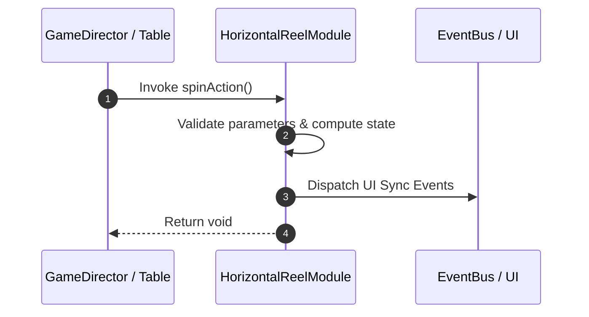

# 📖 `HorizontalReelModule.spinAction()`

<!-- convention-summary-start -->
### HorizontalReelModule.spinAction Line-by-Line Method Specification Summary

- **Core Architecture / Purpose**: Technical reference, API contract, and integration guide for HorizontalReelModule.spinAction Line-by-Line Method Specification.
- **Key Mechanisms & Design**: Encapsulates core algorithms, event hooks, and performance optimizations within the slot framework runtime.
- **Domain Capabilities**: cc_slot_mechanics, 05_methods
- **Scope & Code Paths**: `assets/cc-common/cc-slot-mechanics/HorizontalReel/scripts/HorizontalReelModule.ts`
- **Related Docs**: [Master Index](../INDEX.md)
<!-- convention-summary-end -->


---

## 1. Method Signature & Overview

```typescript
public spinAction(): void
```

- **Declaring Class**: `HorizontalReelModule` (`assets/cc-common/cc-slot-mechanics/HorizontalReel/scripts/HorizontalReelModule.ts`)
- **Source Code Location**: Lines 24 to 39
- **Execution Complexity**: $O(1)$ fast synchronous calculation or controlled timer Promise.

---

## 2. Complete Source Code Implementation

```typescript
	spinAction(): void {
		if (this.reelManager.state === ReelSpinState.STOPPED) {
			this.playStopAnimation();
			return;
		}

		const newPosition: cc.Vec2 = new Vec2(-this.SYMBOL_WIDTH, 0);
		this.tween = tween(this.node)
			.by(this.currentMode.speed, { position: newPosition })
			.call(() => {
				this.tween = null;
				this.recycleSymbol();
				this.spinAction();
			})
			.start();
	}
```

---

## 3. Line-by-Line Code Breakdown

| Line # | Code Snippet | Technical Analysis & Engine Behavior |
| :---: | :--- | :--- |
| **24** | `spinAction(): void {` | Method entry signature declaring `spinAction()` with return type `void`. |
| **25** | `if (this.reelManager.state === ReelSpinState.STOPPED) {` | Conditional branch evaluation guarding edge cases or prerequisites. |
| **26** | `this.playStopAnimation();` | Applies operational logic and state mutation. |
| **27** | `return;` | Applies operational logic and state mutation. |
| **28** | `}` | Method exit boundary, closing block scope. |
| **29** | `` | Applies operational logic and state mutation. |
| **30** | `const newPosition: cc.Vec2 = new Vec2(-this.SYMBOL_WIDTH, 0);` | Local variable initialization allocating `newPosition: cc.Vec2`. |
| **31** | `this.tween = tween(this.node)` | Applies operational logic and state mutation. |
| **32** | `.by(this.currentMode.speed, { position: newPosition })` | Applies operational logic and state mutation. |
| **33** | `.call(() => {` | Applies operational logic and state mutation. |
| **34** | `this.tween = null;` | Applies operational logic and state mutation. |
| **35** | `this.recycleSymbol();` | Applies operational logic and state mutation. |
| **36** | `this.spinAction();` | Applies operational logic and state mutation. |
| **37** | `})` | Applies operational logic and state mutation. |
| **38** | `.start();` | Applies operational logic and state mutation. |
| **39** | `}` | Method exit boundary, closing block scope. |

---

## 4. Data Flow & State Lifecycle



---

## 5. Production Gotchas & Edge Cases

1. **Null Guarding**: Always ensure caller passes non-null parameters or handles undefined fallbacks.
2. **Fast-Stop Safety**: If user triggers fast-stop during execution, ensure timers are cancelled cleanly via `unscheduleAllCallbacks()`.
