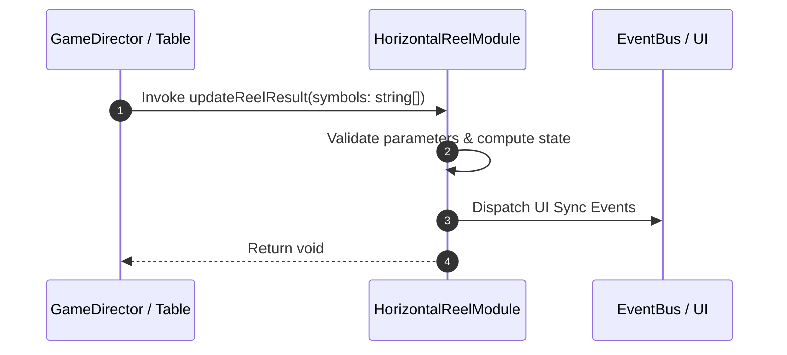

# 📖 `HorizontalReelModule.updateReelResult()`

<!-- convention-summary-start -->
### HorizontalReelModule.updateReelResult Line-by-Line Method Specification Summary

- **Core Architecture / Purpose**: Technical reference, API contract, and integration guide for HorizontalReelModule.updateReelResult Line-by-Line Method Specification.
- **Key Mechanisms & Design**: Encapsulates core algorithms, event hooks, and performance optimizations within the slot framework runtime.
- **Domain Capabilities**: cc_slot_mechanics, 05_methods
- **Scope & Code Paths**: `assets/cc-common/cc-slot-mechanics/HorizontalReel/scripts/HorizontalReelModule.ts`
- **Related Docs**: [Master Index](../INDEX.md)
<!-- convention-summary-end -->


---

## 1. Method Signature & Overview

```typescript
public updateReelResult(symbols: string[]): void
```

- **Declaring Class**: `HorizontalReelModule` (`assets/cc-common/cc-slot-mechanics/HorizontalReel/scripts/HorizontalReelModule.ts`)
- **Source Code Location**: Lines 41 to 50
- **Execution Complexity**: $O(1)$ fast synchronous calculation or controlled timer Promise.

---

## 2. Complete Source Code Implementation

```typescript
	updateReelResult(symbols: string[]): void {
		this.data = [...symbols];
		for (let index = 0; index < this.config.BUFFER_BOT; index++) {
			this.data.unshift(this.getRandomSymbolWithException().symbolCode);
		}

		for (let index = 0; index < this.config.BUFFER_TOP; index++) {
			this.data.push(this.getRandomSymbolWithException().symbolCode);
		}
	}
```

---

## 3. Line-by-Line Code Breakdown

| Line # | Code Snippet | Technical Analysis & Engine Behavior |
| :---: | :--- | :--- |
| **41** | `updateReelResult(symbols: string[]): void {` | Method entry signature declaring `updateReelResult(symbols: string[])` with return type `void`. |
| **42** | `this.data = [...symbols];` | Applies operational logic and state mutation. |
| **43** | `for (let index = 0; index < this.config.BUFFER_BOT; index++) {` | Iterates over collection elements. |
| **44** | `this.data.unshift(this.getRandomSymbolWithException().symbolCode);` | Applies operational logic and state mutation. |
| **45** | `}` | Method exit boundary, closing block scope. |
| **46** | `` | Applies operational logic and state mutation. |
| **47** | `for (let index = 0; index < this.config.BUFFER_TOP; index++) {` | Iterates over collection elements. |
| **48** | `this.data.push(this.getRandomSymbolWithException().symbolCode);` | Applies operational logic and state mutation. |
| **49** | `}` | Method exit boundary, closing block scope. |
| **50** | `}` | Method exit boundary, closing block scope. |

---

## 4. Data Flow & State Lifecycle



---

## 5. Production Gotchas & Edge Cases

1. **Null Guarding**: Always ensure caller passes non-null parameters or handles undefined fallbacks.
2. **Fast-Stop Safety**: If user triggers fast-stop during execution, ensure timers are cancelled cleanly via `unscheduleAllCallbacks()`.
