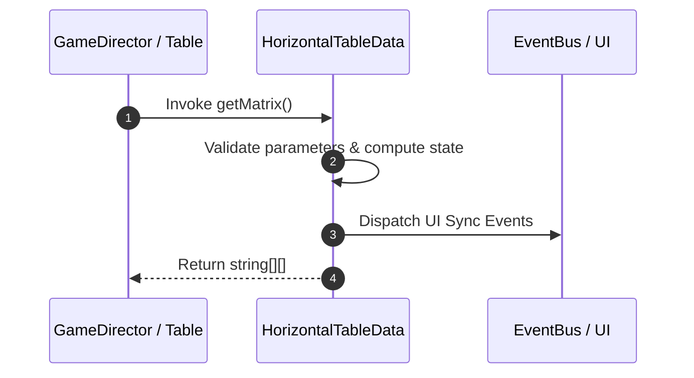

# 📖 `HorizontalTableData.getMatrix()`

<!-- convention-summary-start -->
### HorizontalTableData.getMatrix Line-by-Line Method Specification Summary

- **Core Architecture / Purpose**: Technical reference, API contract, and integration guide for HorizontalTableData.getMatrix Line-by-Line Method Specification.
- **Key Mechanisms & Design**: Encapsulates core algorithms, event hooks, and performance optimizations within the slot framework runtime.
- **Domain Capabilities**: cc_slot_mechanics, 05_methods
- **Scope & Code Paths**: `assets/cc-common/cc-slot-mechanics/HorizontalReel/scripts/HorizontalTableData.ts`
- **Related Docs**: [Master Index](../INDEX.md)
<!-- convention-summary-end -->


---

## 1. Method Signature & Overview

```typescript
public getMatrix(): string[][]
```

- **Declaring Class**: `HorizontalTableData` (`assets/cc-common/cc-slot-mechanics/HorizontalReel/scripts/HorizontalTableData.ts`)
- **Source Code Location**: Lines 22 to 30
- **Execution Complexity**: $O(1)$ fast synchronous calculation or controlled timer Promise.

---

## 2. Complete Source Code Implementation

```typescript
	getMatrix(): string[][] {
		let rawMatrix = this.getRawMatrix();
		if (!rawMatrix) {
			return [];
		}
		const horizontalSymbolIndexes = this.config.HORIZONTAL_SYMBOL_INDEXES;
		const horizontalMatrix = rawMatrix.filter((_symbolValue, symbolIndex) => horizontalSymbolIndexes.indexOf(symbolIndex) !== -1);
		return [[...horizontalMatrix]];
	}
```

---

## 3. Line-by-Line Code Breakdown

| Line # | Code Snippet | Technical Analysis & Engine Behavior |
| :---: | :--- | :--- |
| **22** | `getMatrix(): string[][] {` | Method entry signature declaring `getMatrix()` with return type `string[][]`. |
| **23** | `let rawMatrix = this.getRawMatrix();` | Local variable initialization allocating `rawMatrix`. |
| **24** | `if (!rawMatrix) {` | Conditional branch evaluation guarding edge cases or prerequisites. |
| **25** | `return [];` | Returns computed value / promise to caller. |
| **26** | `}` | Method exit boundary, closing block scope. |
| **27** | `const horizontalSymbolIndexes = this.config.HORIZONTAL_SYMBOL_INDEXES;` | Local variable initialization allocating `horizontalSymbolIndexes`. |
| **28** | `const horizontalMatrix = rawMatrix.filter((_symbolValue, symbolIndex) => horizontalSymbolIndexes.indexOf(symbolIndex) !== -1);` | Local variable initialization allocating `horizontalMatrix`. |
| **29** | `return [[...horizontalMatrix]];` | Returns computed value / promise to caller. |
| **30** | `}` | Method exit boundary, closing block scope. |

---

## 4. Data Flow & State Lifecycle



---

## 5. Production Gotchas & Edge Cases

1. **Null Guarding**: Always ensure caller passes non-null parameters or handles undefined fallbacks.
2. **Fast-Stop Safety**: If user triggers fast-stop during execution, ensure timers are cancelled cleanly via `unscheduleAllCallbacks()`.
