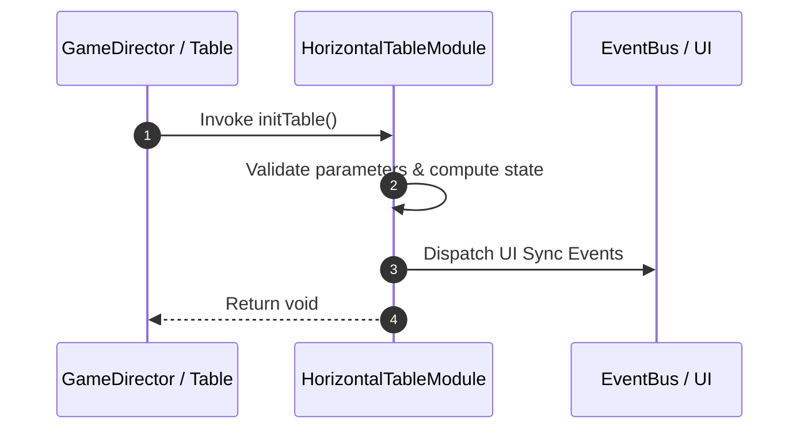

# 📖 `HorizontalTableModule.initTable()`

<!-- convention-summary-start -->
### HorizontalTableModule.initTable Line-by-Line Method Specification Summary

- **Core Architecture / Purpose**: Technical reference, API contract, and integration guide for HorizontalTableModule.initTable Line-by-Line Method Specification.
- **Key Mechanisms & Design**: Encapsulates core algorithms, event hooks, and performance optimizations within the slot framework runtime.
- **Domain Capabilities**: cc_slot_mechanics, 05_methods
- **Scope & Code Paths**: `assets/cc-common/cc-slot-mechanics/HorizontalReel/scripts/HorizontalTableModule.ts`
- **Related Docs**: [Master Index](../INDEX.md)
<!-- convention-summary-end -->


---

## 1. Method Signature & Overview

```typescript
public initTable(): void
```

- **Declaring Class**: `HorizontalTableModule` (`assets/cc-common/cc-slot-mechanics/HorizontalReel/scripts/HorizontalTableModule.ts`)
- **Source Code Location**: Lines 25 to 34
- **Execution Complexity**: $O(1)$ fast synchronous calculation or controlled timer Promise.

---

## 2. Complete Source Code Implementation

```typescript
	initTable(): void {
		const horizontalReel = instantiate(this.reelPrefab);
		horizontalReel.setPosition(0, 0);
		horizontalReel.setParent(this.table);

		const reelComponent = horizontalReel.getComponent(HorizontalReelModule);
		reelComponent.initReel({ reelIndex: 0, config: this.config, pool: this.symbolManager });
		this.reels.push(reelComponent);
		this.showBeautyMatrix();
	}
```

---

## 3. Line-by-Line Code Breakdown

| Line # | Code Snippet | Technical Analysis & Engine Behavior |
| :---: | :--- | :--- |
| **25** | `initTable(): void {` | Method entry signature declaring `initTable()` with return type `void`. |
| **26** | `const horizontalReel = instantiate(this.reelPrefab);` | Local variable initialization allocating `horizontalReel`. |
| **27** | `horizontalReel.setPosition(0, 0);` | Applies operational logic and state mutation. |
| **28** | `horizontalReel.setParent(this.table);` | Applies operational logic and state mutation. |
| **29** | `` | Applies operational logic and state mutation. |
| **30** | `const reelComponent = horizontalReel.getComponent(HorizontalReelModule);` | Local variable initialization allocating `reelComponent`. |
| **31** | `reelComponent.initReel({ reelIndex: 0, config: this.config, pool: this.symbolManager });` | Applies operational logic and state mutation. |
| **32** | `this.reels.push(reelComponent);` | Applies operational logic and state mutation. |
| **33** | `this.showBeautyMatrix();` | Applies operational logic and state mutation. |
| **34** | `}` | Method exit boundary, closing block scope. |

---

## 4. Data Flow & State Lifecycle



---

## 5. Production Gotchas & Edge Cases

1. **Null Guarding**: Always ensure caller passes non-null parameters or handles undefined fallbacks.
2. **Fast-Stop Safety**: If user triggers fast-stop during execution, ensure timers are cancelled cleanly via `unscheduleAllCallbacks()`.
