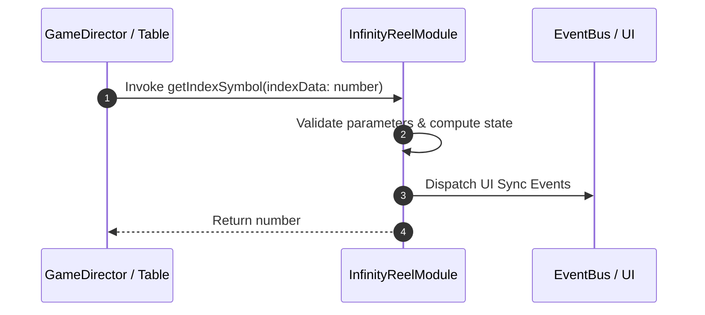

# 📖 `InfinityReelModule.getIndexSymbol()`

<!-- convention-summary-start -->
### InfinityReelModule.getIndexSymbol Line-by-Line Method Specification Summary

- **Core Architecture / Purpose**: Technical reference, API contract, and integration guide for InfinityReelModule.getIndexSymbol Line-by-Line Method Specification.
- **Key Mechanisms & Design**: Encapsulates core algorithms, event hooks, and performance optimizations within the slot framework runtime.
- **Domain Capabilities**: cc_slot_mechanics, 05_methods
- **Scope & Code Paths**: `assets/cc-common/cc-slot-mechanics/InfinityReel/scripts/InfinityReelModule.ts`
- **Related Docs**: [Master Index](../INDEX.md)
<!-- convention-summary-end -->


---

## 1. Method Signature & Overview

```typescript
public getIndexSymbol(indexData: number): number
```

- **Declaring Class**: `InfinityReelModule` (`assets/cc-common/cc-slot-mechanics/InfinityReel/scripts/InfinityReelModule.ts`)
- **Source Code Location**: Lines 62 to 77
- **Execution Complexity**: $O(1)$ fast synchronous calculation or controlled timer Promise.

---

## 2. Complete Source Code Implementation

```typescript
	getIndexSymbol(indexData: number): number {
		let symbolsIndex = [];
		if (this.reelIndex > this.DEFAULT_FORMAT.length - 1) {
			const totalRows = this.DEFAULT_FORMAT[0];
			symbolsIndex = this.config.SYMBOL_INDEXES[0].map(index => index + this.reelIndex * totalRows).reverse();
		} else {
			symbolsIndex = [...this.config.SYMBOL_INDEXES[this.reelIndex]].reverse();
		}

		const bufferTop = Array(this.config.BUFFER_TOP).fill(-1);
		const bufferBot = Array(this.config.BUFFER_BOT).fill(-1);
		symbolsIndex.push(...bufferTop);
		symbolsIndex.unshift(...bufferBot);

		return symbolsIndex[indexData];
	}
```

---

## 3. Line-by-Line Code Breakdown

| Line # | Code Snippet | Technical Analysis & Engine Behavior |
| :---: | :--- | :--- |
| **62** | `getIndexSymbol(indexData: number): number {` | Method entry signature declaring `getIndexSymbol(indexData: number)` with return type `number`. |
| **63** | `let symbolsIndex = [];` | Local variable initialization allocating `symbolsIndex`. |
| **64** | `if (this.reelIndex > this.DEFAULT_FORMAT.length - 1) {` | Conditional branch evaluation guarding edge cases or prerequisites. |
| **65** | `const totalRows = this.DEFAULT_FORMAT[0];` | Local variable initialization allocating `totalRows`. |
| **66** | `symbolsIndex = this.config.SYMBOL_INDEXES[0].map(index => index + this.reelIndex * totalRows).reverse();` | Applies operational logic and state mutation. |
| **67** | `} else {` | Applies operational logic and state mutation. |
| **68** | `symbolsIndex = [...this.config.SYMBOL_INDEXES[this.reelIndex]].reverse();` | Applies operational logic and state mutation. |
| **69** | `}` | Method exit boundary, closing block scope. |
| **70** | `` | Applies operational logic and state mutation. |
| **71** | `const bufferTop = Array(this.config.BUFFER_TOP).fill(-1);` | Local variable initialization allocating `bufferTop`. |
| **72** | `const bufferBot = Array(this.config.BUFFER_BOT).fill(-1);` | Local variable initialization allocating `bufferBot`. |
| **73** | `symbolsIndex.push(...bufferTop);` | Applies operational logic and state mutation. |
| **74** | `symbolsIndex.unshift(...bufferBot);` | Applies operational logic and state mutation. |
| **75** | `` | Applies operational logic and state mutation. |
| **76** | `return symbolsIndex[indexData];` | Returns computed value / promise to caller. |
| **77** | `}` | Method exit boundary, closing block scope. |

---

## 4. Data Flow & State Lifecycle



---

## 5. Production Gotchas & Edge Cases

1. **Null Guarding**: Always ensure caller passes non-null parameters or handles undefined fallbacks.
2. **Fast-Stop Safety**: If user triggers fast-stop during execution, ensure timers are cancelled cleanly via `unscheduleAllCallbacks()`.
