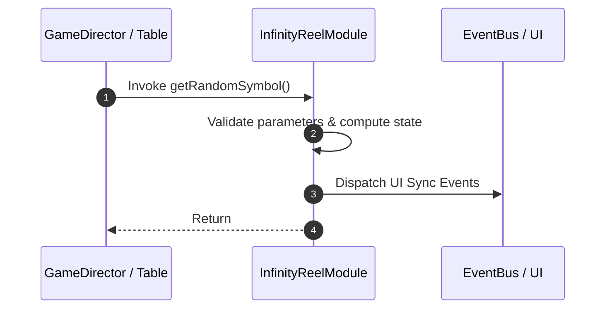

# 📖 `InfinityReelModule.getRandomSymbol()`

<!-- convention-summary-start -->
### InfinityReelModule.getRandomSymbol Line-by-Line Method Specification Summary

- **Core Architecture / Purpose**: Technical reference, API contract, and integration guide for InfinityReelModule.getRandomSymbol Line-by-Line Method Specification.
- **Key Mechanisms & Design**: Encapsulates core algorithms, event hooks, and performance optimizations within the slot framework runtime.
- **Domain Capabilities**: cc_slot_mechanics, 05_methods
- **Scope & Code Paths**: `assets/cc-common/cc-slot-mechanics/InfinityReel/scripts/InfinityReelModule.ts`
- **Related Docs**: [Master Index](../INDEX.md)
<!-- convention-summary-end -->


---

## 1. Method Signature & Overview

```typescript
public getRandomSymbol(): 
```

- **Declaring Class**: `InfinityReelModule` (`assets/cc-common/cc-slot-mechanics/InfinityReel/scripts/InfinityReelModule.ts`)
- **Source Code Location**: Lines 18 to 25
- **Execution Complexity**: $O(1)$ fast synchronous calculation or controlled timer Promise.

---

## 2. Complete Source Code Implementation

```typescript
	protected getRandomSymbol(): { symbolCode: string, symbolSize: cc.Vec2 } {
		const reelIndex: number = (this.reelIndex >= this.DEFAULT_FORMAT.length) ? 0 : this.reelIndex;
		const randomSymbols = this.RANDOM_SYMBOLS_CODE[reelIndex];
		const totalSymbols = randomSymbols.length;
		const randomCode = randomSymbols[Math.floor(Math.random() * totalSymbols)];
		const { symbolCode, symbolSize } = this.mapSymbolData(randomCode);
		return { symbolCode, symbolSize };
	}
```

---

## 3. Line-by-Line Code Breakdown

| Line # | Code Snippet | Technical Analysis & Engine Behavior |
| :---: | :--- | :--- |
| **18** | `protected getRandomSymbol(): { symbolCode: string, symbolSize: cc.Vec2 } {` | Method entry signature declaring `getRandomSymbol()` with return type ``. |
| **19** | `const reelIndex: number = (this.reelIndex >= this.DEFAULT_FORMAT.length) ? 0 : this.reelIndex;` | Local variable initialization allocating `reelIndex: number`. |
| **20** | `const randomSymbols = this.RANDOM_SYMBOLS_CODE[reelIndex];` | Local variable initialization allocating `randomSymbols`. |
| **21** | `const totalSymbols = randomSymbols.length;` | Local variable initialization allocating `totalSymbols`. |
| **22** | `const randomCode = randomSymbols[Math.floor(Math.random() * totalSymbols)];` | Local variable initialization allocating `randomCode`. |
| **23** | `const { symbolCode, symbolSize } = this.mapSymbolData(randomCode);` | Local variable initialization allocating `{ symbolCode, symbolSize }`. |
| **24** | `return { symbolCode, symbolSize };` | Returns computed value / promise to caller. |
| **25** | `}` | Method exit boundary, closing block scope. |

---

## 4. Data Flow & State Lifecycle



---

## 5. Production Gotchas & Edge Cases

1. **Null Guarding**: Always ensure caller passes non-null parameters or handles undefined fallbacks.
2. **Fast-Stop Safety**: If user triggers fast-stop during execution, ensure timers are cancelled cleanly via `unscheduleAllCallbacks()`.
