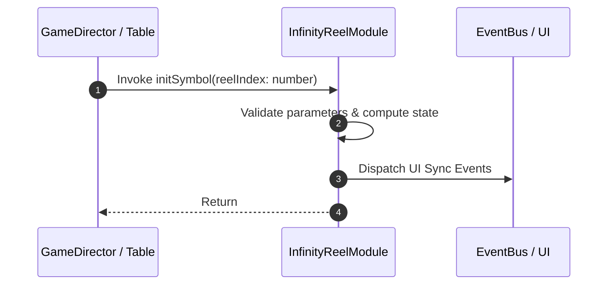

# 📖 `InfinityReelModule.initSymbol()`

<!-- convention-summary-start -->
### InfinityReelModule.initSymbol Line-by-Line Method Specification Summary

- **Core Architecture / Purpose**: Technical reference, API contract, and integration guide for InfinityReelModule.initSymbol Line-by-Line Method Specification.
- **Key Mechanisms & Design**: Encapsulates core algorithms, event hooks, and performance optimizations within the slot framework runtime.
- **Domain Capabilities**: cc_slot_mechanics, 05_methods
- **Scope & Code Paths**: `assets/cc-common/cc-slot-mechanics/InfinityReel/scripts/InfinityReelModule.ts`
- **Related Docs**: [Master Index](../INDEX.md)
<!-- convention-summary-end -->


---

## 1. Method Signature & Overview

```typescript
public initSymbol(reelIndex: number): 
```

- **Declaring Class**: `InfinityReelModule` (`assets/cc-common/cc-slot-mechanics/InfinityReel/scripts/InfinityReelModule.ts`)
- **Source Code Location**: Lines 10 to 16
- **Execution Complexity**: $O(1)$ fast synchronous calculation or controlled timer Promise.

---

## 2. Complete Source Code Implementation

```typescript
	protected initSymbol(reelIndex: number): { visibleSymbol: number, totalSymbol: number } {
		const index: number = (reelIndex >= this.DEFAULT_FORMAT.length) ? 0 : reelIndex;
		const visibleSymbol = this.DEFAULT_FORMAT[index];
		const totalSymbol = visibleSymbol + this.config.BUFFER_TOP + this.config.BUFFER_BOT;

		return { visibleSymbol, totalSymbol };
	}
```

---

## 3. Line-by-Line Code Breakdown

| Line # | Code Snippet | Technical Analysis & Engine Behavior |
| :---: | :--- | :--- |
| **10** | `protected initSymbol(reelIndex: number): { visibleSymbol: number, totalSymbol: number } {` | Method entry signature declaring `initSymbol(reelIndex: number)` with return type ``. |
| **11** | `const index: number = (reelIndex >= this.DEFAULT_FORMAT.length) ? 0 : reelIndex;` | Local variable initialization allocating `index: number`. |
| **12** | `const visibleSymbol = this.DEFAULT_FORMAT[index];` | Local variable initialization allocating `visibleSymbol`. |
| **13** | `const totalSymbol = visibleSymbol + this.config.BUFFER_TOP + this.config.BUFFER_BOT;` | Local variable initialization allocating `totalSymbol`. |
| **14** | `` | Applies operational logic and state mutation. |
| **15** | `return { visibleSymbol, totalSymbol };` | Returns computed value / promise to caller. |
| **16** | `}` | Method exit boundary, closing block scope. |

---

## 4. Data Flow & State Lifecycle



---

## 5. Production Gotchas & Edge Cases

1. **Null Guarding**: Always ensure caller passes non-null parameters or handles undefined fallbacks.
2. **Fast-Stop Safety**: If user triggers fast-stop during execution, ensure timers are cancelled cleanly via `unscheduleAllCallbacks()`.
