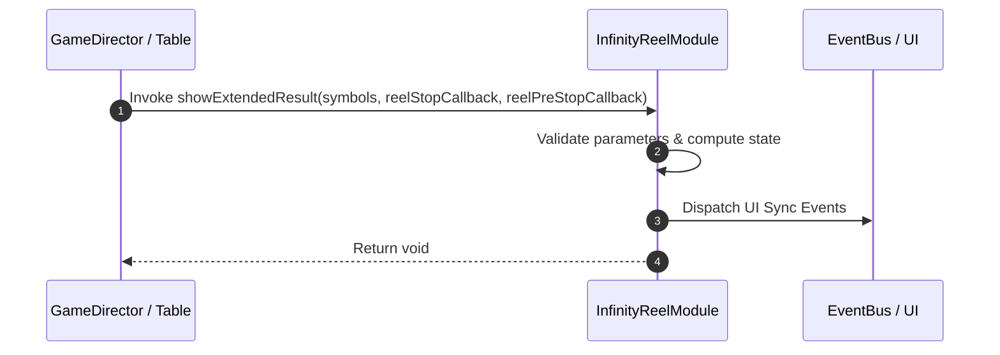

# 📖 `InfinityReelModule.showExtendedResult()`

<!-- convention-summary-start -->
### InfinityReelModule.showExtendedResult Line-by-Line Method Specification Summary

- **Core Architecture / Purpose**: Technical reference, API contract, and integration guide for InfinityReelModule.showExtendedResult Line-by-Line Method Specification.
- **Key Mechanisms & Design**: Encapsulates core algorithms, event hooks, and performance optimizations within the slot framework runtime.
- **Domain Capabilities**: cc_slot_mechanics, 05_methods
- **Scope & Code Paths**: `assets/cc-common/cc-slot-mechanics/InfinityReel/scripts/InfinityReelModule.ts`
- **Related Docs**: [Master Index](../INDEX.md)
<!-- convention-summary-end -->


---

## 1. Method Signature & Overview

```typescript
public showExtendedResult(symbols, reelStopCallback, reelPreStopCallback): void
```

- **Declaring Class**: `InfinityReelModule` (`assets/cc-common/cc-slot-mechanics/InfinityReel/scripts/InfinityReelModule.ts`)
- **Source Code Location**: Lines 54 to 60
- **Execution Complexity**: $O(1)$ fast synchronous calculation or controlled timer Promise.

---

## 2. Complete Source Code Implementation

```typescript
	showExtendedResult(symbols, reelStopCallback, reelPreStopCallback): void {
		this.resultSymbols = [];
		this.updateReelResult(symbols);
		this.setUpExtendedCallback();
		this.reelStopCB = reelStopCallback;
		this.reelPreStopCB = reelPreStopCallback;
	}
```

---

## 3. Line-by-Line Code Breakdown

| Line # | Code Snippet | Technical Analysis & Engine Behavior |
| :---: | :--- | :--- |
| **54** | `showExtendedResult(symbols, reelStopCallback, reelPreStopCallback): void {` | Method entry signature declaring `showExtendedResult(symbols, reelStopCallback, reelPreStopCallback)` with return type `void`. |
| **55** | `this.resultSymbols = [];` | Applies operational logic and state mutation. |
| **56** | `this.updateReelResult(symbols);` | Applies operational logic and state mutation. |
| **57** | `this.setUpExtendedCallback();` | Applies operational logic and state mutation. |
| **58** | `this.reelStopCB = reelStopCallback;` | Applies operational logic and state mutation. |
| **59** | `this.reelPreStopCB = reelPreStopCallback;` | Applies operational logic and state mutation. |
| **60** | `}` | Method exit boundary, closing block scope. |

---

## 4. Data Flow & State Lifecycle



---

## 5. Production Gotchas & Edge Cases

1. **Null Guarding**: Always ensure caller passes non-null parameters or handles undefined fallbacks.
2. **Fast-Stop Safety**: If user triggers fast-stop during execution, ensure timers are cancelled cleanly via `unscheduleAllCallbacks()`.
