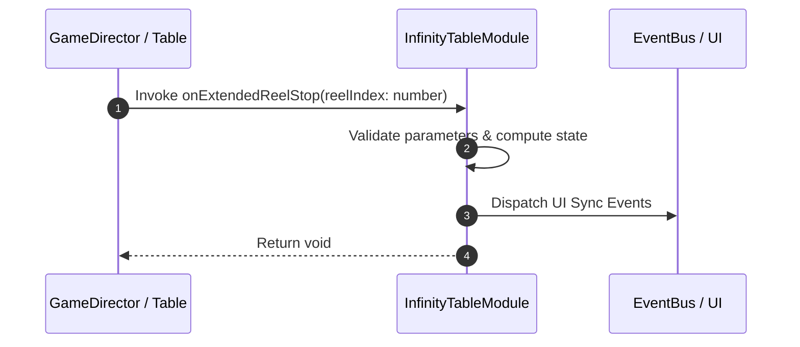

# 📖 `InfinityTableModule.onExtendedReelStop()`

<!-- convention-summary-start -->
### InfinityTableModule.onExtendedReelStop Line-by-Line Method Specification Summary

- **Core Architecture / Purpose**: Technical reference, API contract, and integration guide for InfinityTableModule.onExtendedReelStop Line-by-Line Method Specification.
- **Key Mechanisms & Design**: Encapsulates core algorithms, event hooks, and performance optimizations within the slot framework runtime.
- **Domain Capabilities**: cc_slot_mechanics, 05_methods
- **Scope & Code Paths**: `assets/cc-common/cc-slot-mechanics/InfinityReel/scripts/InfinityTableModule.ts`
- **Related Docs**: [Master Index](../INDEX.md)
<!-- convention-summary-end -->


---

## 1. Method Signature & Overview

```typescript
public onExtendedReelStop(reelIndex: number): void
```

- **Declaring Class**: `InfinityTableModule` (`assets/cc-common/cc-slot-mechanics/InfinityReel/scripts/InfinityTableModule.ts`)
- **Source Code Location**: Lines 169 to 176
- **Execution Complexity**: $O(1)$ fast synchronous calculation or controlled timer Promise.

---

## 2. Complete Source Code Implementation

```typescript
	protected onExtendedReelStop(reelIndex: number): void {
		this.onReelStopExtend(reelIndex);
		if (this.moduleEvent) {
			this.moduleEvent.emit(TableModuleEvents.REEL_STOPPED, this.reelCount, this.extendedReels[this.currentReelExtended - 1].getResultSymbols());
		}
		this.reelCount++;
        this.onChangeState(TableSpinState.STOPPED);
	}
```

---

## 3. Line-by-Line Code Breakdown

| Line # | Code Snippet | Technical Analysis & Engine Behavior |
| :---: | :--- | :--- |
| **169** | `protected onExtendedReelStop(reelIndex: number): void {` | Method entry signature declaring `onExtendedReelStop(reelIndex: number)` with return type `void`. |
| **170** | `this.onReelStopExtend(reelIndex);` | Applies operational logic and state mutation. |
| **171** | `if (this.moduleEvent) {` | Conditional branch evaluation guarding edge cases or prerequisites. |
| **172** | `this.moduleEvent.emit(TableModuleEvents.REEL_STOPPED, this.reelCount, this.extendedReels[this.currentReelExtended - 1].getResultSymbols());` | Dispatches event to subscribers on the event bus. |
| **173** | `}` | Method exit boundary, closing block scope. |
| **174** | `this.reelCount++;` | Applies operational logic and state mutation. |
| **175** | `this.onChangeState(TableSpinState.STOPPED);` | Applies operational logic and state mutation. |
| **176** | `}` | Method exit boundary, closing block scope. |

---

## 4. Data Flow & State Lifecycle



---

## 5. Production Gotchas & Edge Cases

1. **Null Guarding**: Always ensure caller passes non-null parameters or handles undefined fallbacks.
2. **Fast-Stop Safety**: If user triggers fast-stop during execution, ensure timers are cancelled cleanly via `unscheduleAllCallbacks()`.
