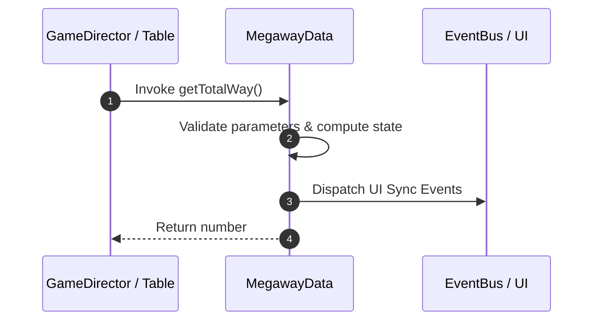

# 📖 `MegawayData.getTotalWay()`

<!-- convention-summary-start -->
### MegawayData.getTotalWay Line-by-Line Method Specification Summary

- **Core Architecture / Purpose**: Technical reference, API contract, and integration guide for MegawayData.getTotalWay Line-by-Line Method Specification.
- **Key Mechanisms & Design**: Encapsulates core algorithms, event hooks, and performance optimizations within the slot framework runtime.
- **Domain Capabilities**: cc_slot_mechanics, 05_methods
- **Scope & Code Paths**: `assets/cc-common/cc-slot-mechanics/Megaway/scripts/MegawayData.ts`
- **Related Docs**: [Master Index](../INDEX.md)
<!-- convention-summary-end -->


---

## 1. Method Signature & Overview

```typescript
public getTotalWay(): number
```

- **Declaring Class**: `MegawayData` (`assets/cc-common/cc-slot-mechanics/Megaway/scripts/MegawayData.ts`)
- **Source Code Location**: Lines 46 to 55
- **Execution Complexity**: $O(1)$ fast synchronous calculation or controlled timer Promise.

---

## 2. Complete Source Code Implementation

```typescript
	getTotalWay(): number {
		const tableFormat = this._tableFormat.length > 0 ? this._tableFormat : this._config.TABLE_FORMAT;
		let totalWay = 1;

		for (let i = 0; i < tableFormat.length; i++) {
			totalWay *= tableFormat[i];
		}

		return totalWay;
	}
```

---

## 3. Line-by-Line Code Breakdown

| Line # | Code Snippet | Technical Analysis & Engine Behavior |
| :---: | :--- | :--- |
| **46** | `getTotalWay(): number {` | Method entry signature declaring `getTotalWay()` with return type `number`. |
| **47** | `const tableFormat = this._tableFormat.length > 0 ? this._tableFormat : this._config.TABLE_FORMAT;` | Local variable initialization allocating `tableFormat`. |
| **48** | `let totalWay = 1;` | Local variable initialization allocating `totalWay`. |
| **49** | `` | Applies operational logic and state mutation. |
| **50** | `for (let i = 0; i < tableFormat.length; i++) {` | Iterates over collection elements. |
| **51** | `totalWay *= tableFormat[i];` | Applies operational logic and state mutation. |
| **52** | `}` | Method exit boundary, closing block scope. |
| **53** | `` | Applies operational logic and state mutation. |
| **54** | `return totalWay;` | Returns computed value / promise to caller. |
| **55** | `}` | Method exit boundary, closing block scope. |

---

## 4. Data Flow & State Lifecycle



---

## 5. Production Gotchas & Edge Cases

1. **Null Guarding**: Always ensure caller passes non-null parameters or handles undefined fallbacks.
2. **Fast-Stop Safety**: If user triggers fast-stop during execution, ensure timers are cancelled cleanly via `unscheduleAllCallbacks()`.
