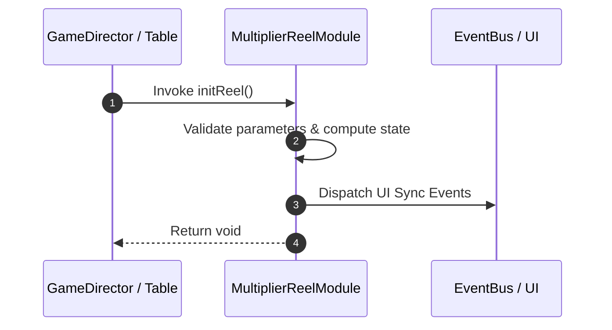

# 📖 `MultiplierReelModule.initReel()`

<!-- convention-summary-start -->
### MultiplierReelModule.initReel Line-by-Line Method Specification Summary

- **Core Architecture / Purpose**: Technical reference, API contract, and integration guide for MultiplierReelModule.initReel Line-by-Line Method Specification.
- **Key Mechanisms & Design**: Encapsulates core algorithms, event hooks, and performance optimizations within the slot framework runtime.
- **Domain Capabilities**: cc_slot_mechanics, 05_methods
- **Scope & Code Paths**: `assets/cc-common/cc-slot-mechanics/MultiplierReel/scripts/MultiplierReelModule.ts`
- **Related Docs**: [Master Index](../INDEX.md)
<!-- convention-summary-end -->


---

## 1. Method Signature & Overview

```typescript
public initReel(): void
```

- **Declaring Class**: `MultiplierReelModule` (`assets/cc-common/cc-slot-mechanics/MultiplierReel/scripts/MultiplierReelModule.ts`)
- **Source Code Location**: Lines 43 to 50
- **Execution Complexity**: $O(1)$ fast synchronous calculation or controlled timer Promise.

---

## 2. Complete Source Code Implementation

```typescript
	initReel(): void {
		for (let i = 0; i < this._config.TOTAL_MULTIPLIER_REEL; i++) {
			const reel = instantiate(this.prefabMultiplierReel);
			reel.setPosition(this._config.MULTIPLIER_REEL_POSITION[i] || Vec2.ZERO);
			this.node.addChild(reel);
			this._multiplierReels.push(reel);
		}
	}
```

---

## 3. Line-by-Line Code Breakdown

| Line # | Code Snippet | Technical Analysis & Engine Behavior |
| :---: | :--- | :--- |
| **43** | `initReel(): void {` | Method entry signature declaring `initReel()` with return type `void`. |
| **44** | `for (let i = 0; i < this._config.TOTAL_MULTIPLIER_REEL; i++) {` | Iterates over collection elements. |
| **45** | `const reel = instantiate(this.prefabMultiplierReel);` | Local variable initialization allocating `reel`. |
| **46** | `reel.setPosition(this._config.MULTIPLIER_REEL_POSITION[i] \|\| Vec2.ZERO);` | Applies operational logic and state mutation. |
| **47** | `this.node.addChild(reel);` | Applies operational logic and state mutation. |
| **48** | `this._multiplierReels.push(reel);` | Applies operational logic and state mutation. |
| **49** | `}` | Method exit boundary, closing block scope. |
| **50** | `}` | Method exit boundary, closing block scope. |

---

## 4. Data Flow & State Lifecycle



---

## 5. Production Gotchas & Edge Cases

1. **Null Guarding**: Always ensure caller passes non-null parameters or handles undefined fallbacks.
2. **Fast-Stop Safety**: If user triggers fast-stop during execution, ensure timers are cancelled cleanly via `unscheduleAllCallbacks()`.
