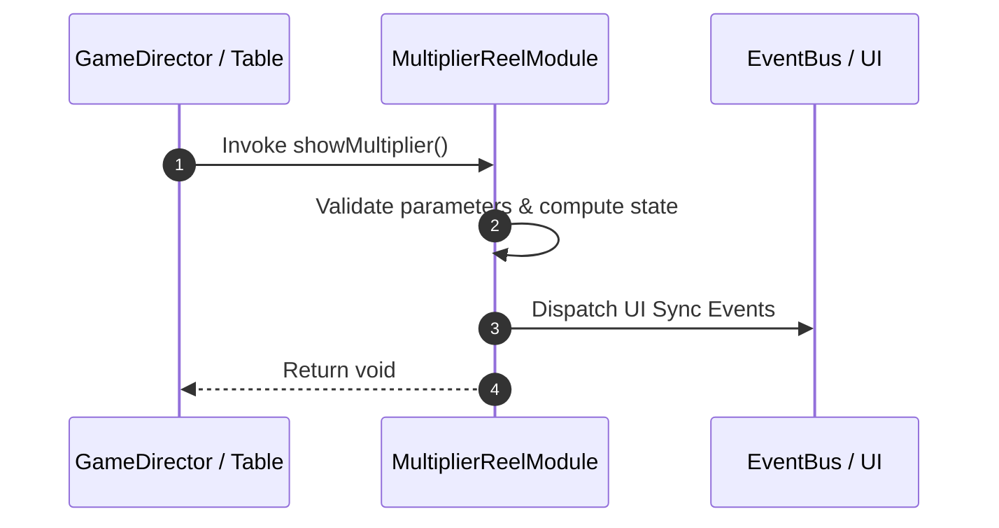

# 📖 `MultiplierReelModule.showMultiplier()`

<!-- convention-summary-start -->
### MultiplierReelModule.showMultiplier Line-by-Line Method Specification Summary

- **Core Architecture / Purpose**: Technical reference, API contract, and integration guide for MultiplierReelModule.showMultiplier Line-by-Line Method Specification.
- **Key Mechanisms & Design**: Encapsulates core algorithms, event hooks, and performance optimizations within the slot framework runtime.
- **Domain Capabilities**: cc_slot_mechanics, 05_methods
- **Scope & Code Paths**: `assets/cc-common/cc-slot-mechanics/MultiplierReel/scripts/MultiplierReelModule.ts`
- **Related Docs**: [Master Index](../INDEX.md)
<!-- convention-summary-end -->


---

## 1. Method Signature & Overview

```typescript
public showMultiplier(): void
```

- **Declaring Class**: `MultiplierReelModule` (`assets/cc-common/cc-slot-mechanics/MultiplierReel/scripts/MultiplierReelModule.ts`)
- **Source Code Location**: Lines 29 to 35
- **Execution Complexity**: $O(1)$ fast synchronous calculation or controlled timer Promise.

---

## 2. Complete Source Code Implementation

```typescript
	showMultiplier(): void {
		const prefix = this._config.MULTIPLIER_PREFIX;
		this._multiplierReels.forEach((reel, index) => {
			const multiplier = this._data.getMultiplierReel(index);
			reel.emit("SHOW_MULTIPLIER", multiplier, prefix);
		});
	}
```

---

## 3. Line-by-Line Code Breakdown

| Line # | Code Snippet | Technical Analysis & Engine Behavior |
| :---: | :--- | :--- |
| **29** | `showMultiplier(): void {` | Method entry signature declaring `showMultiplier()` with return type `void`. |
| **30** | `const prefix = this._config.MULTIPLIER_PREFIX;` | Local variable initialization allocating `prefix`. |
| **31** | `this._multiplierReels.forEach((reel, index) => {` | Applies operational logic and state mutation. |
| **32** | `const multiplier = this._data.getMultiplierReel(index);` | Local variable initialization allocating `multiplier`. |
| **33** | `reel.emit("SHOW_MULTIPLIER", multiplier, prefix);` | Dispatches event to subscribers on the event bus. |
| **34** | `});` | Applies operational logic and state mutation. |
| **35** | `}` | Method exit boundary, closing block scope. |

---

## 4. Data Flow & State Lifecycle



---

## 5. Production Gotchas & Edge Cases

1. **Null Guarding**: Always ensure caller passes non-null parameters or handles undefined fallbacks.
2. **Fast-Stop Safety**: If user triggers fast-stop during execution, ensure timers are cancelled cleanly via `unscheduleAllCallbacks()`.
