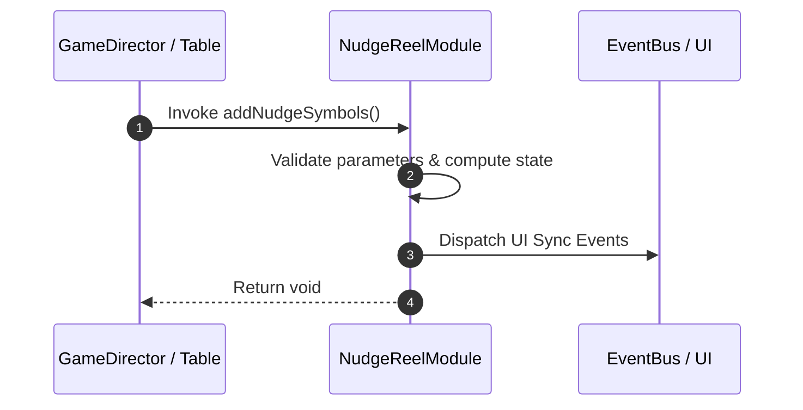

# 📖 `NudgeReelModule.addNudgeSymbols()`

<!-- convention-summary-start -->
### NudgeReelModule.addNudgeSymbols Line-by-Line Method Specification Summary

- **Core Architecture / Purpose**: Technical reference, API contract, and integration guide for NudgeReelModule.addNudgeSymbols Line-by-Line Method Specification.
- **Key Mechanisms & Design**: Encapsulates core algorithms, event hooks, and performance optimizations within the slot framework runtime.
- **Domain Capabilities**: cc_slot_mechanics, 05_methods
- **Scope & Code Paths**: `assets/cc-common/cc-slot-mechanics/NudgeReel/scripts/NudgeReelModule.ts`
- **Related Docs**: [Master Index](../INDEX.md)
<!-- convention-summary-end -->


---

## 1. Method Signature & Overview

```typescript
public addNudgeSymbols(): void
```

- **Declaring Class**: `NudgeReelModule` (`assets/cc-common/cc-slot-mechanics/NudgeReel/scripts/NudgeReelModule.ts`)
- **Source Code Location**: Lines 134 to 150
- **Execution Complexity**: $O(1)$ fast synchronous calculation or controlled timer Promise.

---

## 2. Complete Source Code Implementation

```typescript
	protected addNudgeSymbols(): void {
		let offsetY = 0;

		//update buffer symbol to nudge symbol
		//direction is UP -> index = 0 (top) in list symbols
		//direction is DOWN -> index = length - 1 (bottom) in list symbols
		const bufferIndex = (this._direction == NudgeDirection.NUDGE_UP) ? this.listSymbols.length - 1 : 0;
		const bufferSymbol = this.changeBufferSymbol(bufferIndex);
		offsetY = bufferSymbol.position.y;

		// add remain nudge symbols
		this.addRemainNudgeSymbols(offsetY);

		// add buffer symbol
		offsetY = offsetY + (this._totalNudgeStep - 1) * this._direction * this.SYMBOL_HEIGHT;
		this.addBufferSymbol(offsetY);
	}
```

---

## 3. Line-by-Line Code Breakdown

| Line # | Code Snippet | Technical Analysis & Engine Behavior |
| :---: | :--- | :--- |
| **134** | `protected addNudgeSymbols(): void {` | Method entry signature declaring `addNudgeSymbols()` with return type `void`. |
| **135** | `let offsetY = 0;` | Local variable initialization allocating `offsetY`. |
| **136** | `` | Applies operational logic and state mutation. |
| **137** | `//update buffer symbol to nudge symbol` | Applies operational logic and state mutation. |
| **138** | `//direction is UP -> index = 0 (top) in list symbols` | Applies operational logic and state mutation. |
| **139** | `//direction is DOWN -> index = length - 1 (bottom) in list symbols` | Applies operational logic and state mutation. |
| **140** | `const bufferIndex = (this._direction == NudgeDirection.NUDGE_UP) ? this.listSymbols.length - 1 : 0;` | Local variable initialization allocating `bufferIndex`. |
| **141** | `const bufferSymbol = this.changeBufferSymbol(bufferIndex);` | Local variable initialization allocating `bufferSymbol`. |
| **142** | `offsetY = bufferSymbol.position.y;` | Applies operational logic and state mutation. |
| **143** | `` | Applies operational logic and state mutation. |
| **144** | `// add remain nudge symbols` | Applies operational logic and state mutation. |
| **145** | `this.addRemainNudgeSymbols(offsetY);` | Applies operational logic and state mutation. |
| **146** | `` | Applies operational logic and state mutation. |
| **147** | `// add buffer symbol` | Applies operational logic and state mutation. |
| **148** | `offsetY = offsetY + (this._totalNudgeStep - 1) * this._direction * this.SYMBOL_HEIGHT;` | Applies operational logic and state mutation. |
| **149** | `this.addBufferSymbol(offsetY);` | Applies operational logic and state mutation. |
| **150** | `}` | Method exit boundary, closing block scope. |

---

## 4. Data Flow & State Lifecycle



---

## 5. Production Gotchas & Edge Cases

1. **Null Guarding**: Always ensure caller passes non-null parameters or handles undefined fallbacks.
2. **Fast-Stop Safety**: If user triggers fast-stop during execution, ensure timers are cancelled cleanly via `unscheduleAllCallbacks()`.
