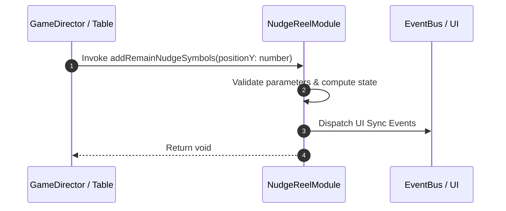

# 📖 `NudgeReelModule.addRemainNudgeSymbols()`

<!-- convention-summary-start -->
### NudgeReelModule.addRemainNudgeSymbols Line-by-Line Method Specification Summary

- **Core Architecture / Purpose**: Technical reference, API contract, and integration guide for NudgeReelModule.addRemainNudgeSymbols Line-by-Line Method Specification.
- **Key Mechanisms & Design**: Encapsulates core algorithms, event hooks, and performance optimizations within the slot framework runtime.
- **Domain Capabilities**: cc_slot_mechanics, 05_methods
- **Scope & Code Paths**: `assets/cc-common/cc-slot-mechanics/NudgeReel/scripts/NudgeReelModule.ts`
- **Related Docs**: [Master Index](../INDEX.md)
<!-- convention-summary-end -->


---

## 1. Method Signature & Overview

```typescript
public addRemainNudgeSymbols(positionY: number): void
```

- **Declaring Class**: `NudgeReelModule` (`assets/cc-common/cc-slot-mechanics/NudgeReel/scripts/NudgeReelModule.ts`)
- **Source Code Location**: Lines 158 to 166
- **Execution Complexity**: $O(1)$ fast synchronous calculation or controlled timer Promise.

---

## 2. Complete Source Code Implementation

```typescript
	protected addRemainNudgeSymbols(positionY: number): void {
		let offsetY = positionY;
		for (let i = 0; i < this._totalNudgeStep; i++) {
			const symbol = this.spawnNudgeSymbol(SYMBOL_NUDGE, SYMBOL_NUDGE_SIZE);
			SlotSymbolModule.getModuleComponent(symbol).setIndex(SymbolIndexType.UNUSED);
			symbol.setPosition(new Vec2(symbol.position.x, offsetY));
			offsetY = offsetY + this._direction * this.SYMBOL_HEIGHT;
		}
	}
```

---

## 3. Line-by-Line Code Breakdown

| Line # | Code Snippet | Technical Analysis & Engine Behavior |
| :---: | :--- | :--- |
| **158** | `protected addRemainNudgeSymbols(positionY: number): void {` | Method entry signature declaring `addRemainNudgeSymbols(positionY: number)` with return type `void`. |
| **159** | `let offsetY = positionY;` | Local variable initialization allocating `offsetY`. |
| **160** | `for (let i = 0; i < this._totalNudgeStep; i++) {` | Iterates over collection elements. |
| **161** | `const symbol = this.spawnNudgeSymbol(SYMBOL_NUDGE, SYMBOL_NUDGE_SIZE);` | Local variable initialization allocating `symbol`. |
| **162** | `SlotSymbolModule.getModuleComponent(symbol).setIndex(SymbolIndexType.UNUSED);` | Applies operational logic and state mutation. |
| **163** | `symbol.setPosition(new Vec2(symbol.position.x, offsetY));` | Applies operational logic and state mutation. |
| **164** | `offsetY = offsetY + this._direction * this.SYMBOL_HEIGHT;` | Applies operational logic and state mutation. |
| **165** | `}` | Method exit boundary, closing block scope. |
| **166** | `}` | Method exit boundary, closing block scope. |

---

## 4. Data Flow & State Lifecycle



---

## 5. Production Gotchas & Edge Cases

1. **Null Guarding**: Always ensure caller passes non-null parameters or handles undefined fallbacks.
2. **Fast-Stop Safety**: If user triggers fast-stop during execution, ensure timers are cancelled cleanly via `unscheduleAllCallbacks()`.
