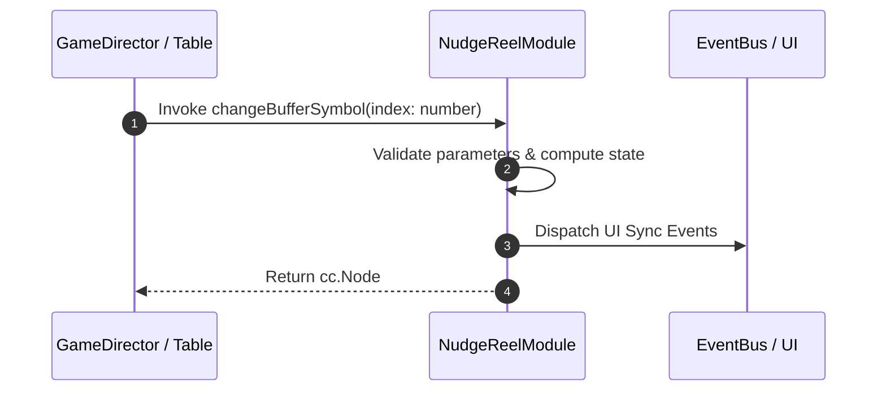

# 📖 `NudgeReelModule.changeBufferSymbol()`

<!-- convention-summary-start -->
### NudgeReelModule.changeBufferSymbol Line-by-Line Method Specification Summary

- **Core Architecture / Purpose**: Technical reference, API contract, and integration guide for NudgeReelModule.changeBufferSymbol Line-by-Line Method Specification.
- **Key Mechanisms & Design**: Encapsulates core algorithms, event hooks, and performance optimizations within the slot framework runtime.
- **Domain Capabilities**: cc_slot_mechanics, 05_methods
- **Scope & Code Paths**: `assets/cc-common/cc-slot-mechanics/NudgeReel/scripts/NudgeReelModule.ts`
- **Related Docs**: [Master Index](../INDEX.md)
<!-- convention-summary-end -->


---

## 1. Method Signature & Overview

```typescript
public changeBufferSymbol(index: number): cc.Node
```

- **Declaring Class**: `NudgeReelModule` (`assets/cc-common/cc-slot-mechanics/NudgeReel/scripts/NudgeReelModule.ts`)
- **Source Code Location**: Lines 152 to 156
- **Execution Complexity**: $O(1)$ fast synchronous calculation or controlled timer Promise.

---

## 2. Complete Source Code Implementation

```typescript
	protected changeBufferSymbol(index: number): cc.Node {
		const symbol = this.listSymbols[index];
		SlotSymbolModule.getModuleComponent(symbol).changeToSymbol(SYMBOL_NUDGE);
		return symbol;
	}
```

---

## 3. Line-by-Line Code Breakdown

| Line # | Code Snippet | Technical Analysis & Engine Behavior |
| :---: | :--- | :--- |
| **152** | `protected changeBufferSymbol(index: number): cc.Node {` | Method entry signature declaring `changeBufferSymbol(index: number)` with return type `cc.Node`. |
| **153** | `const symbol = this.listSymbols[index];` | Local variable initialization allocating `symbol`. |
| **154** | `SlotSymbolModule.getModuleComponent(symbol).changeToSymbol(SYMBOL_NUDGE);` | Applies operational logic and state mutation. |
| **155** | `return symbol;` | Returns computed value / promise to caller. |
| **156** | `}` | Method exit boundary, closing block scope. |

---

## 4. Data Flow & State Lifecycle



---

## 5. Production Gotchas & Edge Cases

1. **Null Guarding**: Always ensure caller passes non-null parameters or handles undefined fallbacks.
2. **Fast-Stop Safety**: If user triggers fast-stop during execution, ensure timers are cancelled cleanly via `unscheduleAllCallbacks()`.
