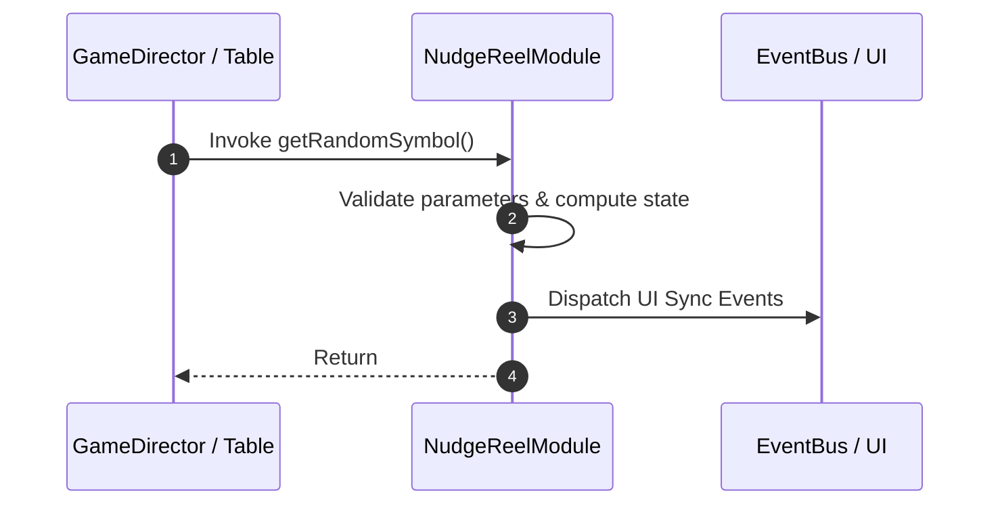

# 📖 `NudgeReelModule.getRandomSymbol()`

<!-- convention-summary-start -->
### NudgeReelModule.getRandomSymbol Line-by-Line Method Specification Summary

- **Core Architecture / Purpose**: Technical reference, API contract, and integration guide for NudgeReelModule.getRandomSymbol Line-by-Line Method Specification.
- **Key Mechanisms & Design**: Encapsulates core algorithms, event hooks, and performance optimizations within the slot framework runtime.
- **Domain Capabilities**: cc_slot_mechanics, 05_methods
- **Scope & Code Paths**: `assets/cc-common/cc-slot-mechanics/NudgeReel/scripts/NudgeReelModule.ts`
- **Related Docs**: [Master Index](../INDEX.md)
<!-- convention-summary-end -->


---

## 1. Method Signature & Overview

```typescript
public getRandomSymbol(): 
```

- **Declaring Class**: `NudgeReelModule` (`assets/cc-common/cc-slot-mechanics/NudgeReel/scripts/NudgeReelModule.ts`)
- **Source Code Location**: Lines 116 to 132
- **Execution Complexity**: $O(1)$ fast synchronous calculation or controlled timer Promise.

---

## 2. Complete Source Code Implementation

```typescript
	protected getRandomSymbol(): { symbolCode: string, symbolSize: cc.Vec2 } {
		// check if this reel has nudge and nudge direction is UP
		// random NUDGE symbol at the bottom for preparing nudge up
		if (this._totalNudgeStep > 0 && this._direction == NudgeDirection.NUDGE_UP) {
			const minStep = this.reelManager.totalSymbol - 1;
			const maxStep = minStep + this._totalNudgeStep - 1;
			if (this.reelManager.step >= minStep && this.reelManager.step <= maxStep) {
				return { symbolCode: SYMBOL_NUDGE, symbolSize: this.config.DEFAULT_SIZE};
			}
		}

		const randomSymbols = this.RANDOM_SYMBOLS_CODE[this.reelIndex];
		const totalSymbols = randomSymbols.length;
		const randomCode = randomSymbols[Math.floor(Math.random() * totalSymbols)];
		const { symbolCode, symbolSize } = this.mapSymbolData(randomCode);
		return { symbolCode, symbolSize };
	}
```

---

## 3. Line-by-Line Code Breakdown

| Line # | Code Snippet | Technical Analysis & Engine Behavior |
| :---: | :--- | :--- |
| **116** | `protected getRandomSymbol(): { symbolCode: string, symbolSize: cc.Vec2 } {` | Method entry signature declaring `getRandomSymbol()` with return type ``. |
| **117** | `// check if this reel has nudge and nudge direction is UP` | Applies operational logic and state mutation. |
| **118** | `// random NUDGE symbol at the bottom for preparing nudge up` | Applies operational logic and state mutation. |
| **119** | `if (this._totalNudgeStep > 0 && this._direction == NudgeDirection.NUDGE_UP) {` | Conditional branch evaluation guarding edge cases or prerequisites. |
| **120** | `const minStep = this.reelManager.totalSymbol - 1;` | Local variable initialization allocating `minStep`. |
| **121** | `const maxStep = minStep + this._totalNudgeStep - 1;` | Local variable initialization allocating `maxStep`. |
| **122** | `if (this.reelManager.step >= minStep && this.reelManager.step <= maxStep) {` | Conditional branch evaluation guarding edge cases or prerequisites. |
| **123** | `return { symbolCode: SYMBOL_NUDGE, symbolSize: this.config.DEFAULT_SIZE};` | Returns computed value / promise to caller. |
| **124** | `}` | Method exit boundary, closing block scope. |
| **125** | `}` | Method exit boundary, closing block scope. |
| **126** | `` | Applies operational logic and state mutation. |
| **127** | `const randomSymbols = this.RANDOM_SYMBOLS_CODE[this.reelIndex];` | Local variable initialization allocating `randomSymbols`. |
| **128** | `const totalSymbols = randomSymbols.length;` | Local variable initialization allocating `totalSymbols`. |
| **129** | `const randomCode = randomSymbols[Math.floor(Math.random() * totalSymbols)];` | Local variable initialization allocating `randomCode`. |
| **130** | `const { symbolCode, symbolSize } = this.mapSymbolData(randomCode);` | Local variable initialization allocating `{ symbolCode, symbolSize }`. |
| **131** | `return { symbolCode, symbolSize };` | Returns computed value / promise to caller. |
| **132** | `}` | Method exit boundary, closing block scope. |

---

## 4. Data Flow & State Lifecycle



---

## 5. Production Gotchas & Edge Cases

1. **Null Guarding**: Always ensure caller passes non-null parameters or handles undefined fallbacks.
2. **Fast-Stop Safety**: If user triggers fast-stop during execution, ensure timers are cancelled cleanly via `unscheduleAllCallbacks()`.
