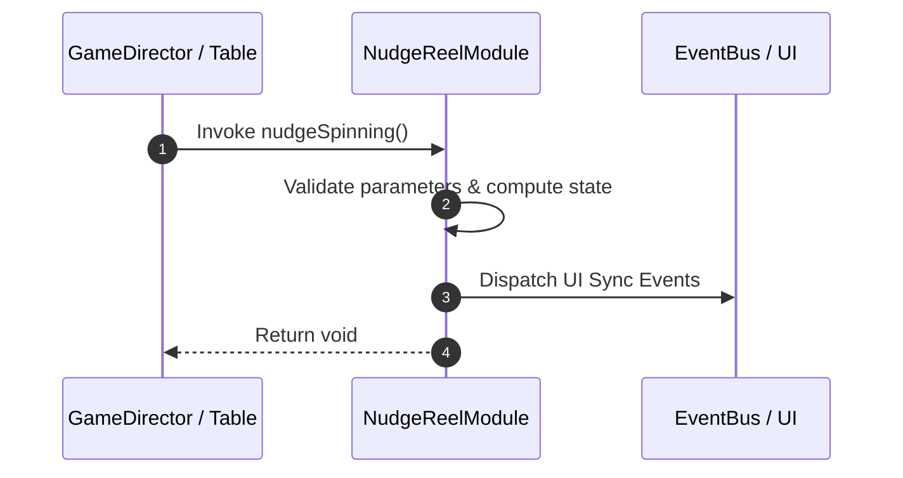

# 📖 `NudgeReelModule.nudgeSpinning()`

<!-- convention-summary-start -->
### NudgeReelModule.nudgeSpinning Line-by-Line Method Specification Summary

- **Core Architecture / Purpose**: Technical reference, API contract, and integration guide for NudgeReelModule.nudgeSpinning Line-by-Line Method Specification.
- **Key Mechanisms & Design**: Encapsulates core algorithms, event hooks, and performance optimizations within the slot framework runtime.
- **Domain Capabilities**: cc_slot_mechanics, 05_methods
- **Scope & Code Paths**: `assets/cc-common/cc-slot-mechanics/NudgeReel/scripts/NudgeReelModule.ts`
- **Related Docs**: [Master Index](../INDEX.md)
<!-- convention-summary-end -->


---

## 1. Method Signature & Overview

```typescript
public nudgeSpinning(): void
```

- **Declaring Class**: `NudgeReelModule` (`assets/cc-common/cc-slot-mechanics/NudgeReel/scripts/NudgeReelModule.ts`)
- **Source Code Location**: Lines 54 to 70
- **Execution Complexity**: $O(1)$ fast synchronous calculation or controlled timer Promise.

---

## 2. Complete Source Code Implementation

```typescript
	protected nudgeSpinning(): void {
		if (this._nudgeStep <= 0) {
			this.resetNudgeReel();
			this.updateIndexSymbols();
			return;
		}

		const newPosition: cc.Vec2 = new Vec2(0, -this.SYMBOL_HEIGHT * this._direction);
		this.tween = tween(this.node)
			.by(NUDGE_SPEED, { position: newPosition })
			.call(() => {
				this.tween = null;
				this.recycleNudgeSymbol();
				this.nudgeSpinning();
			})
			.start();   
	}
```

---

## 3. Line-by-Line Code Breakdown

| Line # | Code Snippet | Technical Analysis & Engine Behavior |
| :---: | :--- | :--- |
| **54** | `protected nudgeSpinning(): void {` | Method entry signature declaring `nudgeSpinning()` with return type `void`. |
| **55** | `if (this._nudgeStep <= 0) {` | Conditional branch evaluation guarding edge cases or prerequisites. |
| **56** | `this.resetNudgeReel();` | Applies operational logic and state mutation. |
| **57** | `this.updateIndexSymbols();` | Applies operational logic and state mutation. |
| **58** | `return;` | Applies operational logic and state mutation. |
| **59** | `}` | Method exit boundary, closing block scope. |
| **60** | `` | Applies operational logic and state mutation. |
| **61** | `const newPosition: cc.Vec2 = new Vec2(0, -this.SYMBOL_HEIGHT * this._direction);` | Local variable initialization allocating `newPosition: cc.Vec2`. |
| **62** | `this.tween = tween(this.node)` | Applies operational logic and state mutation. |
| **63** | `.by(NUDGE_SPEED, { position: newPosition })` | Applies operational logic and state mutation. |
| **64** | `.call(() => {` | Applies operational logic and state mutation. |
| **65** | `this.tween = null;` | Applies operational logic and state mutation. |
| **66** | `this.recycleNudgeSymbol();` | Applies operational logic and state mutation. |
| **67** | `this.nudgeSpinning();` | Applies operational logic and state mutation. |
| **68** | `})` | Applies operational logic and state mutation. |
| **69** | `.start();` | Applies operational logic and state mutation. |
| **70** | `}` | Method exit boundary, closing block scope. |

---

## 4. Data Flow & State Lifecycle



---

## 5. Production Gotchas & Edge Cases

1. **Null Guarding**: Always ensure caller passes non-null parameters or handles undefined fallbacks.
2. **Fast-Stop Safety**: If user triggers fast-stop during execution, ensure timers are cancelled cleanly via `unscheduleAllCallbacks()`.
