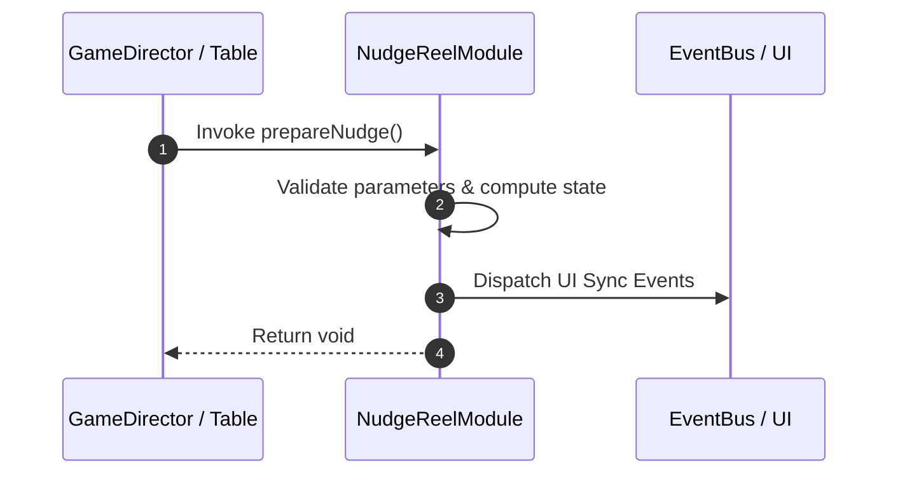

# 📖 `NudgeReelModule.prepareNudge()`

<!-- convention-summary-start -->
### NudgeReelModule.prepareNudge Line-by-Line Method Specification Summary

- **Core Architecture / Purpose**: Technical reference, API contract, and integration guide for NudgeReelModule.prepareNudge Line-by-Line Method Specification.
- **Key Mechanisms & Design**: Encapsulates core algorithms, event hooks, and performance optimizations within the slot framework runtime.
- **Domain Capabilities**: cc_slot_mechanics, 05_methods
- **Scope & Code Paths**: `assets/cc-common/cc-slot-mechanics/NudgeReel/scripts/NudgeReelModule.ts`
- **Related Docs**: [Master Index](../INDEX.md)
<!-- convention-summary-end -->


---

## 1. Method Signature & Overview

```typescript
public prepareNudge(): void
```

- **Declaring Class**: `NudgeReelModule` (`assets/cc-common/cc-slot-mechanics/NudgeReel/scripts/NudgeReelModule.ts`)
- **Source Code Location**: Lines 32 to 45
- **Execution Complexity**: $O(1)$ fast synchronous calculation or controlled timer Promise.

---

## 2. Complete Source Code Implementation

```typescript
	prepareNudge(): void {
		const currentPosition = this.node.position.clone();
		const newPosition: cc.Vec2 = new Vec2(0, 30 * this._direction);
		this.tween = tween(this.node)
			.delay(0.4)
			.by(this.currentMode.speed, { position: newPosition })
			.delay(0.2)
			.to(this.currentMode.speed, { position: currentPosition })
			.call(() => {
				this.tween = null;
				this.startNudge();
			})
			.start();
	}
```

---

## 3. Line-by-Line Code Breakdown

| Line # | Code Snippet | Technical Analysis & Engine Behavior |
| :---: | :--- | :--- |
| **32** | `prepareNudge(): void {` | Method entry signature declaring `prepareNudge()` with return type `void`. |
| **33** | `const currentPosition = this.node.position.clone();` | Local variable initialization allocating `currentPosition`. |
| **34** | `const newPosition: cc.Vec2 = new Vec2(0, 30 * this._direction);` | Local variable initialization allocating `newPosition: cc.Vec2`. |
| **35** | `this.tween = tween(this.node)` | Applies operational logic and state mutation. |
| **36** | `.delay(0.4)` | Applies operational logic and state mutation. |
| **37** | `.by(this.currentMode.speed, { position: newPosition })` | Applies operational logic and state mutation. |
| **38** | `.delay(0.2)` | Applies operational logic and state mutation. |
| **39** | `.to(this.currentMode.speed, { position: currentPosition })` | Applies operational logic and state mutation. |
| **40** | `.call(() => {` | Applies operational logic and state mutation. |
| **41** | `this.tween = null;` | Applies operational logic and state mutation. |
| **42** | `this.startNudge();` | Applies operational logic and state mutation. |
| **43** | `})` | Applies operational logic and state mutation. |
| **44** | `.start();` | Applies operational logic and state mutation. |
| **45** | `}` | Method exit boundary, closing block scope. |

---

## 4. Data Flow & State Lifecycle



---

## 5. Production Gotchas & Edge Cases

1. **Null Guarding**: Always ensure caller passes non-null parameters or handles undefined fallbacks.
2. **Fast-Stop Safety**: If user triggers fast-stop during execution, ensure timers are cancelled cleanly via `unscheduleAllCallbacks()`.
