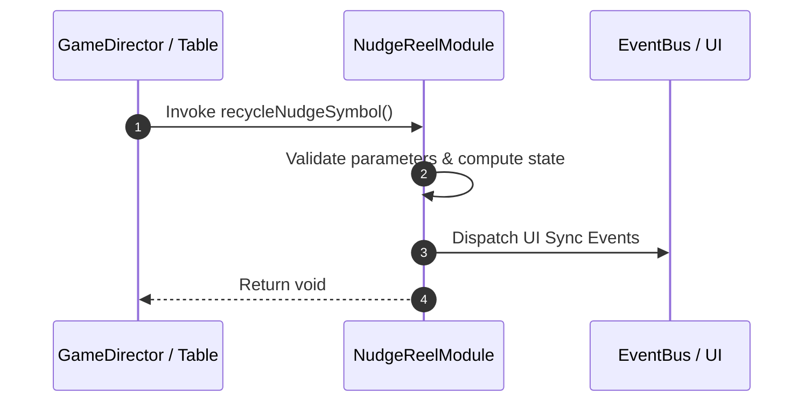

# 📖 `NudgeReelModule.recycleNudgeSymbol()`

<!-- convention-summary-start -->
### NudgeReelModule.recycleNudgeSymbol Line-by-Line Method Specification Summary

- **Core Architecture / Purpose**: Technical reference, API contract, and integration guide for NudgeReelModule.recycleNudgeSymbol Line-by-Line Method Specification.
- **Key Mechanisms & Design**: Encapsulates core algorithms, event hooks, and performance optimizations within the slot framework runtime.
- **Domain Capabilities**: cc_slot_mechanics, 05_methods
- **Scope & Code Paths**: `assets/cc-common/cc-slot-mechanics/NudgeReel/scripts/NudgeReelModule.ts`
- **Related Docs**: [Master Index](../INDEX.md)
<!-- convention-summary-end -->


---

## 1. Method Signature & Overview

```typescript
public recycleNudgeSymbol(): void
```

- **Declaring Class**: `NudgeReelModule` (`assets/cc-common/cc-slot-mechanics/NudgeReel/scripts/NudgeReelModule.ts`)
- **Source Code Location**: Lines 72 to 94
- **Execution Complexity**: $O(1)$ fast synchronous calculation or controlled timer Promise.

---

## 2. Complete Source Code Implementation

```typescript
	protected recycleNudgeSymbol(): void {
		if (!this.listSymbols.length) {
			return;
		}

		const length = this.listSymbols.length;
		const bufferIndex = (this._direction == NudgeDirection.NUDGE_DOWN) ? length - 1 : 0;
		const symbol = this.listSymbols[bufferIndex];
		const comp = SlotSymbolModule.getModuleComponent(symbol);

		if (!comp.getSize().equals(this.DEFAULT_SIZE) && comp.sizeCount > 1) {
			comp.sizeCount--;
		} else {
			this.symbolManager.removeSymbol(symbol);
			if (this._direction == NudgeDirection.NUDGE_UP) {
				this.listSymbols.shift();
			} else {
				this.listSymbols.pop();
			}
		}

		this._nudgeStep--;
	}
```

---

## 3. Line-by-Line Code Breakdown

| Line # | Code Snippet | Technical Analysis & Engine Behavior |
| :---: | :--- | :--- |
| **72** | `protected recycleNudgeSymbol(): void {` | Method entry signature declaring `recycleNudgeSymbol()` with return type `void`. |
| **73** | `if (!this.listSymbols.length) {` | Conditional branch evaluation guarding edge cases or prerequisites. |
| **74** | `return;` | Applies operational logic and state mutation. |
| **75** | `}` | Method exit boundary, closing block scope. |
| **76** | `` | Applies operational logic and state mutation. |
| **77** | `const length = this.listSymbols.length;` | Local variable initialization allocating `length`. |
| **78** | `const bufferIndex = (this._direction == NudgeDirection.NUDGE_DOWN) ? length - 1 : 0;` | Local variable initialization allocating `bufferIndex`. |
| **79** | `const symbol = this.listSymbols[bufferIndex];` | Local variable initialization allocating `symbol`. |
| **80** | `const comp = SlotSymbolModule.getModuleComponent(symbol);` | Local variable initialization allocating `comp`. |
| **81** | `` | Applies operational logic and state mutation. |
| **82** | `if (!comp.getSize().equals(this.DEFAULT_SIZE) && comp.sizeCount > 1) {` | Conditional branch evaluation guarding edge cases or prerequisites. |
| **83** | `comp.sizeCount--;` | Applies operational logic and state mutation. |
| **84** | `} else {` | Applies operational logic and state mutation. |
| **85** | `this.symbolManager.removeSymbol(symbol);` | Applies operational logic and state mutation. |
| **86** | `if (this._direction == NudgeDirection.NUDGE_UP) {` | Conditional branch evaluation guarding edge cases or prerequisites. |
| **87** | `this.listSymbols.shift();` | Applies operational logic and state mutation. |
| **88** | `} else {` | Applies operational logic and state mutation. |
| **89** | `this.listSymbols.pop();` | Applies operational logic and state mutation. |
| **90** | `}` | Method exit boundary, closing block scope. |
| **91** | `}` | Method exit boundary, closing block scope. |
| **92** | `` | Applies operational logic and state mutation. |
| **93** | `this._nudgeStep--;` | Applies operational logic and state mutation. |
| **94** | `}` | Method exit boundary, closing block scope. |

---

## 4. Data Flow & State Lifecycle



---

## 5. Production Gotchas & Edge Cases

1. **Null Guarding**: Always ensure caller passes non-null parameters or handles undefined fallbacks.
2. **Fast-Stop Safety**: If user triggers fast-stop during execution, ensure timers are cancelled cleanly via `unscheduleAllCallbacks()`.
