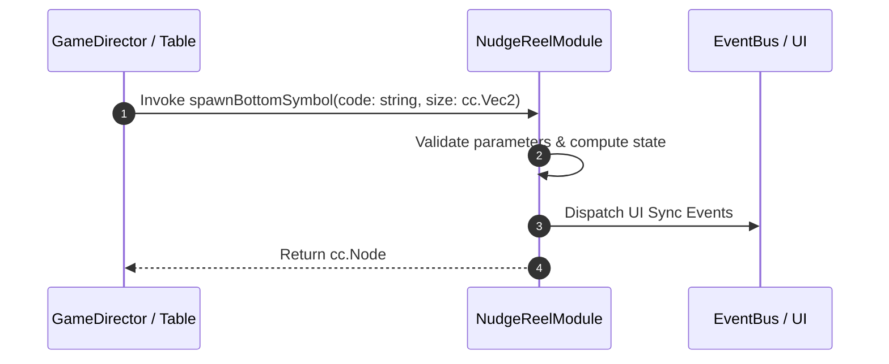

# 📖 `NudgeReelModule.spawnBottomSymbol()`

<!-- convention-summary-start -->
### NudgeReelModule.spawnBottomSymbol Line-by-Line Method Specification Summary

- **Core Architecture / Purpose**: Technical reference, API contract, and integration guide for NudgeReelModule.spawnBottomSymbol Line-by-Line Method Specification.
- **Key Mechanisms & Design**: Encapsulates core algorithms, event hooks, and performance optimizations within the slot framework runtime.
- **Domain Capabilities**: cc_slot_mechanics, 05_methods
- **Scope & Code Paths**: `assets/cc-common/cc-slot-mechanics/NudgeReel/scripts/NudgeReelModule.ts`
- **Related Docs**: [Master Index](../INDEX.md)
<!-- convention-summary-end -->


---

## 1. Method Signature & Overview

```typescript
public spawnBottomSymbol(code: string, size: cc.Vec2): cc.Node
```

- **Declaring Class**: `NudgeReelModule` (`assets/cc-common/cc-slot-mechanics/NudgeReel/scripts/NudgeReelModule.ts`)
- **Source Code Location**: Lines 104 to 114
- **Execution Complexity**: $O(1)$ fast synchronous calculation or controlled timer Promise.

---

## 2. Complete Source Code Implementation

```typescript
	protected spawnBottomSymbol(code: string, size: cc.Vec2): cc.Node {
		const offsetX = size.x > this.DEFAULT_SIZE.x ? (size.x / 2 - 0.5) * this.SYMBOL_WIDTH : 0;
		const offsetY = size.y * this.SYMBOL_HEIGHT;
		const topY = this.originalPosition.y + Math.abs(this.node.position.y) - this.reelManager.showSymbol * this.SYMBOL_HEIGHT;

		const symbol = this.symbolManager.createSymbol(code, size, this.node, SymbolOwnerType.REEL_SYMBOL);
		symbol.setPosition(offsetX, topY - offsetY);

		this.listSymbols.push(symbol);
		return symbol;
	}
```

---

## 3. Line-by-Line Code Breakdown

| Line # | Code Snippet | Technical Analysis & Engine Behavior |
| :---: | :--- | :--- |
| **104** | `protected spawnBottomSymbol(code: string, size: cc.Vec2): cc.Node {` | Method entry signature declaring `spawnBottomSymbol(code: string, size: cc.Vec2)` with return type `cc.Node`. |
| **105** | `const offsetX = size.x > this.DEFAULT_SIZE.x ? (size.x / 2 - 0.5) * this.SYMBOL_WIDTH : 0;` | Local variable initialization allocating `offsetX`. |
| **106** | `const offsetY = size.y * this.SYMBOL_HEIGHT;` | Local variable initialization allocating `offsetY`. |
| **107** | `const topY = this.originalPosition.y + Math.abs(this.node.position.y) - this.reelManager.showSymbol * this.SYMBOL_HEIGHT;` | Local variable initialization allocating `topY`. |
| **108** | `` | Applies operational logic and state mutation. |
| **109** | `const symbol = this.symbolManager.createSymbol(code, size, this.node, SymbolOwnerType.REEL_SYMBOL);` | Local variable initialization allocating `symbol`. |
| **110** | `symbol.setPosition(offsetX, topY - offsetY);` | Applies operational logic and state mutation. |
| **111** | `` | Applies operational logic and state mutation. |
| **112** | `this.listSymbols.push(symbol);` | Applies operational logic and state mutation. |
| **113** | `return symbol;` | Returns computed value / promise to caller. |
| **114** | `}` | Method exit boundary, closing block scope. |

---

## 4. Data Flow & State Lifecycle



---

## 5. Production Gotchas & Edge Cases

1. **Null Guarding**: Always ensure caller passes non-null parameters or handles undefined fallbacks.
2. **Fast-Stop Safety**: If user triggers fast-stop during execution, ensure timers are cancelled cleanly via `unscheduleAllCallbacks()`.
