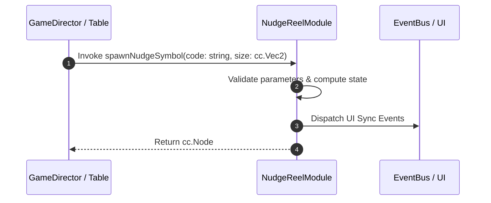

# 📖 `NudgeReelModule.spawnNudgeSymbol()`

<!-- convention-summary-start -->
### NudgeReelModule.spawnNudgeSymbol Line-by-Line Method Specification Summary

- **Core Architecture / Purpose**: Technical reference, API contract, and integration guide for NudgeReelModule.spawnNudgeSymbol Line-by-Line Method Specification.
- **Key Mechanisms & Design**: Encapsulates core algorithms, event hooks, and performance optimizations within the slot framework runtime.
- **Domain Capabilities**: cc_slot_mechanics, 05_methods
- **Scope & Code Paths**: `assets/cc-common/cc-slot-mechanics/NudgeReel/scripts/NudgeReelModule.ts`
- **Related Docs**: [Master Index](../INDEX.md)
<!-- convention-summary-end -->


---

## 1. Method Signature & Overview

```typescript
public spawnNudgeSymbol(code: string, size: cc.Vec2): cc.Node
```

- **Declaring Class**: `NudgeReelModule` (`assets/cc-common/cc-slot-mechanics/NudgeReel/scripts/NudgeReelModule.ts`)
- **Source Code Location**: Lines 96 to 102
- **Execution Complexity**: $O(1)$ fast synchronous calculation or controlled timer Promise.

---

## 2. Complete Source Code Implementation

```typescript
	protected spawnNudgeSymbol(code: string, size: cc.Vec2): cc.Node {
		if (this._direction == NudgeDirection.NUDGE_UP) {
			return this.spawnBottomSymbol(code, size);
		} else {
			return super.spawnSymbol(code, size);
		}
	}
```

---

## 3. Line-by-Line Code Breakdown

| Line # | Code Snippet | Technical Analysis & Engine Behavior |
| :---: | :--- | :--- |
| **96** | `protected spawnNudgeSymbol(code: string, size: cc.Vec2): cc.Node {` | Method entry signature declaring `spawnNudgeSymbol(code: string, size: cc.Vec2)` with return type `cc.Node`. |
| **97** | `if (this._direction == NudgeDirection.NUDGE_UP) {` | Conditional branch evaluation guarding edge cases or prerequisites. |
| **98** | `return this.spawnBottomSymbol(code, size);` | Returns computed value / promise to caller. |
| **99** | `} else {` | Applies operational logic and state mutation. |
| **100** | `return super.spawnSymbol(code, size);` | Returns computed value / promise to caller. |
| **101** | `}` | Method exit boundary, closing block scope. |
| **102** | `}` | Method exit boundary, closing block scope. |

---

## 4. Data Flow & State Lifecycle



---

## 5. Production Gotchas & Edge Cases

1. **Null Guarding**: Always ensure caller passes non-null parameters or handles undefined fallbacks.
2. **Fast-Stop Safety**: If user triggers fast-stop during execution, ensure timers are cancelled cleanly via `unscheduleAllCallbacks()`.
