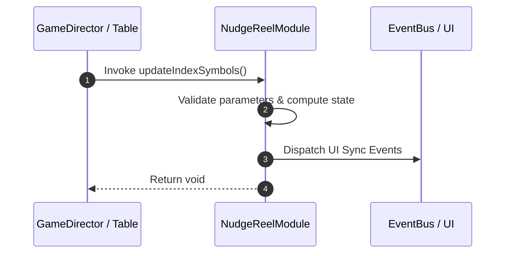

# 📖 `NudgeReelModule.updateIndexSymbols()`

<!-- convention-summary-start -->
### NudgeReelModule.updateIndexSymbols Line-by-Line Method Specification Summary

- **Core Architecture / Purpose**: Technical reference, API contract, and integration guide for NudgeReelModule.updateIndexSymbols Line-by-Line Method Specification.
- **Key Mechanisms & Design**: Encapsulates core algorithms, event hooks, and performance optimizations within the slot framework runtime.
- **Domain Capabilities**: cc_slot_mechanics, 05_methods
- **Scope & Code Paths**: `assets/cc-common/cc-slot-mechanics/NudgeReel/scripts/NudgeReelModule.ts`
- **Related Docs**: [Master Index](../INDEX.md)
<!-- convention-summary-end -->


---

## 1. Method Signature & Overview

```typescript
public updateIndexSymbols(): void
```

- **Declaring Class**: `NudgeReelModule` (`assets/cc-common/cc-slot-mechanics/NudgeReel/scripts/NudgeReelModule.ts`)
- **Source Code Location**: Lines 174 to 186
- **Execution Complexity**: $O(1)$ fast synchronous calculation or controlled timer Promise.

---

## 2. Complete Source Code Implementation

```typescript
	protected updateIndexSymbols(): void {
		this.resultSymbols = [];
        
		const startIndex = this.config.BUFFER_TOP;
		const endIndex = this.reelManager.totalSymbol - this.config.BUFFER_BOT;
		const symbolsIndex = [...this.config.SYMBOL_INDEXES[this.reelIndex]].reverse();
		let index = 0;
		for (let i = endIndex - 1; i >= startIndex; i--) {
			const symbol = this.listSymbols[i];
			SlotSymbolModule.getModuleComponent(symbol).setIndex(symbolsIndex[index++]);
			this.resultSymbols.push(symbol);
		}
	}
```

---

## 3. Line-by-Line Code Breakdown

| Line # | Code Snippet | Technical Analysis & Engine Behavior |
| :---: | :--- | :--- |
| **174** | `protected updateIndexSymbols(): void {` | Method entry signature declaring `updateIndexSymbols()` with return type `void`. |
| **175** | `this.resultSymbols = [];` | Applies operational logic and state mutation. |
| **176** | `` | Applies operational logic and state mutation. |
| **177** | `const startIndex = this.config.BUFFER_TOP;` | Local variable initialization allocating `startIndex`. |
| **178** | `const endIndex = this.reelManager.totalSymbol - this.config.BUFFER_BOT;` | Local variable initialization allocating `endIndex`. |
| **179** | `const symbolsIndex = [...this.config.SYMBOL_INDEXES[this.reelIndex]].reverse();` | Local variable initialization allocating `symbolsIndex`. |
| **180** | `let index = 0;` | Local variable initialization allocating `index`. |
| **181** | `for (let i = endIndex - 1; i >= startIndex; i--) {` | Iterates over collection elements. |
| **182** | `const symbol = this.listSymbols[i];` | Local variable initialization allocating `symbol`. |
| **183** | `SlotSymbolModule.getModuleComponent(symbol).setIndex(symbolsIndex[index++]);` | Applies operational logic and state mutation. |
| **184** | `this.resultSymbols.push(symbol);` | Applies operational logic and state mutation. |
| **185** | `}` | Method exit boundary, closing block scope. |
| **186** | `}` | Method exit boundary, closing block scope. |

---

## 4. Data Flow & State Lifecycle



---

## 5. Production Gotchas & Edge Cases

1. **Null Guarding**: Always ensure caller passes non-null parameters or handles undefined fallbacks.
2. **Fast-Stop Safety**: If user triggers fast-stop during execution, ensure timers are cancelled cleanly via `unscheduleAllCallbacks()`.
