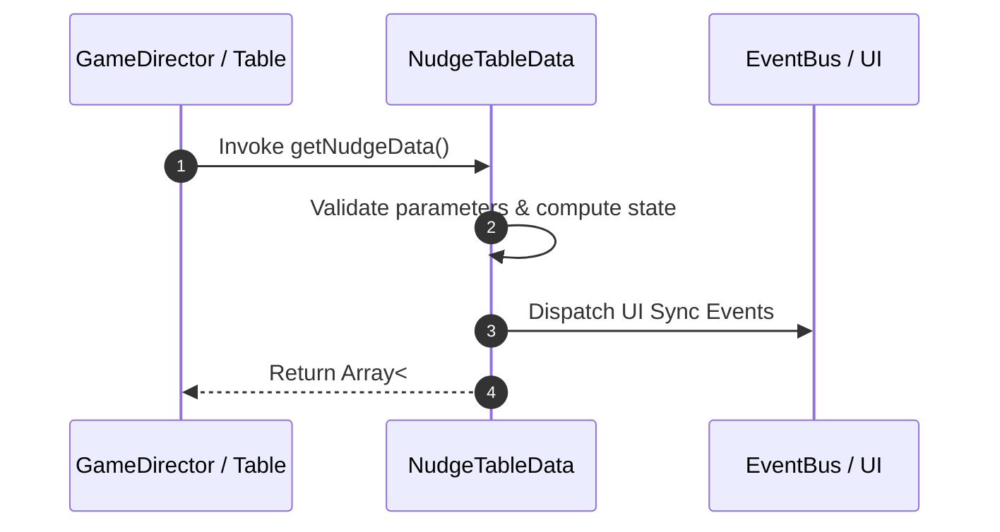

# 📖 `NudgeTableData.getNudgeData()`

<!-- convention-summary-start -->
### NudgeTableData.getNudgeData Line-by-Line Method Specification Summary

- **Core Architecture / Purpose**: Technical reference, API contract, and integration guide for NudgeTableData.getNudgeData Line-by-Line Method Specification.
- **Key Mechanisms & Design**: Encapsulates core algorithms, event hooks, and performance optimizations within the slot framework runtime.
- **Domain Capabilities**: cc_slot_mechanics, 05_methods
- **Scope & Code Paths**: `assets/cc-common/cc-slot-mechanics/NudgeReel/scripts/NudgeTableData.ts`
- **Related Docs**: [Master Index](../INDEX.md)
<!-- convention-summary-end -->


---

## 1. Method Signature & Overview

```typescript
public getNudgeData(): Array<
```

- **Declaring Class**: `NudgeTableData` (`assets/cc-common/cc-slot-mechanics/NudgeReel/scripts/NudgeTableData.ts`)
- **Source Code Location**: Lines 18 to 27
- **Execution Complexity**: $O(1)$ fast synchronous calculation or controlled timer Promise.

---

## 2. Complete Source Code Implementation

```typescript
	getNudgeData(): Array<{ index: number, step: number, direction: number }> {
		let data = [];
		const nudges = this["nud"];
		for (let i = 0; i < nudges.length; i++) {
			const nudgeData = nudges[i].split(':').map(Number);
			const step = nudgeData[1];
			data.push({ index: nudgeData[0], step: Math.abs(step), direction: nudgeData[2]});
		}
		return data;
	}
```

---

## 3. Line-by-Line Code Breakdown

| Line # | Code Snippet | Technical Analysis & Engine Behavior |
| :---: | :--- | :--- |
| **18** | `getNudgeData(): Array<{ index: number, step: number, direction: number }> {` | Method entry signature declaring `getNudgeData()` with return type `Array<`. |
| **19** | `let data = [];` | Local variable initialization allocating `data`. |
| **20** | `const nudges = this["nud"];` | Local variable initialization allocating `nudges`. |
| **21** | `for (let i = 0; i < nudges.length; i++) {` | Iterates over collection elements. |
| **22** | `const nudgeData = nudges[i].split(':').map(Number);` | Local variable initialization allocating `nudgeData`. |
| **23** | `const step = nudgeData[1];` | Local variable initialization allocating `step`. |
| **24** | `data.push({ index: nudgeData[0], step: Math.abs(step), direction: nudgeData[2]});` | Applies operational logic and state mutation. |
| **25** | `}` | Method exit boundary, closing block scope. |
| **26** | `return data;` | Returns computed value / promise to caller. |
| **27** | `}` | Method exit boundary, closing block scope. |

---

## 4. Data Flow & State Lifecycle



---

## 5. Production Gotchas & Edge Cases

1. **Null Guarding**: Always ensure caller passes non-null parameters or handles undefined fallbacks.
2. **Fast-Stop Safety**: If user triggers fast-stop during execution, ensure timers are cancelled cleanly via `unscheduleAllCallbacks()`.
