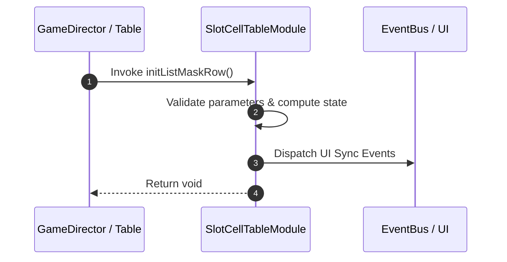

# 📖 `SlotCellTableModule.initListMaskRow()`

<!-- convention-summary-start -->
### SlotCellTableModule.initListMaskRow Line-by-Line Method Specification Summary

- **Core Architecture / Purpose**: Technical reference, API contract, and integration guide for SlotCellTableModule.initListMaskRow Line-by-Line Method Specification.
- **Key Mechanisms & Design**: Encapsulates core algorithms, event hooks, and performance optimizations within the slot framework runtime.
- **Domain Capabilities**: cc_slot_mechanics, 05_methods
- **Scope & Code Paths**: `assets/cc-common/cc-slot-mechanics/SlotCellTable/scripts/SlotCellTableModule.ts`
- **Related Docs**: [Master Index](../INDEX.md)
<!-- convention-summary-end -->


---

## 1. Method Signature & Overview

```typescript
public initListMaskRow(): void
```

- **Declaring Class**: `SlotCellTableModule` (`assets/cc-common/cc-slot-mechanics/SlotCellTable/scripts/SlotCellTableModule.ts`)
- **Source Code Location**: Lines 128 to 145
- **Execution Complexity**: $O(1)$ fast synchronous calculation or controlled timer Promise.

---

## 2. Complete Source Code Implementation

```typescript
	protected initListMaskRow(): void {
		this.START_X = -(this.TOTAL_COLS / 2 - 0.5) * this.SYMBOL_WIDTH;
		const totalRows = this.config.TABLE_FORMAT[0];
		const startY = (totalRows / 2 - 0.5) * this.SYMBOL_HEIGHT;
		for (let row = 0; row < totalRows; row++) {
			const node = new Node(`MaskRow_${row}`);
			node.setParent(this.table);
			node.setPosition( new cc.Vec2(0, startY - row * this.SYMBOL_HEIGHT));

			const maskSize = this.config.SYMBOL_MASK_SIZE;
			node.width = maskSize.width * this.TOTAL_COLS;
			node.height = maskSize.height;
			node.addComponent(Mask);
			// node.getComponent(Mask).type = Mask.Type.GRAPHICS_RECT;

			this.listMaskRow.push(node);
		}
	}
```

---

## 3. Line-by-Line Code Breakdown

| Line # | Code Snippet | Technical Analysis & Engine Behavior |
| :---: | :--- | :--- |
| **128** | `protected initListMaskRow(): void {` | Method entry signature declaring `initListMaskRow()` with return type `void`. |
| **129** | `this.START_X = -(this.TOTAL_COLS / 2 - 0.5) * this.SYMBOL_WIDTH;` | Applies operational logic and state mutation. |
| **130** | `const totalRows = this.config.TABLE_FORMAT[0];` | Local variable initialization allocating `totalRows`. |
| **131** | `const startY = (totalRows / 2 - 0.5) * this.SYMBOL_HEIGHT;` | Local variable initialization allocating `startY`. |
| **132** | `for (let row = 0; row < totalRows; row++) {` | Iterates over collection elements. |
| **133** | `const node = new Node(`MaskRow_${row}`);` | Local variable initialization allocating `node`. |
| **134** | `node.setParent(this.table);` | Applies operational logic and state mutation. |
| **135** | `node.setPosition( new cc.Vec2(0, startY - row * this.SYMBOL_HEIGHT));` | Applies operational logic and state mutation. |
| **136** | `` | Applies operational logic and state mutation. |
| **137** | `const maskSize = this.config.SYMBOL_MASK_SIZE;` | Local variable initialization allocating `maskSize`. |
| **138** | `node.width = maskSize.width * this.TOTAL_COLS;` | Applies operational logic and state mutation. |
| **139** | `node.height = maskSize.height;` | Applies operational logic and state mutation. |
| **140** | `node.addComponent(Mask);` | Applies operational logic and state mutation. |
| **141** | `// node.getComponent(Mask).type = Mask.Type.GRAPHICS_RECT;` | Queries attached component instance from scene graph node. |
| **142** | `` | Applies operational logic and state mutation. |
| **143** | `this.listMaskRow.push(node);` | Applies operational logic and state mutation. |
| **144** | `}` | Method exit boundary, closing block scope. |
| **145** | `}` | Method exit boundary, closing block scope. |

---

## 4. Data Flow & State Lifecycle



---

## 5. Production Gotchas & Edge Cases

1. **Null Guarding**: Always ensure caller passes non-null parameters or handles undefined fallbacks.
2. **Fast-Stop Safety**: If user triggers fast-stop during execution, ensure timers are cancelled cleanly via `unscheduleAllCallbacks()`.
