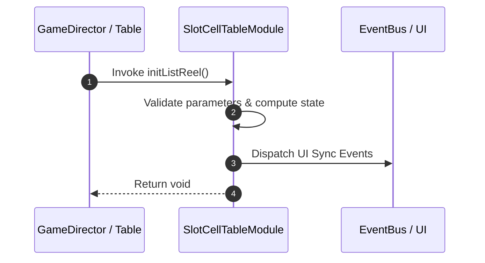

# 📖 `SlotCellTableModule.initListReel()`

<!-- convention-summary-start -->
### SlotCellTableModule.initListReel Line-by-Line Method Specification Summary

- **Core Architecture / Purpose**: Technical reference, API contract, and integration guide for SlotCellTableModule.initListReel Line-by-Line Method Specification.
- **Key Mechanisms & Design**: Encapsulates core algorithms, event hooks, and performance optimizations within the slot framework runtime.
- **Domain Capabilities**: cc_slot_mechanics, 05_methods
- **Scope & Code Paths**: `assets/cc-common/cc-slot-mechanics/SlotCellTable/scripts/SlotCellTableModule.ts`
- **Related Docs**: [Master Index](../INDEX.md)
<!-- convention-summary-end -->


---

## 1. Method Signature & Overview

```typescript
public initListReel(): void
```

- **Declaring Class**: `SlotCellTableModule` (`assets/cc-common/cc-slot-mechanics/SlotCellTable/scripts/SlotCellTableModule.ts`)
- **Source Code Location**: Lines 147 to 167
- **Execution Complexity**: $O(1)$ fast synchronous calculation or controlled timer Promise.

---

## 2. Complete Source Code Implementation

```typescript
	initListReel(): void {
		this.START_X = -(this.TOTAL_COLS / 2 - 0.5) * this.SYMBOL_WIDTH;
		for (let col = 0; col < this.TOTAL_COLS; col++) {
			this.reelList[col] = [];
			const totalRows = this.config.TABLE_FORMAT[col];
			for (let row = 0; row < totalRows; row++) {
				const reelNode = new Node(`Reel_${col}_${row}`);
				const maskRow = this.listMaskRow[row];
				reelNode.setParent(maskRow);

				const x = this.START_X + col * this.SYMBOL_WIDTH;
				reelNode.setPosition(new cc.Vec2(x, 0));

				const reelComponent = reelNode.addComponent(CellReelModule);
				reelComponent.initReel({ reelIndex: col, config: this.config, pool: this.symbolManager, reelRow: row });
				reelComponent.hideFakeSymbols();

				this.reelList[col][row] = reelComponent;
			}
		}
	}
```

---

## 3. Line-by-Line Code Breakdown

| Line # | Code Snippet | Technical Analysis & Engine Behavior |
| :---: | :--- | :--- |
| **147** | `initListReel(): void {` | Method entry signature declaring `initListReel()` with return type `void`. |
| **148** | `this.START_X = -(this.TOTAL_COLS / 2 - 0.5) * this.SYMBOL_WIDTH;` | Applies operational logic and state mutation. |
| **149** | `for (let col = 0; col < this.TOTAL_COLS; col++) {` | Iterates over collection elements. |
| **150** | `this.reelList[col] = [];` | Applies operational logic and state mutation. |
| **151** | `const totalRows = this.config.TABLE_FORMAT[col];` | Local variable initialization allocating `totalRows`. |
| **152** | `for (let row = 0; row < totalRows; row++) {` | Iterates over collection elements. |
| **153** | `const reelNode = new Node(`Reel_${col}_${row}`);` | Local variable initialization allocating `reelNode`. |
| **154** | `const maskRow = this.listMaskRow[row];` | Local variable initialization allocating `maskRow`. |
| **155** | `reelNode.setParent(maskRow);` | Applies operational logic and state mutation. |
| **156** | `` | Applies operational logic and state mutation. |
| **157** | `const x = this.START_X + col * this.SYMBOL_WIDTH;` | Local variable initialization allocating `x`. |
| **158** | `reelNode.setPosition(new cc.Vec2(x, 0));` | Applies operational logic and state mutation. |
| **159** | `` | Applies operational logic and state mutation. |
| **160** | `const reelComponent = reelNode.addComponent(CellReelModule);` | Local variable initialization allocating `reelComponent`. |
| **161** | `reelComponent.initReel({ reelIndex: col, config: this.config, pool: this.symbolManager, reelRow: row });` | Applies operational logic and state mutation. |
| **162** | `reelComponent.hideFakeSymbols();` | Applies operational logic and state mutation. |
| **163** | `` | Applies operational logic and state mutation. |
| **164** | `this.reelList[col][row] = reelComponent;` | Applies operational logic and state mutation. |
| **165** | `}` | Method exit boundary, closing block scope. |
| **166** | `}` | Method exit boundary, closing block scope. |
| **167** | `}` | Method exit boundary, closing block scope. |

---

## 4. Data Flow & State Lifecycle



---

## 5. Production Gotchas & Edge Cases

1. **Null Guarding**: Always ensure caller passes non-null parameters or handles undefined fallbacks.
2. **Fast-Stop Safety**: If user triggers fast-stop during execution, ensure timers are cancelled cleanly via `unscheduleAllCallbacks()`.
