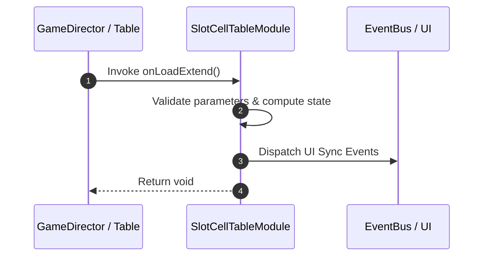

# 📖 `SlotCellTableModule.onLoadExtend()`

<!-- convention-summary-start -->
### SlotCellTableModule.onLoadExtend Line-by-Line Method Specification Summary

- **Core Architecture / Purpose**: Technical reference, API contract, and integration guide for SlotCellTableModule.onLoadExtend Line-by-Line Method Specification.
- **Key Mechanisms & Design**: Encapsulates core algorithms, event hooks, and performance optimizations within the slot framework runtime.
- **Domain Capabilities**: cc_slot_mechanics, 05_methods
- **Scope & Code Paths**: `assets/cc-common/cc-slot-mechanics/SlotCellTable/scripts/SlotCellTableModule.ts`
- **Related Docs**: [Master Index](../INDEX.md)
<!-- convention-summary-end -->


---

## 1. Method Signature & Overview

```typescript
public onLoadExtend(): void
```

- **Declaring Class**: `SlotCellTableModule` (`assets/cc-common/cc-slot-mechanics/SlotCellTable/scripts/SlotCellTableModule.ts`)
- **Source Code Location**: Lines 25 to 40
- **Execution Complexity**: $O(1)$ fast synchronous calculation or controlled timer Promise.

---

## 2. Complete Source Code Implementation

```typescript
	onLoadExtend(): void {
		this.reelList = [];
		this.config = this.getComponent(CellTableConfig);
		if (!this.config) {
			warn('Config not add to this node');
			return;
		}
		this.getConfigValue();
		this._slotTableData = this.getComponent(CellTableData);

		if (!this.symbolManager) {
			this.symbolManager = this.getComponent(SlotSymbolManager);
		}

		this.symbolManager.setGameConfig(this.gameConfig);
	}
```

---

## 3. Line-by-Line Code Breakdown

| Line # | Code Snippet | Technical Analysis & Engine Behavior |
| :---: | :--- | :--- |
| **25** | `onLoadExtend(): void {` | Method entry signature declaring `onLoadExtend()` with return type `void`. |
| **26** | `this.reelList = [];` | Applies operational logic and state mutation. |
| **27** | `this.config = this.getComponent(CellTableConfig);` | Queries attached component instance from scene graph node. |
| **28** | `if (!this.config) {` | Conditional branch evaluation guarding edge cases or prerequisites. |
| **29** | `warn('Config not add to this node');` | Applies operational logic and state mutation. |
| **30** | `return;` | Applies operational logic and state mutation. |
| **31** | `}` | Method exit boundary, closing block scope. |
| **32** | `this.getConfigValue();` | Applies operational logic and state mutation. |
| **33** | `this._slotTableData = this.getComponent(CellTableData);` | Queries attached component instance from scene graph node. |
| **34** | `` | Applies operational logic and state mutation. |
| **35** | `if (!this.symbolManager) {` | Conditional branch evaluation guarding edge cases or prerequisites. |
| **36** | `this.symbolManager = this.getComponent(SlotSymbolManager);` | Queries attached component instance from scene graph node. |
| **37** | `}` | Method exit boundary, closing block scope. |
| **38** | `` | Applies operational logic and state mutation. |
| **39** | `this.symbolManager.setGameConfig(this.gameConfig);` | Applies operational logic and state mutation. |
| **40** | `}` | Method exit boundary, closing block scope. |

---

## 4. Data Flow & State Lifecycle



---

## 5. Production Gotchas & Edge Cases

1. **Null Guarding**: Always ensure caller passes non-null parameters or handles undefined fallbacks.
2. **Fast-Stop Safety**: If user triggers fast-stop during execution, ensure timers are cancelled cleanly via `unscheduleAllCallbacks()`.
