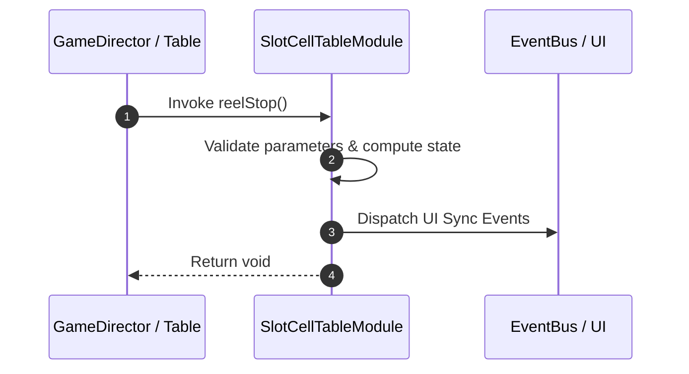

# 📖 `SlotCellTableModule.reelStop()`

<!-- convention-summary-start -->
### SlotCellTableModule.reelStop Line-by-Line Method Specification Summary

- **Core Architecture / Purpose**: Technical reference, API contract, and integration guide for SlotCellTableModule.reelStop Line-by-Line Method Specification.
- **Key Mechanisms & Design**: Encapsulates core algorithms, event hooks, and performance optimizations within the slot framework runtime.
- **Domain Capabilities**: cc_slot_mechanics, 05_methods
- **Scope & Code Paths**: `assets/cc-common/cc-slot-mechanics/SlotCellTable/scripts/SlotCellTableModule.ts`
- **Related Docs**: [Master Index](../INDEX.md)
<!-- convention-summary-end -->


---

## 1. Method Signature & Overview

```typescript
public reelStop(): void
```

- **Declaring Class**: `SlotCellTableModule` (`assets/cc-common/cc-slot-mechanics/SlotCellTable/scripts/SlotCellTableModule.ts`)
- **Source Code Location**: Lines 115 to 122
- **Execution Complexity**: $O(1)$ fast synchronous calculation or controlled timer Promise.

---

## 2. Complete Source Code Implementation

```typescript
	protected reelStop(): void {
		this.totalReelStop++;
		if (this.totalReelStop >= this.totalReelSpin) {
			this.state = TableSpinState.STOPPED;
			this._callbackStop && this._callbackStop();
			this._callbackStop = null;
		}
	}
```

---

## 3. Line-by-Line Code Breakdown

| Line # | Code Snippet | Technical Analysis & Engine Behavior |
| :---: | :--- | :--- |
| **115** | `protected reelStop(): void {` | Method entry signature declaring `reelStop()` with return type `void`. |
| **116** | `this.totalReelStop++;` | Applies operational logic and state mutation. |
| **117** | `if (this.totalReelStop >= this.totalReelSpin) {` | Conditional branch evaluation guarding edge cases or prerequisites. |
| **118** | `this.state = TableSpinState.STOPPED;` | Applies operational logic and state mutation. |
| **119** | `this._callbackStop && this._callbackStop();` | Applies operational logic and state mutation. |
| **120** | `this._callbackStop = null;` | Applies operational logic and state mutation. |
| **121** | `}` | Method exit boundary, closing block scope. |
| **122** | `}` | Method exit boundary, closing block scope. |

---

## 4. Data Flow & State Lifecycle



---

## 5. Production Gotchas & Edge Cases

1. **Null Guarding**: Always ensure caller passes non-null parameters or handles undefined fallbacks.
2. **Fast-Stop Safety**: If user triggers fast-stop during execution, ensure timers are cancelled cleanly via `unscheduleAllCallbacks()`.
