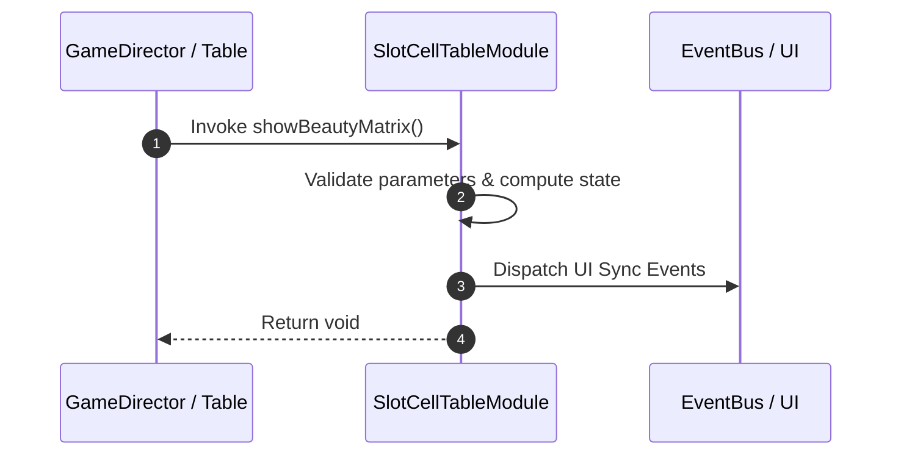

# 📖 `SlotCellTableModule.showBeautyMatrix()`

<!-- convention-summary-start -->
### SlotCellTableModule.showBeautyMatrix Line-by-Line Method Specification Summary

- **Core Architecture / Purpose**: Technical reference, API contract, and integration guide for SlotCellTableModule.showBeautyMatrix Line-by-Line Method Specification.
- **Key Mechanisms & Design**: Encapsulates core algorithms, event hooks, and performance optimizations within the slot framework runtime.
- **Domain Capabilities**: cc_slot_mechanics, 05_methods
- **Scope & Code Paths**: `assets/cc-common/cc-slot-mechanics/SlotCellTable/scripts/SlotCellTableModule.ts`
- **Related Docs**: [Master Index](../INDEX.md)
<!-- convention-summary-end -->


---

## 1. Method Signature & Overview

```typescript
public showBeautyMatrix(): void
```

- **Declaring Class**: `SlotCellTableModule` (`assets/cc-common/cc-slot-mechanics/SlotCellTable/scripts/SlotCellTableModule.ts`)
- **Source Code Location**: Lines 169 to 188
- **Execution Complexity**: $O(1)$ fast synchronous calculation or controlled timer Promise.

---

## 2. Complete Source Code Implementation

```typescript
	showBeautyMatrix(): void {
		if (!this.config.BEAUTY_MATRIX || !this.config.BEAUTY_MATRIX.length) {
			return;
		}
		let beautyMatrix = [...this.config.getRandomBeautyMatrix()];

		this.syncTable(beautyMatrix);
		for (let col = 0; col < this.TOTAL_COLS; col++) {
			const totalRows = this.config.TABLE_FORMAT[col];
			for (let row = 0; row < totalRows; row++) {
				const reelComponent = this.reelList[col][row];
				reelComponent.hideFakeSymbols();
				const symbols = reelComponent.getRealSymbols();
				symbols.forEach(symbol => {
					const symbolComp = SlotSymbolModule.getModuleComponent(symbol);
					symbolComp.playSymbolIntro(symbolComp.symbolCode);
				});
			}
		}
	}
```

---

## 3. Line-by-Line Code Breakdown

| Line # | Code Snippet | Technical Analysis & Engine Behavior |
| :---: | :--- | :--- |
| **169** | `showBeautyMatrix(): void {` | Method entry signature declaring `showBeautyMatrix()` with return type `void`. |
| **170** | `if (!this.config.BEAUTY_MATRIX \|\| !this.config.BEAUTY_MATRIX.length) {` | Conditional branch evaluation guarding edge cases or prerequisites. |
| **171** | `return;` | Applies operational logic and state mutation. |
| **172** | `}` | Method exit boundary, closing block scope. |
| **173** | `let beautyMatrix = [...this.config.getRandomBeautyMatrix()];` | Local variable initialization allocating `beautyMatrix`. |
| **174** | `` | Applies operational logic and state mutation. |
| **175** | `this.syncTable(beautyMatrix);` | Applies operational logic and state mutation. |
| **176** | `for (let col = 0; col < this.TOTAL_COLS; col++) {` | Iterates over collection elements. |
| **177** | `const totalRows = this.config.TABLE_FORMAT[col];` | Local variable initialization allocating `totalRows`. |
| **178** | `for (let row = 0; row < totalRows; row++) {` | Iterates over collection elements. |
| **179** | `const reelComponent = this.reelList[col][row];` | Local variable initialization allocating `reelComponent`. |
| **180** | `reelComponent.hideFakeSymbols();` | Applies operational logic and state mutation. |
| **181** | `const symbols = reelComponent.getRealSymbols();` | Local variable initialization allocating `symbols`. |
| **182** | `symbols.forEach(symbol => {` | Applies operational logic and state mutation. |
| **183** | `const symbolComp = SlotSymbolModule.getModuleComponent(symbol);` | Local variable initialization allocating `symbolComp`. |
| **184** | `symbolComp.playSymbolIntro(symbolComp.symbolCode);` | Applies operational logic and state mutation. |
| **185** | `});` | Applies operational logic and state mutation. |
| **186** | `}` | Method exit boundary, closing block scope. |
| **187** | `}` | Method exit boundary, closing block scope. |
| **188** | `}` | Method exit boundary, closing block scope. |

---

## 4. Data Flow & State Lifecycle



---

## 5. Production Gotchas & Edge Cases

1. **Null Guarding**: Always ensure caller passes non-null parameters or handles undefined fallbacks.
2. **Fast-Stop Safety**: If user triggers fast-stop during execution, ensure timers are cancelled cleanly via `unscheduleAllCallbacks()`.
