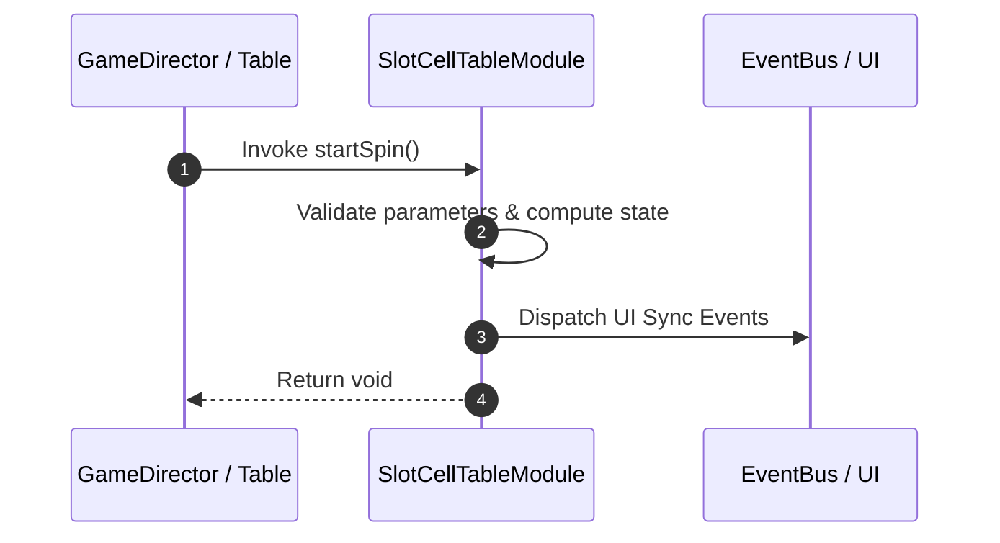

# 📖 `SlotCellTableModule.startSpin()`

<!-- convention-summary-start -->
### SlotCellTableModule.startSpin Line-by-Line Method Specification Summary

- **Core Architecture / Purpose**: Technical reference, API contract, and integration guide for SlotCellTableModule.startSpin Line-by-Line Method Specification.
- **Key Mechanisms & Design**: Encapsulates core algorithms, event hooks, and performance optimizations within the slot framework runtime.
- **Domain Capabilities**: cc_slot_mechanics, 05_methods
- **Scope & Code Paths**: `assets/cc-common/cc-slot-mechanics/SlotCellTable/scripts/SlotCellTableModule.ts`
- **Related Docs**: [Master Index](../INDEX.md)
<!-- convention-summary-end -->


---

## 1. Method Signature & Overview

```typescript
public startSpin(): void
```

- **Declaring Class**: `SlotCellTableModule` (`assets/cc-common/cc-slot-mechanics/SlotCellTable/scripts/SlotCellTableModule.ts`)
- **Source Code Location**: Lines 75 to 93
- **Execution Complexity**: $O(1)$ fast synchronous calculation or controlled timer Promise.

---

## 2. Complete Source Code Implementation

```typescript
	startSpin(): void {
		if (this.state === TableSpinState.READY || this.state === TableSpinState.STOPPED) {
			this.state = TableSpinState.START;
			this.table.active = true;

			this.currentMode = this.gameSettings.isTurboActive ? this.config.MODES.TURBO : this.config.MODES.NORMAL;
			this.totalReelSpin = 0;
			this.totalReelStop = 0;

			for (let col = 0; col < this.TOTAL_COLS; col++) {
				const totalRows = this.config.TABLE_FORMAT[col];
				for (let row = 0; row < totalRows; row++) {
					const reelComponent = this.reelList[col][row];
					this.totalReelSpin++;
					reelComponent.runReelSpin(this.currentMode);
				}
			}
		}
	}
```

---

## 3. Line-by-Line Code Breakdown

| Line # | Code Snippet | Technical Analysis & Engine Behavior |
| :---: | :--- | :--- |
| **75** | `startSpin(): void {` | Method entry signature declaring `startSpin()` with return type `void`. |
| **76** | `if (this.state === TableSpinState.READY \|\| this.state === TableSpinState.STOPPED) {` | Conditional branch evaluation guarding edge cases or prerequisites. |
| **77** | `this.state = TableSpinState.START;` | Applies operational logic and state mutation. |
| **78** | `this.table.active = true;` | Applies operational logic and state mutation. |
| **79** | `` | Applies operational logic and state mutation. |
| **80** | `this.currentMode = this.gameSettings.isTurboActive ? this.config.MODES.TURBO : this.config.MODES.NORMAL;` | Applies operational logic and state mutation. |
| **81** | `this.totalReelSpin = 0;` | Applies operational logic and state mutation. |
| **82** | `this.totalReelStop = 0;` | Applies operational logic and state mutation. |
| **83** | `` | Applies operational logic and state mutation. |
| **84** | `for (let col = 0; col < this.TOTAL_COLS; col++) {` | Iterates over collection elements. |
| **85** | `const totalRows = this.config.TABLE_FORMAT[col];` | Local variable initialization allocating `totalRows`. |
| **86** | `for (let row = 0; row < totalRows; row++) {` | Iterates over collection elements. |
| **87** | `const reelComponent = this.reelList[col][row];` | Local variable initialization allocating `reelComponent`. |
| **88** | `this.totalReelSpin++;` | Applies operational logic and state mutation. |
| **89** | `reelComponent.runReelSpin(this.currentMode);` | Applies operational logic and state mutation. |
| **90** | `}` | Method exit boundary, closing block scope. |
| **91** | `}` | Method exit boundary, closing block scope. |
| **92** | `}` | Method exit boundary, closing block scope. |
| **93** | `}` | Method exit boundary, closing block scope. |

---

## 4. Data Flow & State Lifecycle



---

## 5. Production Gotchas & Edge Cases

1. **Null Guarding**: Always ensure caller passes non-null parameters or handles undefined fallbacks.
2. **Fast-Stop Safety**: If user triggers fast-stop during execution, ensure timers are cancelled cleanly via `unscheduleAllCallbacks()`.
