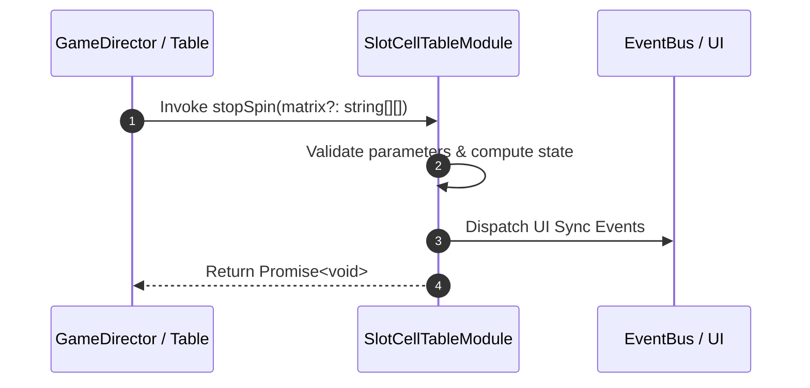

# 📖 `SlotCellTableModule.stopSpin()`

<!-- convention-summary-start -->
### SlotCellTableModule.stopSpin Line-by-Line Method Specification Summary

- **Core Architecture / Purpose**: Technical reference, API contract, and integration guide for SlotCellTableModule.stopSpin Line-by-Line Method Specification.
- **Key Mechanisms & Design**: Encapsulates core algorithms, event hooks, and performance optimizations within the slot framework runtime.
- **Domain Capabilities**: cc_slot_mechanics, 05_methods
- **Scope & Code Paths**: `assets/cc-common/cc-slot-mechanics/SlotCellTable/scripts/SlotCellTableModule.ts`
- **Related Docs**: [Master Index](../INDEX.md)
<!-- convention-summary-end -->


---

## 1. Method Signature & Overview

```typescript
public stopSpin(matrix?: string[][]): Promise<void>
```

- **Declaring Class**: `SlotCellTableModule` (`assets/cc-common/cc-slot-mechanics/SlotCellTable/scripts/SlotCellTableModule.ts`)
- **Source Code Location**: Lines 95 to 113
- **Execution Complexity**: $O(1)$ fast synchronous calculation or controlled timer Promise.

---

## 2. Complete Source Code Implementation

```typescript
	stopSpin(matrix?: string[][]): Promise<void> {
		this._matrix = matrix || this._slotTableData.getMatrix();

		this._lastMatrix = [...this._matrix];
		this.state = TableSpinState.SHOWING_RESULT;

		for (let col = 0; col < this.TOTAL_COLS; col++) {
			const totalRows = this.config.TABLE_FORMAT[col];
			for (let row = 0; row < totalRows; row++) {
				const reelComponent = this.reelList[col][row];
				const symbolData = this._matrix[col][row];
				reelComponent.showResult([symbolData], this.reelStop.bind(this), this.reelPreStop.bind(this));
			}
		}

		return new Promise((resolve) => {
			this._callbackStop = resolve;
		});
	}
```

---

## 3. Line-by-Line Code Breakdown

| Line # | Code Snippet | Technical Analysis & Engine Behavior |
| :---: | :--- | :--- |
| **95** | `stopSpin(matrix?: string[][]): Promise<void> {` | Method entry signature declaring `stopSpin(matrix?: string[][])` with return type `Promise<void>`. |
| **96** | `this._matrix = matrix \|\| this._slotTableData.getMatrix();` | Applies operational logic and state mutation. |
| **97** | `` | Applies operational logic and state mutation. |
| **98** | `this._lastMatrix = [...this._matrix];` | Applies operational logic and state mutation. |
| **99** | `this.state = TableSpinState.SHOWING_RESULT;` | Applies operational logic and state mutation. |
| **100** | `` | Applies operational logic and state mutation. |
| **101** | `for (let col = 0; col < this.TOTAL_COLS; col++) {` | Iterates over collection elements. |
| **102** | `const totalRows = this.config.TABLE_FORMAT[col];` | Local variable initialization allocating `totalRows`. |
| **103** | `for (let row = 0; row < totalRows; row++) {` | Iterates over collection elements. |
| **104** | `const reelComponent = this.reelList[col][row];` | Local variable initialization allocating `reelComponent`. |
| **105** | `const symbolData = this._matrix[col][row];` | Local variable initialization allocating `symbolData`. |
| **106** | `reelComponent.showResult([symbolData], this.reelStop.bind(this), this.reelPreStop.bind(this));` | Applies operational logic and state mutation. |
| **107** | `}` | Method exit boundary, closing block scope. |
| **108** | `}` | Method exit boundary, closing block scope. |
| **109** | `` | Applies operational logic and state mutation. |
| **110** | `return new Promise((resolve) => {` | Returns computed value / promise to caller. |
| **111** | `this._callbackStop = resolve;` | Applies operational logic and state mutation. |
| **112** | `});` | Applies operational logic and state mutation. |
| **113** | `}` | Method exit boundary, closing block scope. |

---

## 4. Data Flow & State Lifecycle



---

## 5. Production Gotchas & Edge Cases

1. **Null Guarding**: Always ensure caller passes non-null parameters or handles undefined fallbacks.
2. **Fast-Stop Safety**: If user triggers fast-stop during execution, ensure timers are cancelled cleanly via `unscheduleAllCallbacks()`.
