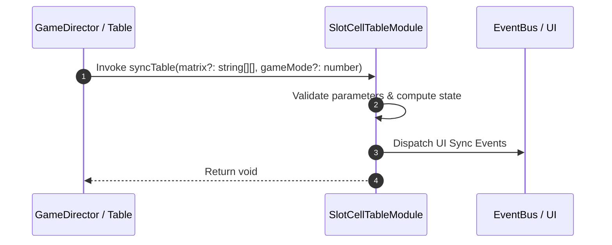

# 📖 `SlotCellTableModule.syncTable()`

<!-- convention-summary-start -->
### SlotCellTableModule.syncTable Line-by-Line Method Specification Summary

- **Core Architecture / Purpose**: Technical reference, API contract, and integration guide for SlotCellTableModule.syncTable Line-by-Line Method Specification.
- **Key Mechanisms & Design**: Encapsulates core algorithms, event hooks, and performance optimizations within the slot framework runtime.
- **Domain Capabilities**: cc_slot_mechanics, 05_methods
- **Scope & Code Paths**: `assets/cc-common/cc-slot-mechanics/SlotCellTable/scripts/SlotCellTableModule.ts`
- **Related Docs**: [Master Index](../INDEX.md)
<!-- convention-summary-end -->


---

## 1. Method Signature & Overview

```typescript
public syncTable(matrix?: string[][], gameMode?: number): void
```

- **Declaring Class**: `SlotCellTableModule` (`assets/cc-common/cc-slot-mechanics/SlotCellTable/scripts/SlotCellTableModule.ts`)
- **Source Code Location**: Lines 48 to 65
- **Execution Complexity**: $O(1)$ fast synchronous calculation or controlled timer Promise.

---

## 2. Complete Source Code Implementation

```typescript
	syncTable(matrix?: string[][], gameMode?: number): void {
		this._matrix = matrix || this._slotTableData.getResumeMatrix(gameMode);

		if (!this._matrix || !this._matrix.length) {
			return;
		}
		this.removeAllSymbols();
		this.table.active = true;
		this._lastMatrix = [...this._matrix];
		for (let col = 0; col < this.TOTAL_COLS; col++) {
			const totalRows = this.config.TABLE_FORMAT[col];
			for (let row = 0; row < totalRows; row++) {
				const reelComponent = this.reelList[col][row];
				reelComponent.clearSymbols();
				reelComponent.resumeReel([this._matrix[col][row]]);
			}
		}
	}
```

---

## 3. Line-by-Line Code Breakdown

| Line # | Code Snippet | Technical Analysis & Engine Behavior |
| :---: | :--- | :--- |
| **48** | `syncTable(matrix?: string[][], gameMode?: number): void {` | Method entry signature declaring `syncTable(matrix?: string[][], gameMode?: number)` with return type `void`. |
| **49** | `this._matrix = matrix \|\| this._slotTableData.getResumeMatrix(gameMode);` | Applies operational logic and state mutation. |
| **50** | `` | Applies operational logic and state mutation. |
| **51** | `if (!this._matrix \|\| !this._matrix.length) {` | Conditional branch evaluation guarding edge cases or prerequisites. |
| **52** | `return;` | Applies operational logic and state mutation. |
| **53** | `}` | Method exit boundary, closing block scope. |
| **54** | `this.removeAllSymbols();` | Applies operational logic and state mutation. |
| **55** | `this.table.active = true;` | Applies operational logic and state mutation. |
| **56** | `this._lastMatrix = [...this._matrix];` | Applies operational logic and state mutation. |
| **57** | `for (let col = 0; col < this.TOTAL_COLS; col++) {` | Iterates over collection elements. |
| **58** | `const totalRows = this.config.TABLE_FORMAT[col];` | Local variable initialization allocating `totalRows`. |
| **59** | `for (let row = 0; row < totalRows; row++) {` | Iterates over collection elements. |
| **60** | `const reelComponent = this.reelList[col][row];` | Local variable initialization allocating `reelComponent`. |
| **61** | `reelComponent.clearSymbols();` | Applies operational logic and state mutation. |
| **62** | `reelComponent.resumeReel([this._matrix[col][row]]);` | Applies operational logic and state mutation. |
| **63** | `}` | Method exit boundary, closing block scope. |
| **64** | `}` | Method exit boundary, closing block scope. |
| **65** | `}` | Method exit boundary, closing block scope. |

---

## 4. Data Flow & State Lifecycle



---

## 5. Production Gotchas & Edge Cases

1. **Null Guarding**: Always ensure caller passes non-null parameters or handles undefined fallbacks.
2. **Fast-Stop Safety**: If user triggers fast-stop during execution, ensure timers are cancelled cleanly via `unscheduleAllCallbacks()`.
