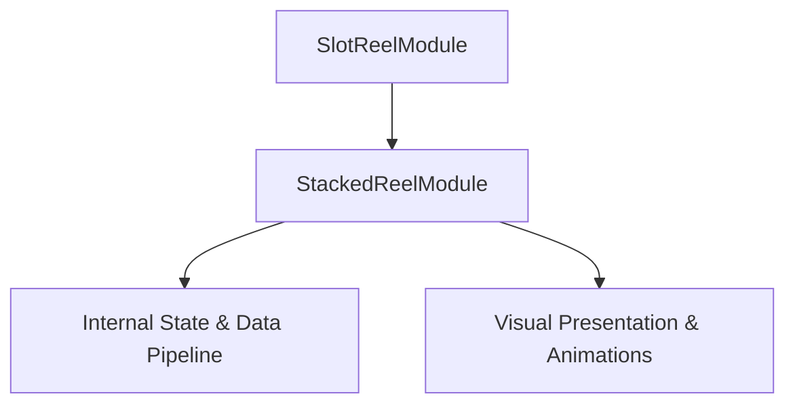

# 🏛️ StackedReelModule Architectural Role & Mechanics Overview

<!-- convention-summary-start -->
### StackedReelModule Architectural Role & Mechanics Overview Summary

- **Core Architecture / Purpose**: Technical reference, API contract, and integration guide for StackedReelModule Architectural Role & Mechanics Overview.
- **Key Mechanisms & Design**: Encapsulates core algorithms, event hooks, and performance optimizations within the slot framework runtime.
- **Domain Capabilities**: cc_slot_mechanics, 01_overview
- **Scope & Code Paths**: `assets/cc-common/cc-slot-mechanics/StackedReel/StackedReelModule.ts`
- **Related Docs**: [Master Index](../INDEX.md)
<!-- convention-summary-end -->

---

## 1. Architectural Mission

`StackedReelModule` is a core component of the `cc-slot-mechanics` package (`assets/cc-common/cc-slot-mechanics/StackedReel/StackedReelModule.ts`).
- **Inheritance Chain**: `StackedReelModule` ➔ `SlotReelModule`
- **Primary Responsibility**: Provides specialized slot mechanics execution, coordinate mathematics, and state management for advanced slot games.

---

## 2. Key Responsibilities

1. **State & Physics Coordination**:
   - Implements game-specific algorithms and state mutations.
2. **Director & Writer Integration**:
   - Dispatches step completion callbacks to `ScriptExecutor` to maintain non-blocking async command queues.
