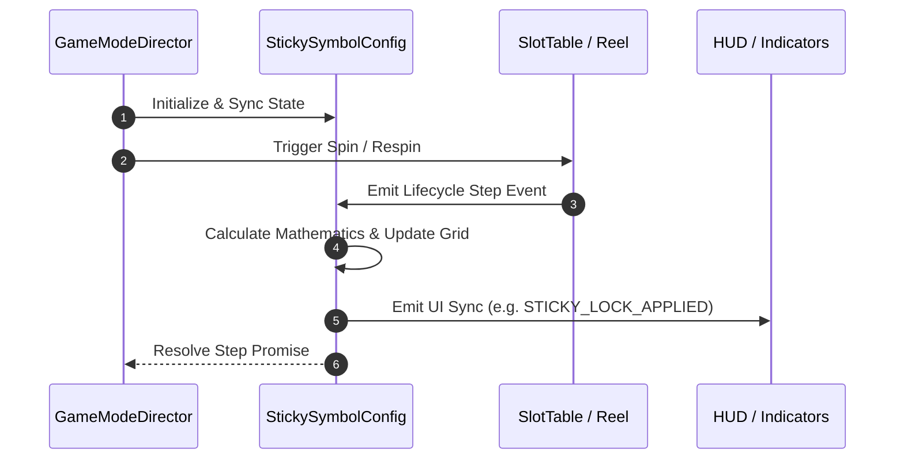

# 🔄 `StickySymbolConfig` Mechanics Game Flow & Execution Sequence

<!-- convention-summary-start -->
### StickySymbolConfig Mechanics Game Flow & Sequence Summary

- **Core Architecture / Purpose**: Defines network protocol, socket packet lifecycle, state persistence, and error handling for StickySymbolConfig Mechanics Game Flow & Sequence.
- **Key Mechanisms & Design**: Handles WebSocket frame dispatch, acknowledgment confirmation, state resume, and resilient synchronization between client DataStore and Backend Gateway.
- **Domain Capabilities**: cc_slot_mechanics, 02_game_flow
- **Scope & Code Paths**: `assets/cc-common/`
- **Related Docs**: [Master Index](../INDEX.md)
<!-- convention-summary-end -->

---

## 1. Sequence Execution Diagram

---

## 2. Execution Phases

1. **Phase 1: Pre-Spin State Initialization**:
   - Resets counters, caches previous matrix snapshots, and registers event listeners.
2. **Phase 2: Active Spin & Dynamic Mechanics Evaluation**:
   - Evaluates reel stops, bounding boxes, or cascade explosions.
3. **Phase 3: Settle & Post-Step Synchronization**:
   - Dispatches completion events to downstream modules.
