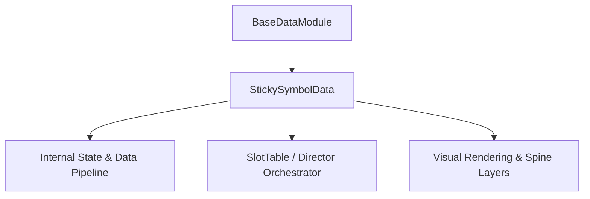

# 🏛️ `StickySymbolData` Architectural Role & Mechanics Overview

<!-- convention-summary-start -->
### StickySymbolData Architectural Role & Mechanics Overview Summary

- **Core Architecture / Purpose**: Technical reference, API contract, and integration guide for StickySymbolData Architectural Role & Mechanics Overview.
- **Key Mechanisms & Design**: Encapsulates core algorithms, event hooks, and performance optimizations within the slot framework runtime.
- **Domain Capabilities**: cc_slot_mechanics, 01_overview
- **Scope & Code Paths**: `assets/cc-common/cc-slot-mechanics/StickySymbol/scripts/StickySymbolData.ts`
- **Related Docs**: [Master Index](../INDEX.md)
<!-- convention-summary-end -->

- **Mechanics Package**: `assets/cc-common/cc-slot-mechanics/StickySymbol`
- **Source File**: `assets/cc-common/cc-slot-mechanics/StickySymbol/scripts/StickySymbolData.ts`
- **Class Hierarchy**: `StickySymbolData` ➔ `BaseDataModule`
- **Subsystem Domain**: StickySymbol Mechanics Engine

---

## 1. Mathematical & Engineering Foundation

`StickySymbolData` is a core runtime module within the **StickySymbol Mechanics Engine**.

> **Mathematical Foundation & Formulation**:  
> Specialized slot mechanics coordinate mathematics and state transitions.

---

## 2. Core Responsibilities & System Invariants

1. **State & Coordinate Calculation**:
   - Manages mathematical matrix models, reel coordinates, and bounding box calculations with zero memory leaks.
2. **Director & Writer Command Pipeline**:
   - Emits asynchronous step completion signals to `ScriptExecutor` to maintain uninterrupted $60\text{ FPS}$ spin loops.
3. **Event Bus Communication**:
   - Subscribes and publishes events: `MECHANIC_EVENT`.
