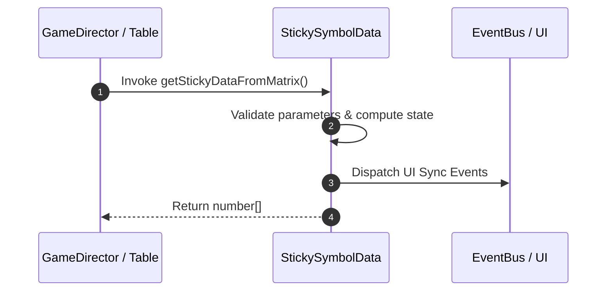

# 📖 `StickySymbolData.getStickyDataFromMatrix()`

<!-- convention-summary-start -->
### StickySymbolData.getStickyDataFromMatrix Line-by-Line Method Specification Summary

- **Core Architecture / Purpose**: Technical reference, API contract, and integration guide for StickySymbolData.getStickyDataFromMatrix Line-by-Line Method Specification.
- **Key Mechanisms & Design**: Encapsulates core algorithms, event hooks, and performance optimizations within the slot framework runtime.
- **Domain Capabilities**: cc_slot_mechanics, 05_methods
- **Scope & Code Paths**: `assets/cc-common/cc-slot-mechanics/StickySymbol/scripts/StickySymbolData.ts`
- **Related Docs**: [Master Index](../INDEX.md)
<!-- convention-summary-end -->


---

## 1. Method Signature & Overview

```typescript
public getStickyDataFromMatrix(): number[]
```

- **Declaring Class**: `StickySymbolData` (`assets/cc-common/cc-slot-mechanics/StickySymbol/scripts/StickySymbolData.ts`)
- **Source Code Location**: Lines 77 to 86
- **Execution Complexity**: $O(1)$ fast synchronous calculation or controlled timer Promise.

---

## 2. Complete Source Code Implementation

```typescript
	getStickyDataFromMatrix(): number[] {
		const matrix = this.getMatrix();
		const flatMatrix = matrix.reduce((acc, row) => acc.concat(row), [] as string[]);
		flatMatrix.forEach((symbol, index) => {
			if (this.config.LIST_SYMBOL_FORCE_STICKY.indexOf(symbol) !== -1 && this.stickyIndexes.indexOf(index) === -1) {
				this.stickyIndexes.push(index);
			}
		});
		return Array.from(this.stickyIndexes);
	}
```

---

## 3. Line-by-Line Code Breakdown

| Line # | Code Snippet | Technical Analysis & Engine Behavior |
| :---: | :--- | :--- |
| **77** | `getStickyDataFromMatrix(): number[] {` | Method entry signature declaring `getStickyDataFromMatrix()` with return type `number[]`. |
| **78** | `const matrix = this.getMatrix();` | Local variable initialization allocating `matrix`. |
| **79** | `const flatMatrix = matrix.reduce((acc, row) => acc.concat(row), [] as string[]);` | Local variable initialization allocating `flatMatrix`. |
| **80** | `flatMatrix.forEach((symbol, index) => {` | Applies operational logic and state mutation. |
| **81** | `if (this.config.LIST_SYMBOL_FORCE_STICKY.indexOf(symbol) !== -1 && this.stickyIndexes.indexOf(index) === -1) {` | Conditional branch evaluation guarding edge cases or prerequisites. |
| **82** | `this.stickyIndexes.push(index);` | Applies operational logic and state mutation. |
| **83** | `}` | Method exit boundary, closing block scope. |
| **84** | `});` | Applies operational logic and state mutation. |
| **85** | `return Array.from(this.stickyIndexes);` | Returns computed value / promise to caller. |
| **86** | `}` | Method exit boundary, closing block scope. |

---

## 4. Data Flow & State Lifecycle



---

## 5. Production Gotchas & Edge Cases

1. **Null Guarding**: Always ensure caller passes non-null parameters or handles undefined fallbacks.
2. **Fast-Stop Safety**: If user triggers fast-stop during execution, ensure timers are cancelled cleanly via `unscheduleAllCallbacks()`.
