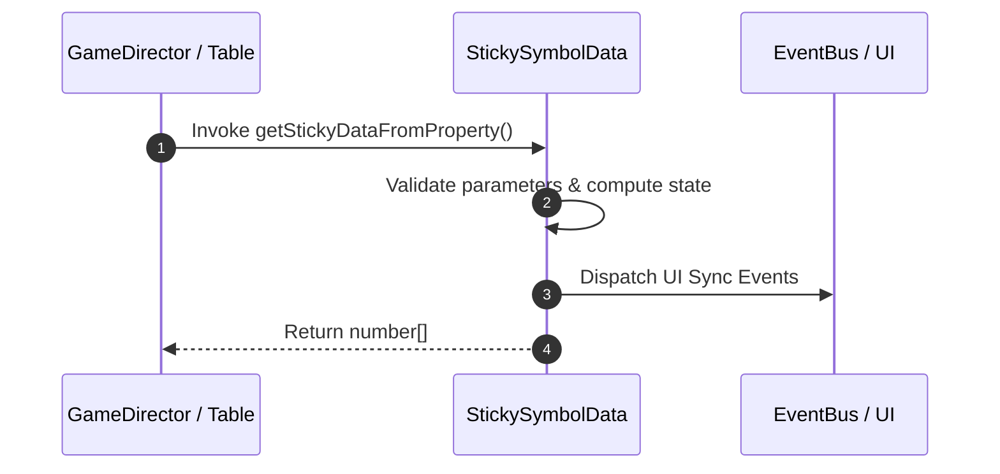

# 📖 `StickySymbolData.getStickyDataFromProperty()`

<!-- convention-summary-start -->
### StickySymbolData.getStickyDataFromProperty Line-by-Line Method Specification Summary

- **Core Architecture / Purpose**: Technical reference, API contract, and integration guide for StickySymbolData.getStickyDataFromProperty Line-by-Line Method Specification.
- **Key Mechanisms & Design**: Encapsulates core algorithms, event hooks, and performance optimizations within the slot framework runtime.
- **Domain Capabilities**: cc_slot_mechanics, 05_methods
- **Scope & Code Paths**: `assets/cc-common/cc-slot-mechanics/StickySymbol/scripts/StickySymbolData.ts`
- **Related Docs**: [Master Index](../INDEX.md)
<!-- convention-summary-end -->


---

## 1. Method Signature & Overview

```typescript
public getStickyDataFromProperty(): number[]
```

- **Declaring Class**: `StickySymbolData` (`assets/cc-common/cc-slot-mechanics/StickySymbol/scripts/StickySymbolData.ts`)
- **Source Code Location**: Lines 64 to 75
- **Execution Complexity**: $O(1)$ fast synchronous calculation or controlled timer Promise.

---

## 2. Complete Source Code Implementation

```typescript
	getStickyDataFromProperty(): number[] {
		const stickyData = this[this.customStickyProperty];
		if (!stickyData) {
			return [];
		}
		if (typeof stickyData == 'string') {
			const arr = stickyData.split(",");
			return arr.map(i => Number(i));
		}

		return stickyData;
	}
```

---

## 3. Line-by-Line Code Breakdown

| Line # | Code Snippet | Technical Analysis & Engine Behavior |
| :---: | :--- | :--- |
| **64** | `getStickyDataFromProperty(): number[] {` | Method entry signature declaring `getStickyDataFromProperty()` with return type `number[]`. |
| **65** | `const stickyData = this[this.customStickyProperty];` | Local variable initialization allocating `stickyData`. |
| **66** | `if (!stickyData) {` | Conditional branch evaluation guarding edge cases or prerequisites. |
| **67** | `return [];` | Returns computed value / promise to caller. |
| **68** | `}` | Method exit boundary, closing block scope. |
| **69** | `if (typeof stickyData == 'string') {` | Conditional branch evaluation guarding edge cases or prerequisites. |
| **70** | `const arr = stickyData.split(",");` | Local variable initialization allocating `arr`. |
| **71** | `return arr.map(i => Number(i));` | Returns computed value / promise to caller. |
| **72** | `}` | Method exit boundary, closing block scope. |
| **73** | `` | Applies operational logic and state mutation. |
| **74** | `return stickyData;` | Returns computed value / promise to caller. |
| **75** | `}` | Method exit boundary, closing block scope. |

---

## 4. Data Flow & State Lifecycle



---

## 5. Production Gotchas & Edge Cases

1. **Null Guarding**: Always ensure caller passes non-null parameters or handles undefined fallbacks.
2. **Fast-Stop Safety**: If user triggers fast-stop during execution, ensure timers are cancelled cleanly via `unscheduleAllCallbacks()`.
