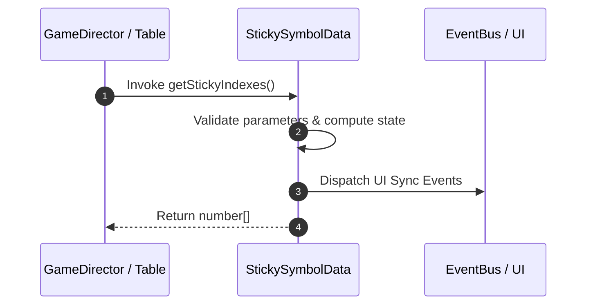

# 📖 `StickySymbolData.getStickyIndexes()`

<!-- convention-summary-start -->
### StickySymbolData.getStickyIndexes Line-by-Line Method Specification Summary

- **Core Architecture / Purpose**: Technical reference, API contract, and integration guide for StickySymbolData.getStickyIndexes Line-by-Line Method Specification.
- **Key Mechanisms & Design**: Encapsulates core algorithms, event hooks, and performance optimizations within the slot framework runtime.
- **Domain Capabilities**: cc_slot_mechanics, 05_methods
- **Scope & Code Paths**: `assets/cc-common/cc-slot-mechanics/StickySymbol/scripts/StickySymbolData.ts`
- **Related Docs**: [Master Index](../INDEX.md)
<!-- convention-summary-end -->


---

## 1. Method Signature & Overview

```typescript
public getStickyIndexes(): number[]
```

- **Declaring Class**: `StickySymbolData` (`assets/cc-common/cc-slot-mechanics/StickySymbol/scripts/StickySymbolData.ts`)
- **Source Code Location**: Lines 57 to 62
- **Execution Complexity**: $O(1)$ fast synchronous calculation or controlled timer Promise.

---

## 2. Complete Source Code Implementation

```typescript
	getStickyIndexes(): number[] {
		if (this.customStickyProperty) {
			return this.getStickyDataFromProperty();
		}
		return this.getStickyDataFromMatrix();
	}
```

---

## 3. Line-by-Line Code Breakdown

| Line # | Code Snippet | Technical Analysis & Engine Behavior |
| :---: | :--- | :--- |
| **57** | `getStickyIndexes(): number[] {` | Method entry signature declaring `getStickyIndexes()` with return type `number[]`. |
| **58** | `if (this.customStickyProperty) {` | Conditional branch evaluation guarding edge cases or prerequisites. |
| **59** | `return this.getStickyDataFromProperty();` | Returns computed value / promise to caller. |
| **60** | `}` | Method exit boundary, closing block scope. |
| **61** | `return this.getStickyDataFromMatrix();` | Returns computed value / promise to caller. |
| **62** | `}` | Method exit boundary, closing block scope. |

---

## 4. Data Flow & State Lifecycle



---

## 5. Production Gotchas & Edge Cases

1. **Null Guarding**: Always ensure caller passes non-null parameters or handles undefined fallbacks.
2. **Fast-Stop Safety**: If user triggers fast-stop during execution, ensure timers are cancelled cleanly via `unscheduleAllCallbacks()`.
