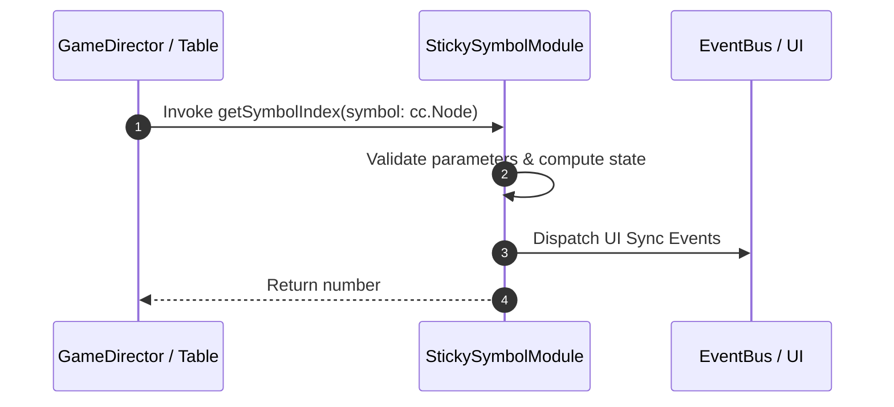

# 📖 `StickySymbolModule.getSymbolIndex()`

<!-- convention-summary-start -->
### StickySymbolModule.getSymbolIndex Line-by-Line Method Specification Summary

- **Core Architecture / Purpose**: Technical reference, API contract, and integration guide for StickySymbolModule.getSymbolIndex Line-by-Line Method Specification.
- **Key Mechanisms & Design**: Encapsulates core algorithms, event hooks, and performance optimizations within the slot framework runtime.
- **Domain Capabilities**: cc_slot_mechanics, 05_methods
- **Scope & Code Paths**: `assets/cc-common/cc-slot-mechanics/StickySymbol/scripts/StickySymbolModule.ts`
- **Related Docs**: [Master Index](../INDEX.md)
<!-- convention-summary-end -->


---

## 1. Method Signature & Overview

```typescript
public getSymbolIndex(symbol: cc.Node): number
```

- **Declaring Class**: `StickySymbolModule` (`assets/cc-common/cc-slot-mechanics/StickySymbol/scripts/StickySymbolModule.ts`)
- **Source Code Location**: Lines 101 to 107
- **Execution Complexity**: $O(1)$ fast synchronous calculation or controlled timer Promise.

---

## 2. Complete Source Code Implementation

```typescript
	getSymbolIndex(symbol: cc.Node): number {
		const symbolModule: SlotSymbolModule = SlotSymbolModule.getModuleComponent(symbol);
		if (symbolModule) {
			return symbolModule.getIndex();
		}
		return SymbolIndexType.UNUSED;
	}
```

---

## 3. Line-by-Line Code Breakdown

| Line # | Code Snippet | Technical Analysis & Engine Behavior |
| :---: | :--- | :--- |
| **101** | `getSymbolIndex(symbol: cc.Node): number {` | Method entry signature declaring `getSymbolIndex(symbol: cc.Node)` with return type `number`. |
| **102** | `const symbolModule: SlotSymbolModule = SlotSymbolModule.getModuleComponent(symbol);` | Local variable initialization allocating `symbolModule: SlotSymbolModule`. |
| **103** | `if (symbolModule) {` | Conditional branch evaluation guarding edge cases or prerequisites. |
| **104** | `return symbolModule.getIndex();` | Returns computed value / promise to caller. |
| **105** | `}` | Method exit boundary, closing block scope. |
| **106** | `return SymbolIndexType.UNUSED;` | Returns computed value / promise to caller. |
| **107** | `}` | Method exit boundary, closing block scope. |

---

## 4. Data Flow & State Lifecycle



---

## 5. Production Gotchas & Edge Cases

1. **Null Guarding**: Always ensure caller passes non-null parameters or handles undefined fallbacks.
2. **Fast-Stop Safety**: If user triggers fast-stop during execution, ensure timers are cancelled cleanly via `unscheduleAllCallbacks()`.
