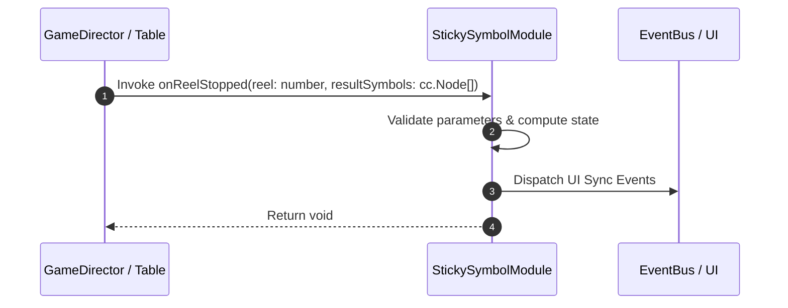

# 📖 `StickySymbolModule.onReelStopped()`

<!-- convention-summary-start -->
### StickySymbolModule.onReelStopped Line-by-Line Method Specification Summary

- **Core Architecture / Purpose**: Technical reference, API contract, and integration guide for StickySymbolModule.onReelStopped Line-by-Line Method Specification.
- **Key Mechanisms & Design**: Encapsulates core algorithms, event hooks, and performance optimizations within the slot framework runtime.
- **Domain Capabilities**: cc_slot_mechanics, 05_methods
- **Scope & Code Paths**: `assets/cc-common/cc-slot-mechanics/StickySymbol/scripts/StickySymbolModule.ts`
- **Related Docs**: [Master Index](../INDEX.md)
<!-- convention-summary-end -->


---

## 1. Method Signature & Overview

```typescript
public onReelStopped(reel: number, resultSymbols: cc.Node[]): void
```

- **Declaring Class**: `StickySymbolModule` (`assets/cc-common/cc-slot-mechanics/StickySymbol/scripts/StickySymbolModule.ts`)
- **Source Code Location**: Lines 44 to 60
- **Execution Complexity**: $O(1)$ fast synchronous calculation or controlled timer Promise.

---

## 2. Complete Source Code Implementation

```typescript
	onReelStopped(reel: number, resultSymbols: cc.Node[]): void {
		const stickyIndexes = this.data.getStickyIndexes();
		const matrix = this.data.getMatrix();
		for (let index = 0; index < resultSymbols.length; index++) {
			const symbol = resultSymbols[index];
			const symbolIndex = this.getSymbolIndex(symbol);
			if (stickyIndexes.indexOf(symbolIndex) !== -1 && !this.stickySymbols.has(symbolIndex)) {
				this.stickySymbols.set(symbolIndex, symbol);
			}
		}

		if (reel == matrix.length - 1) {
			if (this.data.isFinishSticky()) {
				this.clearStickySymbols();
			}
		}
	}
```

---

## 3. Line-by-Line Code Breakdown

| Line # | Code Snippet | Technical Analysis & Engine Behavior |
| :---: | :--- | :--- |
| **44** | `onReelStopped(reel: number, resultSymbols: cc.Node[]): void {` | Method entry signature declaring `onReelStopped(reel: number, resultSymbols: cc.Node[])` with return type `void`. |
| **45** | `const stickyIndexes = this.data.getStickyIndexes();` | Local variable initialization allocating `stickyIndexes`. |
| **46** | `const matrix = this.data.getMatrix();` | Local variable initialization allocating `matrix`. |
| **47** | `for (let index = 0; index < resultSymbols.length; index++) {` | Iterates over collection elements. |
| **48** | `const symbol = resultSymbols[index];` | Local variable initialization allocating `symbol`. |
| **49** | `const symbolIndex = this.getSymbolIndex(symbol);` | Local variable initialization allocating `symbolIndex`. |
| **50** | `if (stickyIndexes.indexOf(symbolIndex) !== -1 && !this.stickySymbols.has(symbolIndex)) {` | Conditional branch evaluation guarding edge cases or prerequisites. |
| **51** | `this.stickySymbols.set(symbolIndex, symbol);` | Applies operational logic and state mutation. |
| **52** | `}` | Method exit boundary, closing block scope. |
| **53** | `}` | Method exit boundary, closing block scope. |
| **54** | `` | Applies operational logic and state mutation. |
| **55** | `if (reel == matrix.length - 1) {` | Conditional branch evaluation guarding edge cases or prerequisites. |
| **56** | `if (this.data.isFinishSticky()) {` | Conditional branch evaluation guarding edge cases or prerequisites. |
| **57** | `this.clearStickySymbols();` | Applies operational logic and state mutation. |
| **58** | `}` | Method exit boundary, closing block scope. |
| **59** | `}` | Method exit boundary, closing block scope. |
| **60** | `}` | Method exit boundary, closing block scope. |

---

## 4. Data Flow & State Lifecycle



---

## 5. Production Gotchas & Edge Cases

1. **Null Guarding**: Always ensure caller passes non-null parameters or handles undefined fallbacks.
2. **Fast-Stop Safety**: If user triggers fast-stop during execution, ensure timers are cancelled cleanly via `unscheduleAllCallbacks()`.
