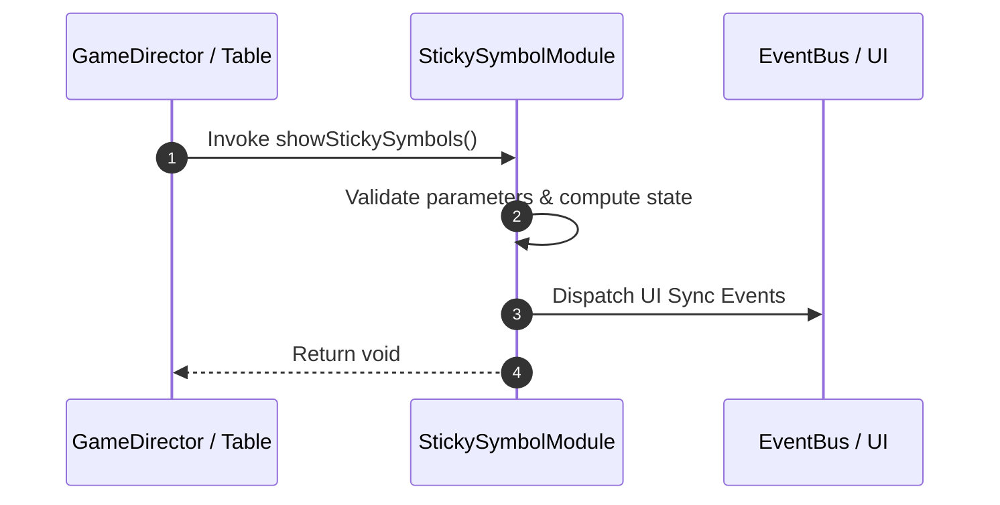

# 📖 `StickySymbolModule.showStickySymbols()`

<!-- convention-summary-start -->
### StickySymbolModule.showStickySymbols Line-by-Line Method Specification Summary

- **Core Architecture / Purpose**: Technical reference, API contract, and integration guide for StickySymbolModule.showStickySymbols Line-by-Line Method Specification.
- **Key Mechanisms & Design**: Encapsulates core algorithms, event hooks, and performance optimizations within the slot framework runtime.
- **Domain Capabilities**: cc_slot_mechanics, 05_methods
- **Scope & Code Paths**: `assets/cc-common/cc-slot-mechanics/StickySymbol/scripts/StickySymbolModule.ts`
- **Related Docs**: [Master Index](../INDEX.md)
<!-- convention-summary-end -->


---

## 1. Method Signature & Overview

```typescript
public showStickySymbols(): void
```

- **Declaring Class**: `StickySymbolModule` (`assets/cc-common/cc-slot-mechanics/StickySymbol/scripts/StickySymbolModule.ts`)
- **Source Code Location**: Lines 70 to 80
- **Execution Complexity**: $O(1)$ fast synchronous calculation or controlled timer Promise.

---

## 2. Complete Source Code Implementation

```typescript
	showStickySymbols(): void {
		this.showStickyLayer();
		this.stickySymbols.forEach((symbol) => {
			if (symbol && symbol.isValid) {
				symbol.active = true;
				symbol.emit("ENABLE_HIGHLIGHT");
				this.updateSymbolIndex(symbol, this.config.STICKY_SYMBOL_INDEX);
				eno.changeParent(symbol, this.stickyLayer);
			}
		});
	}
```

---

## 3. Line-by-Line Code Breakdown

| Line # | Code Snippet | Technical Analysis & Engine Behavior |
| :---: | :--- | :--- |
| **70** | `showStickySymbols(): void {` | Method entry signature declaring `showStickySymbols()` with return type `void`. |
| **71** | `this.showStickyLayer();` | Applies operational logic and state mutation. |
| **72** | `this.stickySymbols.forEach((symbol) => {` | Applies operational logic and state mutation. |
| **73** | `if (symbol && symbol.isValid) {` | Conditional branch evaluation guarding edge cases or prerequisites. |
| **74** | `symbol.active = true;` | Applies operational logic and state mutation. |
| **75** | `symbol.emit("ENABLE_HIGHLIGHT");` | Dispatches event to subscribers on the event bus. |
| **76** | `this.updateSymbolIndex(symbol, this.config.STICKY_SYMBOL_INDEX);` | Applies operational logic and state mutation. |
| **77** | `eno.changeParent(symbol, this.stickyLayer);` | Applies operational logic and state mutation. |
| **78** | `}` | Method exit boundary, closing block scope. |
| **79** | `});` | Applies operational logic and state mutation. |
| **80** | `}` | Method exit boundary, closing block scope. |

---

## 4. Data Flow & State Lifecycle



---

## 5. Production Gotchas & Edge Cases

1. **Null Guarding**: Always ensure caller passes non-null parameters or handles undefined fallbacks.
2. **Fast-Stop Safety**: If user triggers fast-stop during execution, ensure timers are cancelled cleanly via `unscheduleAllCallbacks()`.
