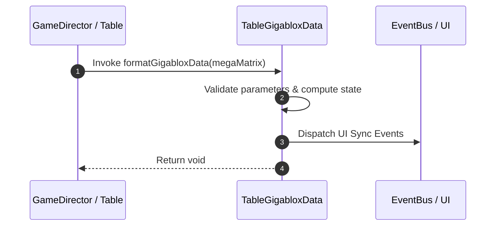

# 📖 `TableGigabloxData.formatGigabloxData()`

<!-- convention-summary-start -->
### TableGigabloxData.formatGigabloxData Line-by-Line Method Specification Summary

- **Core Architecture / Purpose**: Technical reference, API contract, and integration guide for TableGigabloxData.formatGigabloxData Line-by-Line Method Specification.
- **Key Mechanisms & Design**: Encapsulates core algorithms, event hooks, and performance optimizations within the slot framework runtime.
- **Domain Capabilities**: cc_slot_mechanics, 05_methods
- **Scope & Code Paths**: `assets/cc-common/cc-slot-mechanics/Gigablox/scripts/TableGigabloxData.ts`
- **Related Docs**: [Master Index](../INDEX.md)
<!-- convention-summary-end -->


---

## 1. Method Signature & Overview

```typescript
public formatGigabloxData(megaMatrix): void
```

- **Declaring Class**: `TableGigabloxData` (`assets/cc-common/cc-slot-mechanics/Gigablox/scripts/TableGigabloxData.ts`)
- **Source Code Location**: Lines 53 to 89
- **Execution Complexity**: $O(1)$ fast synchronous calculation or controlled timer Promise.

---

## 2. Complete Source Code Implementation

```typescript
	formatGigabloxData(megaMatrix): void {
		const NORMAL_TABLE_FORMAT = [3, 3, 3, 3, 3];
		let bloxes = [];
		let blox = 1;
		for (let col = 0; col < NORMAL_TABLE_FORMAT.length; col++) {
			if (blox == 1) {
				for (let row = 0; row < NORMAL_TABLE_FORMAT[col]; row++) {
					if (megaMatrix[col][row].includes("-") && blox == 1) {
						blox = megaMatrix[col][row].split("-")[1];
						bloxes.push({ col, blox: blox });
					}
				}
			} else {
				blox--;
				continue;
			}
		}
		if (bloxes.length > 0) {
			for (let i = 0; i < bloxes.length; i++) {
				const { col } = bloxes[i];
				let symbols = [];
				let symbolStartRows = [];
				for (let row = 0; row < NORMAL_TABLE_FORMAT[col]; row++) {
					const symbol = megaMatrix[col][row]
					if (symbols.indexOf(symbol) < 0) {
						symbols.push(symbol);
						symbolStartRows.push(row);
					}
				}
				if (symbols.length > 0) {
					bloxes[i].symbols = symbols;
					bloxes[i].rows = symbolStartRows;
				}
			}
		}
		//log(bloxes);
	}
```

---

## 3. Line-by-Line Code Breakdown

| Line # | Code Snippet | Technical Analysis & Engine Behavior |
| :---: | :--- | :--- |
| **53** | `formatGigabloxData(megaMatrix): void {` | Method entry signature declaring `formatGigabloxData(megaMatrix)` with return type `void`. |
| **54** | `const NORMAL_TABLE_FORMAT = [3, 3, 3, 3, 3];` | Local variable initialization allocating `NORMAL_TABLE_FORMAT`. |
| **55** | `let bloxes = [];` | Local variable initialization allocating `bloxes`. |
| **56** | `let blox = 1;` | Local variable initialization allocating `blox`. |
| **57** | `for (let col = 0; col < NORMAL_TABLE_FORMAT.length; col++) {` | Iterates over collection elements. |
| **58** | `if (blox == 1) {` | Conditional branch evaluation guarding edge cases or prerequisites. |
| **59** | `for (let row = 0; row < NORMAL_TABLE_FORMAT[col]; row++) {` | Iterates over collection elements. |
| **60** | `if (megaMatrix[col][row].includes("-") && blox == 1) {` | Conditional branch evaluation guarding edge cases or prerequisites. |
| **61** | `blox = megaMatrix[col][row].split("-")[1];` | Applies operational logic and state mutation. |
| **62** | `bloxes.push({ col, blox: blox });` | Applies operational logic and state mutation. |
| **63** | `}` | Method exit boundary, closing block scope. |
| **64** | `}` | Method exit boundary, closing block scope. |
| **65** | `} else {` | Applies operational logic and state mutation. |
| **66** | `blox--;` | Applies operational logic and state mutation. |
| **67** | `continue;` | Applies operational logic and state mutation. |
| **68** | `}` | Method exit boundary, closing block scope. |
| **69** | `}` | Method exit boundary, closing block scope. |
| **70** | `if (bloxes.length > 0) {` | Conditional branch evaluation guarding edge cases or prerequisites. |
| **71** | `for (let i = 0; i < bloxes.length; i++) {` | Iterates over collection elements. |
| **72** | `const { col } = bloxes[i];` | Local variable initialization allocating `{ col }`. |
| **73** | `let symbols = [];` | Local variable initialization allocating `symbols`. |
| **74** | `let symbolStartRows = [];` | Local variable initialization allocating `symbolStartRows`. |
| **75** | `for (let row = 0; row < NORMAL_TABLE_FORMAT[col]; row++) {` | Iterates over collection elements. |
| **76** | `const symbol = megaMatrix[col][row]` | Local variable initialization allocating `symbol`. |
| **77** | `if (symbols.indexOf(symbol) < 0) {` | Conditional branch evaluation guarding edge cases or prerequisites. |
| **78** | `symbols.push(symbol);` | Applies operational logic and state mutation. |
| **79** | `symbolStartRows.push(row);` | Applies operational logic and state mutation. |
| **80** | `}` | Method exit boundary, closing block scope. |
| **81** | `}` | Method exit boundary, closing block scope. |
| **82** | `if (symbols.length > 0) {` | Conditional branch evaluation guarding edge cases or prerequisites. |
| **83** | `bloxes[i].symbols = symbols;` | Applies operational logic and state mutation. |
| **84** | `bloxes[i].rows = symbolStartRows;` | Applies operational logic and state mutation. |
| **85** | `}` | Method exit boundary, closing block scope. |
| **86** | `}` | Method exit boundary, closing block scope. |
| **87** | `}` | Method exit boundary, closing block scope. |
| **88** | `//log(bloxes);` | Applies operational logic and state mutation. |
| **89** | `}` | Method exit boundary, closing block scope. |

---

## 4. Data Flow & State Lifecycle



---

## 5. Production Gotchas & Edge Cases

1. **Null Guarding**: Always ensure caller passes non-null parameters or handles undefined fallbacks.
2. **Fast-Stop Safety**: If user triggers fast-stop during execution, ensure timers are cancelled cleanly via `unscheduleAllCallbacks()`.
