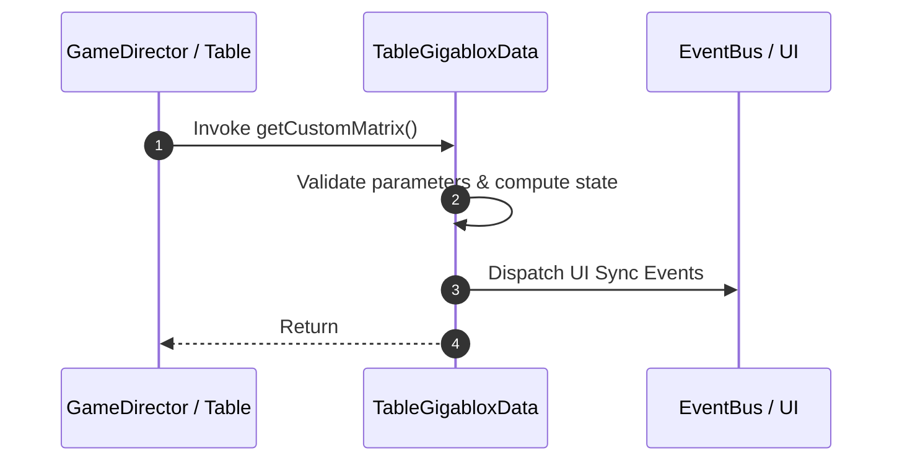

# 📖 `TableGigabloxData.getCustomMatrix()`

<!-- convention-summary-start -->
### TableGigabloxData.getCustomMatrix Line-by-Line Method Specification Summary

- **Core Architecture / Purpose**: Technical reference, API contract, and integration guide for TableGigabloxData.getCustomMatrix Line-by-Line Method Specification.
- **Key Mechanisms & Design**: Encapsulates core algorithms, event hooks, and performance optimizations within the slot framework runtime.
- **Domain Capabilities**: cc_slot_mechanics, 05_methods
- **Scope & Code Paths**: `assets/cc-common/cc-slot-mechanics/Gigablox/scripts/TableGigabloxData.ts`
- **Related Docs**: [Master Index](../INDEX.md)
<!-- convention-summary-end -->


---

## 1. Method Signature & Overview

```typescript
public getCustomMatrix(): 
```

- **Declaring Class**: `TableGigabloxData` (`assets/cc-common/cc-slot-mechanics/Gigablox/scripts/TableGigabloxData.ts`)
- **Source Code Location**: Lines 23 to 51
- **Execution Complexity**: $O(1)$ fast synchronous calculation or controlled timer Promise.

---

## 2. Complete Source Code Implementation

```typescript
	getCustomMatrix(): { result: string[][], blox: any[] } {
		let rawMatrix = this.getRawMatrix();
		let mx = eno.SlotUtils.convertSlotMatrix(rawMatrix, this.config.TABLE_FORMAT); 
		
		const blox1 = [
			{
				col: 1,
				rows: [1],
				size: 3,
				//symbols: ['K']
			}
		];
		const blox2 = [
			{
				col: 0,
				rows: [1],
				size: 3,
				//symbols: ['K']
			},
			{
				col: 3,
				rows: [2],
				size: 2,
				//symbols: ['K']
			}
		];

		return { result:mx, blox: blox1 };
	}
```

---

## 3. Line-by-Line Code Breakdown

| Line # | Code Snippet | Technical Analysis & Engine Behavior |
| :---: | :--- | :--- |
| **23** | `getCustomMatrix(): { result: string[][], blox: any[] } {` | Method entry signature declaring `getCustomMatrix()` with return type ``. |
| **24** | `let rawMatrix = this.getRawMatrix();` | Local variable initialization allocating `rawMatrix`. |
| **25** | `let mx = eno.SlotUtils.convertSlotMatrix(rawMatrix, this.config.TABLE_FORMAT);` | Local variable initialization allocating `mx`. |
| **26** | `` | Applies operational logic and state mutation. |
| **27** | `const blox1 = [` | Local variable initialization allocating `blox1`. |
| **28** | `{` | Applies operational logic and state mutation. |
| **29** | `col: 1,` | Applies operational logic and state mutation. |
| **30** | `rows: [1],` | Applies operational logic and state mutation. |
| **31** | `size: 3,` | Applies operational logic and state mutation. |
| **32** | `//symbols: ['K']` | Applies operational logic and state mutation. |
| **33** | `}` | Method exit boundary, closing block scope. |
| **34** | `];` | Applies operational logic and state mutation. |
| **35** | `const blox2 = [` | Local variable initialization allocating `blox2`. |
| **36** | `{` | Applies operational logic and state mutation. |
| **37** | `col: 0,` | Applies operational logic and state mutation. |
| **38** | `rows: [1],` | Applies operational logic and state mutation. |
| **39** | `size: 3,` | Applies operational logic and state mutation. |
| **40** | `//symbols: ['K']` | Applies operational logic and state mutation. |
| **41** | `},` | Applies operational logic and state mutation. |
| **42** | `{` | Applies operational logic and state mutation. |
| **43** | `col: 3,` | Applies operational logic and state mutation. |
| **44** | `rows: [2],` | Applies operational logic and state mutation. |
| **45** | `size: 2,` | Applies operational logic and state mutation. |
| **46** | `//symbols: ['K']` | Applies operational logic and state mutation. |
| **47** | `}` | Method exit boundary, closing block scope. |
| **48** | `];` | Applies operational logic and state mutation. |
| **49** | `` | Applies operational logic and state mutation. |
| **50** | `return { result:mx, blox: blox1 };` | Returns computed value / promise to caller. |
| **51** | `}` | Method exit boundary, closing block scope. |

---

## 4. Data Flow & State Lifecycle



---

## 5. Production Gotchas & Edge Cases

1. **Null Guarding**: Always ensure caller passes non-null parameters or handles undefined fallbacks.
2. **Fast-Stop Safety**: If user triggers fast-stop during execution, ensure timers are cancelled cleanly via `unscheduleAllCallbacks()`.
