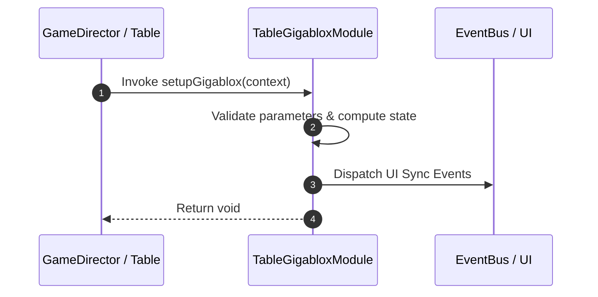

# 📖 `TableGigabloxModule.setupGigablox()`

<!-- convention-summary-start -->
### TableGigabloxModule.setupGigablox Line-by-Line Method Specification Summary

- **Core Architecture / Purpose**: Technical reference, API contract, and integration guide for TableGigabloxModule.setupGigablox Line-by-Line Method Specification.
- **Key Mechanisms & Design**: Encapsulates core algorithms, event hooks, and performance optimizations within the slot framework runtime.
- **Domain Capabilities**: cc_slot_mechanics, 05_methods
- **Scope & Code Paths**: `assets/cc-common/cc-slot-mechanics/Gigablox/scripts/TableGigabloxModule.ts`
- **Related Docs**: [Master Index](../INDEX.md)
<!-- convention-summary-end -->


---

## 1. Method Signature & Overview

```typescript
public setupGigablox(context): void
```

- **Declaring Class**: `TableGigabloxModule` (`assets/cc-common/cc-slot-mechanics/Gigablox/scripts/TableGigabloxModule.ts`)
- **Source Code Location**: Lines 38 to 45
- **Execution Complexity**: $O(1)$ fast synchronous calculation or controlled timer Promise.

---

## 2. Complete Source Code Implementation

```typescript
	protected setupGigablox(context): void {
		for (let i = 0; i < this._bloxes.length; i++) {
			const { col, size } = this._bloxes[i];
			for (let j = col; j <= col + size - 1; j++) {
				(context.reels[j] as GigabloxReelModule).setupGigaBlox(this._bloxes[i]);
			}
		}
	}
```

---

## 3. Line-by-Line Code Breakdown

| Line # | Code Snippet | Technical Analysis & Engine Behavior |
| :---: | :--- | :--- |
| **38** | `protected setupGigablox(context): void {` | Method entry signature declaring `setupGigablox(context)` with return type `void`. |
| **39** | `for (let i = 0; i < this._bloxes.length; i++) {` | Iterates over collection elements. |
| **40** | `const { col, size } = this._bloxes[i];` | Local variable initialization allocating `{ col, size }`. |
| **41** | `for (let j = col; j <= col + size - 1; j++) {` | Iterates over collection elements. |
| **42** | `(context.reels[j] as GigabloxReelModule).setupGigaBlox(this._bloxes[i]);` | Applies operational logic and state mutation. |
| **43** | `}` | Method exit boundary, closing block scope. |
| **44** | `}` | Method exit boundary, closing block scope. |
| **45** | `}` | Method exit boundary, closing block scope. |

---

## 4. Data Flow & State Lifecycle



---

## 5. Production Gotchas & Edge Cases

1. **Null Guarding**: Always ensure caller passes non-null parameters or handles undefined fallbacks.
2. **Fast-Stop Safety**: If user triggers fast-stop during execution, ensure timers are cancelled cleanly via `unscheduleAllCallbacks()`.
