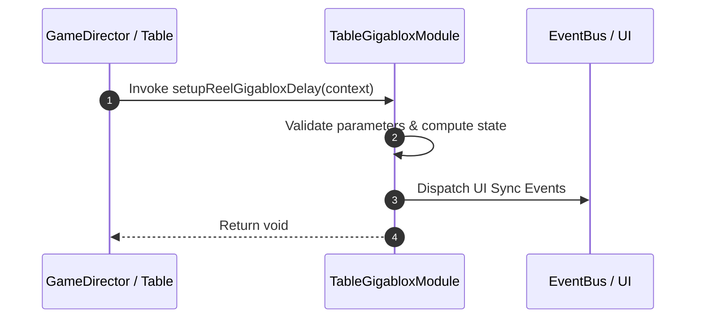

# 📖 `TableGigabloxModule.setupReelGigabloxDelay()`

<!-- convention-summary-start -->
### TableGigabloxModule.setupReelGigabloxDelay Line-by-Line Method Specification Summary

- **Core Architecture / Purpose**: Technical reference, API contract, and integration guide for TableGigabloxModule.setupReelGigabloxDelay Line-by-Line Method Specification.
- **Key Mechanisms & Design**: Encapsulates core algorithms, event hooks, and performance optimizations within the slot framework runtime.
- **Domain Capabilities**: cc_slot_mechanics, 05_methods
- **Scope & Code Paths**: `assets/cc-common/cc-slot-mechanics/Gigablox/scripts/TableGigabloxModule.ts`
- **Related Docs**: [Master Index](../INDEX.md)
<!-- convention-summary-end -->


---

## 1. Method Signature & Overview

```typescript
public setupReelGigabloxDelay(context): void
```

- **Declaring Class**: `TableGigabloxModule` (`assets/cc-common/cc-slot-mechanics/Gigablox/scripts/TableGigabloxModule.ts`)
- **Source Code Location**: Lines 47 to 68
- **Execution Complexity**: $O(1)$ fast synchronous calculation or controlled timer Promise.

---

## 2. Complete Source Code Implementation

```typescript
	protected setupReelGigabloxDelay(context): void {
		let i = 0;
		let reelIndex = 0;
		let reelDelay = 0;
		while (reelIndex < context.reels.length) {
			(context.reels[reelIndex] as GigabloxReelModule).gigabloxDelay = reelDelay;
			if (i < this._bloxes.length) {
				const blox = this._bloxes[i];
				if (reelIndex < blox.col) {
					reelDelay++;
				} else if (reelIndex == blox.col && reelIndex < blox.col + blox.size - 1) {
					// to do
				} else if (reelIndex == blox.col + blox.size - 1) {
					reelDelay++;
					i++;
				}
			} else {
				reelDelay++;
			}
			reelIndex++;
		}
	}
```

---

## 3. Line-by-Line Code Breakdown

| Line # | Code Snippet | Technical Analysis & Engine Behavior |
| :---: | :--- | :--- |
| **47** | `protected setupReelGigabloxDelay(context): void {` | Method entry signature declaring `setupReelGigabloxDelay(context)` with return type `void`. |
| **48** | `let i = 0;` | Local variable initialization allocating `i`. |
| **49** | `let reelIndex = 0;` | Local variable initialization allocating `reelIndex`. |
| **50** | `let reelDelay = 0;` | Local variable initialization allocating `reelDelay`. |
| **51** | `while (reelIndex < context.reels.length) {` | Applies operational logic and state mutation. |
| **52** | `(context.reels[reelIndex] as GigabloxReelModule).gigabloxDelay = reelDelay;` | Applies operational logic and state mutation. |
| **53** | `if (i < this._bloxes.length) {` | Conditional branch evaluation guarding edge cases or prerequisites. |
| **54** | `const blox = this._bloxes[i];` | Local variable initialization allocating `blox`. |
| **55** | `if (reelIndex < blox.col) {` | Conditional branch evaluation guarding edge cases or prerequisites. |
| **56** | `reelDelay++;` | Applies operational logic and state mutation. |
| **57** | `} else if (reelIndex == blox.col && reelIndex < blox.col + blox.size - 1) {` | Applies operational logic and state mutation. |
| **58** | `// to do` | Applies operational logic and state mutation. |
| **59** | `} else if (reelIndex == blox.col + blox.size - 1) {` | Applies operational logic and state mutation. |
| **60** | `reelDelay++;` | Applies operational logic and state mutation. |
| **61** | `i++;` | Applies operational logic and state mutation. |
| **62** | `}` | Method exit boundary, closing block scope. |
| **63** | `} else {` | Applies operational logic and state mutation. |
| **64** | `reelDelay++;` | Applies operational logic and state mutation. |
| **65** | `}` | Method exit boundary, closing block scope. |
| **66** | `reelIndex++;` | Applies operational logic and state mutation. |
| **67** | `}` | Method exit boundary, closing block scope. |
| **68** | `}` | Method exit boundary, closing block scope. |

---

## 4. Data Flow & State Lifecycle



---

## 5. Production Gotchas & Edge Cases

1. **Null Guarding**: Always ensure caller passes non-null parameters or handles undefined fallbacks.
2. **Fast-Stop Safety**: If user triggers fast-stop during execution, ensure timers are cancelled cleanly via `unscheduleAllCallbacks()`.
