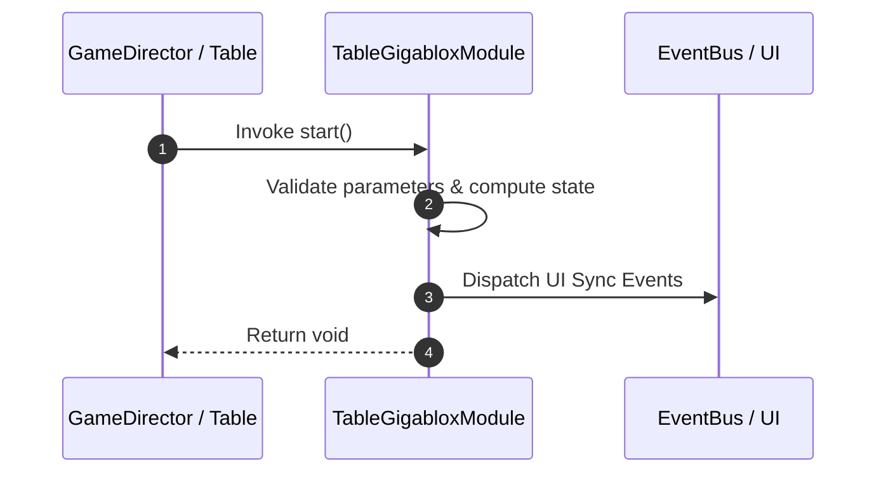

# 📖 `TableGigabloxModule.start()`

<!-- convention-summary-start -->
### TableGigabloxModule.start Line-by-Line Method Specification Summary

- **Core Architecture / Purpose**: Technical reference, API contract, and integration guide for TableGigabloxModule.start Line-by-Line Method Specification.
- **Key Mechanisms & Design**: Encapsulates core algorithms, event hooks, and performance optimizations within the slot framework runtime.
- **Domain Capabilities**: cc_slot_mechanics, 05_methods
- **Scope & Code Paths**: `assets/cc-common/cc-slot-mechanics/Gigablox/scripts/TableGigabloxModule.ts`
- **Related Docs**: [Master Index](../INDEX.md)
<!-- convention-summary-end -->


---

## 1. Method Signature & Overview

```typescript
public start(): void
```

- **Declaring Class**: `TableGigabloxModule` (`assets/cc-common/cc-slot-mechanics/Gigablox/scripts/TableGigabloxModule.ts`)
- **Source Code Location**: Lines 26 to 28
- **Execution Complexity**: $O(1)$ fast synchronous calculation or controlled timer Promise.

---

## 2. Complete Source Code Implementation

```typescript
	start(): void {
		this.node.on("PROCESS_BEFORE_STOP_REELS", this.onStopReels, this);
	}
```

---

## 3. Line-by-Line Code Breakdown

| Line # | Code Snippet | Technical Analysis & Engine Behavior |
| :---: | :--- | :--- |
| **26** | `start(): void {` | Method entry signature declaring `start()` with return type `void`. |
| **27** | `this.node.on("PROCESS_BEFORE_STOP_REELS", this.onStopReels, this);` | Applies operational logic and state mutation. |
| **28** | `}` | Method exit boundary, closing block scope. |

---

## 4. Data Flow & State Lifecycle



---

## 5. Production Gotchas & Edge Cases

1. **Null Guarding**: Always ensure caller passes non-null parameters or handles undefined fallbacks.
2. **Fast-Stop Safety**: If user triggers fast-stop during execution, ensure timers are cancelled cleanly via `unscheduleAllCallbacks()`.
