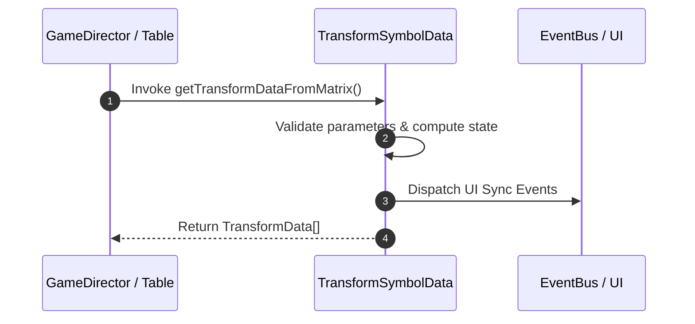

# 📖 `TransformSymbolData.getTransformDataFromMatrix()`

<!-- convention-summary-start -->
### TransformSymbolData.getTransformDataFromMatrix Line-by-Line Method Specification Summary

- **Core Architecture / Purpose**: Technical reference, API contract, and integration guide for TransformSymbolData.getTransformDataFromMatrix Line-by-Line Method Specification.
- **Key Mechanisms & Design**: Encapsulates core algorithms, event hooks, and performance optimizations within the slot framework runtime.
- **Domain Capabilities**: cc_slot_mechanics, 05_methods
- **Scope & Code Paths**: `assets/cc-common/cc-slot-mechanics/TransformSymbol/scripts/TransformSymbolData.ts`
- **Related Docs**: [Master Index](../INDEX.md)
<!-- convention-summary-end -->


---

## 1. Method Signature & Overview

```typescript
public getTransformDataFromMatrix(): TransformData[]
```

- **Declaring Class**: `TransformSymbolData` (`assets/cc-common/cc-slot-mechanics/TransformSymbol/scripts/TransformSymbolData.ts`)
- **Source Code Location**: Lines 78 to 94
- **Execution Complexity**: $O(1)$ fast synchronous calculation or controlled timer Promise.

---

## 2. Complete Source Code Implementation

```typescript
	protected getTransformDataFromMatrix(): TransformData[] {
		const transformData: TransformData[] = [];
		const matrix0: string[] = this.getMatrix0();
		const matrix: string[] = this.getMatrix();

		if (!matrix0.length || !matrix.length || eno.ArrayUtils.matrixEqual(matrix0, matrix)) {
			return [];
		}

		for (let i = 0; i < matrix.length; i++) {
			if (matrix[i] !== matrix0[i]) {
				transformData.push({ symbolCode: matrix[i], symbolIndex: i });
			}
		}

		return transformData;
	}
```

---

## 3. Line-by-Line Code Breakdown

| Line # | Code Snippet | Technical Analysis & Engine Behavior |
| :---: | :--- | :--- |
| **78** | `protected getTransformDataFromMatrix(): TransformData[] {` | Method entry signature declaring `getTransformDataFromMatrix()` with return type `TransformData[]`. |
| **79** | `const transformData: TransformData[] = [];` | Local variable initialization allocating `transformData: TransformData[]`. |
| **80** | `const matrix0: string[] = this.getMatrix0();` | Local variable initialization allocating `matrix0: string[]`. |
| **81** | `const matrix: string[] = this.getMatrix();` | Local variable initialization allocating `matrix: string[]`. |
| **82** | `` | Applies operational logic and state mutation. |
| **83** | `if (!matrix0.length \|\| !matrix.length \|\| eno.ArrayUtils.matrixEqual(matrix0, matrix)) {` | Conditional branch evaluation guarding edge cases or prerequisites. |
| **84** | `return [];` | Returns computed value / promise to caller. |
| **85** | `}` | Method exit boundary, closing block scope. |
| **86** | `` | Applies operational logic and state mutation. |
| **87** | `for (let i = 0; i < matrix.length; i++) {` | Iterates over collection elements. |
| **88** | `if (matrix[i] !== matrix0[i]) {` | Conditional branch evaluation guarding edge cases or prerequisites. |
| **89** | `transformData.push({ symbolCode: matrix[i], symbolIndex: i });` | Applies operational logic and state mutation. |
| **90** | `}` | Method exit boundary, closing block scope. |
| **91** | `}` | Method exit boundary, closing block scope. |
| **92** | `` | Applies operational logic and state mutation. |
| **93** | `return transformData;` | Returns computed value / promise to caller. |
| **94** | `}` | Method exit boundary, closing block scope. |

---

## 4. Data Flow & State Lifecycle



---

## 5. Production Gotchas & Edge Cases

1. **Null Guarding**: Always ensure caller passes non-null parameters or handles undefined fallbacks.
2. **Fast-Stop Safety**: If user triggers fast-stop during execution, ensure timers are cancelled cleanly via `unscheduleAllCallbacks()`.
