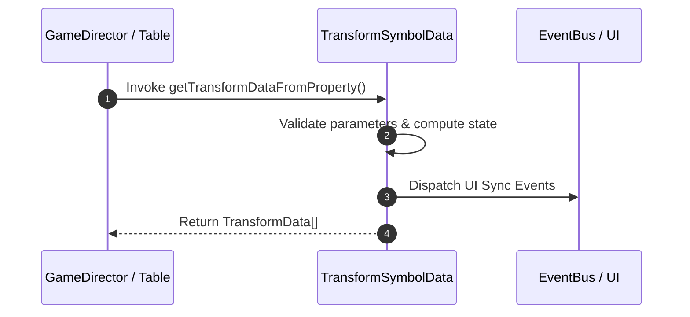

# 📖 `TransformSymbolData.getTransformDataFromProperty()`

<!-- convention-summary-start -->
### TransformSymbolData.getTransformDataFromProperty Line-by-Line Method Specification Summary

- **Core Architecture / Purpose**: Technical reference, API contract, and integration guide for TransformSymbolData.getTransformDataFromProperty Line-by-Line Method Specification.
- **Key Mechanisms & Design**: Encapsulates core algorithms, event hooks, and performance optimizations within the slot framework runtime.
- **Domain Capabilities**: cc_slot_mechanics, 05_methods
- **Scope & Code Paths**: `assets/cc-common/cc-slot-mechanics/TransformSymbol/scripts/TransformSymbolData.ts`
- **Related Docs**: [Master Index](../INDEX.md)
<!-- convention-summary-end -->


---

## 1. Method Signature & Overview

```typescript
public getTransformDataFromProperty(): TransformData[]
```

- **Declaring Class**: `TransformSymbolData` (`assets/cc-common/cc-slot-mechanics/TransformSymbol/scripts/TransformSymbolData.ts`)
- **Source Code Location**: Lines 65 to 76
- **Execution Complexity**: $O(1)$ fast synchronous calculation or controlled timer Promise.

---

## 2. Complete Source Code Implementation

```typescript
	protected getTransformDataFromProperty(): TransformData[] {
		if (!this[this.customTransformProperty]) {
			return [];
		}
		const arr = this[this.customTransformProperty].split(",");
		const transformData: TransformData[] = [];
		for (let i = 0; i < arr.length; i++) {
			const subArr = arr[i].split(":");
			transformData.push({ symbolCode: subArr[0], symbolIndex: Number(subArr[1]) });
		}
		return transformData;
	}
```

---

## 3. Line-by-Line Code Breakdown

| Line # | Code Snippet | Technical Analysis & Engine Behavior |
| :---: | :--- | :--- |
| **65** | `protected getTransformDataFromProperty(): TransformData[] {` | Method entry signature declaring `getTransformDataFromProperty()` with return type `TransformData[]`. |
| **66** | `if (!this[this.customTransformProperty]) {` | Conditional branch evaluation guarding edge cases or prerequisites. |
| **67** | `return [];` | Returns computed value / promise to caller. |
| **68** | `}` | Method exit boundary, closing block scope. |
| **69** | `const arr = this[this.customTransformProperty].split(",");` | Local variable initialization allocating `arr`. |
| **70** | `const transformData: TransformData[] = [];` | Local variable initialization allocating `transformData: TransformData[]`. |
| **71** | `for (let i = 0; i < arr.length; i++) {` | Iterates over collection elements. |
| **72** | `const subArr = arr[i].split(":");` | Local variable initialization allocating `subArr`. |
| **73** | `transformData.push({ symbolCode: subArr[0], symbolIndex: Number(subArr[1]) });` | Applies operational logic and state mutation. |
| **74** | `}` | Method exit boundary, closing block scope. |
| **75** | `return transformData;` | Returns computed value / promise to caller. |
| **76** | `}` | Method exit boundary, closing block scope. |

---

## 4. Data Flow & State Lifecycle



---

## 5. Production Gotchas & Edge Cases

1. **Null Guarding**: Always ensure caller passes non-null parameters or handles undefined fallbacks.
2. **Fast-Stop Safety**: If user triggers fast-stop during execution, ensure timers are cancelled cleanly via `unscheduleAllCallbacks()`.
