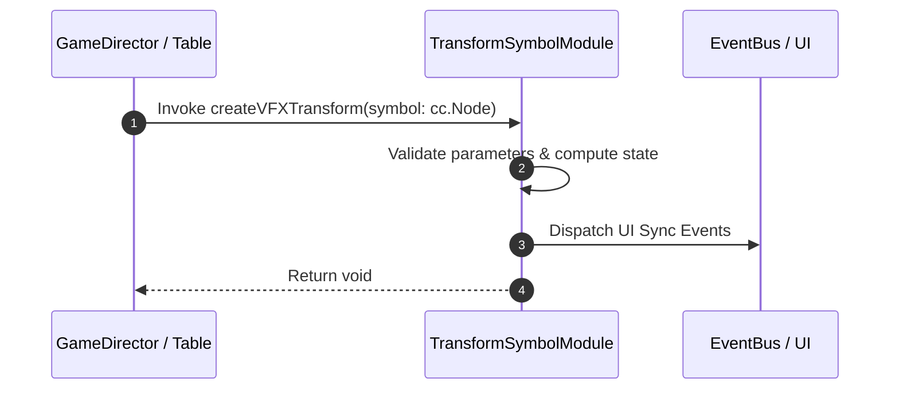

# 📖 `TransformSymbolModule.createVFXTransform()`

<!-- convention-summary-start -->
### TransformSymbolModule.createVFXTransform Line-by-Line Method Specification Summary

- **Core Architecture / Purpose**: Technical reference, API contract, and integration guide for TransformSymbolModule.createVFXTransform Line-by-Line Method Specification.
- **Key Mechanisms & Design**: Encapsulates core algorithms, event hooks, and performance optimizations within the slot framework runtime.
- **Domain Capabilities**: cc_slot_mechanics, 05_methods
- **Scope & Code Paths**: `assets/cc-common/cc-slot-mechanics/TransformSymbol/scripts/TransformSymbolModule.ts`
- **Related Docs**: [Master Index](../INDEX.md)
<!-- convention-summary-end -->


---

## 1. Method Signature & Overview

```typescript
public createVFXTransform(symbol: cc.Node): void
```

- **Declaring Class**: `TransformSymbolModule` (`assets/cc-common/cc-slot-mechanics/TransformSymbol/scripts/TransformSymbolModule.ts`)
- **Source Code Location**: Lines 78 to 89
- **Execution Complexity**: $O(1)$ fast synchronous calculation or controlled timer Promise.

---

## 2. Complete Source Code Implementation

```typescript
	createVFXTransform(symbol: cc.Node): void {
		if (!this.vfxPool) {
			return;
		}
		const vfx = this.vfxPool.getObject();

		const position = NodeUtils.getPositionInOtherNode(this.vfxLayer, symbol);
		vfx.setParent(this.vfxLayer);
		vfx.setPosition(position);
		vfx.active = true;
		vfx.emit("PLAY_ANIMATION");
	}
```

---

## 3. Line-by-Line Code Breakdown

| Line # | Code Snippet | Technical Analysis & Engine Behavior |
| :---: | :--- | :--- |
| **78** | `createVFXTransform(symbol: cc.Node): void {` | Method entry signature declaring `createVFXTransform(symbol: cc.Node)` with return type `void`. |
| **79** | `if (!this.vfxPool) {` | Conditional branch evaluation guarding edge cases or prerequisites. |
| **80** | `return;` | Applies operational logic and state mutation. |
| **81** | `}` | Method exit boundary, closing block scope. |
| **82** | `const vfx = this.vfxPool.getObject();` | Local variable initialization allocating `vfx`. |
| **83** | `` | Applies operational logic and state mutation. |
| **84** | `const position = NodeUtils.getPositionInOtherNode(this.vfxLayer, symbol);` | Local variable initialization allocating `position`. |
| **85** | `vfx.setParent(this.vfxLayer);` | Applies operational logic and state mutation. |
| **86** | `vfx.setPosition(position);` | Applies operational logic and state mutation. |
| **87** | `vfx.active = true;` | Applies operational logic and state mutation. |
| **88** | `vfx.emit("PLAY_ANIMATION");` | Dispatches event to subscribers on the event bus. |
| **89** | `}` | Method exit boundary, closing block scope. |

---

## 4. Data Flow & State Lifecycle



---

## 5. Production Gotchas & Edge Cases

1. **Null Guarding**: Always ensure caller passes non-null parameters or handles undefined fallbacks.
2. **Fast-Stop Safety**: If user triggers fast-stop during execution, ensure timers are cancelled cleanly via `unscheduleAllCallbacks()`.
