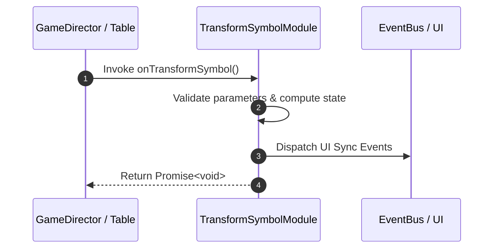

# 📖 `TransformSymbolModule.onTransformSymbol()`

<!-- convention-summary-start -->
### TransformSymbolModule.onTransformSymbol Line-by-Line Method Specification Summary

- **Core Architecture / Purpose**: Technical reference, API contract, and integration guide for TransformSymbolModule.onTransformSymbol Line-by-Line Method Specification.
- **Key Mechanisms & Design**: Encapsulates core algorithms, event hooks, and performance optimizations within the slot framework runtime.
- **Domain Capabilities**: cc_slot_mechanics, 05_methods
- **Scope & Code Paths**: `assets/cc-common/cc-slot-mechanics/TransformSymbol/scripts/TransformSymbolModule.ts`
- **Related Docs**: [Master Index](../INDEX.md)
<!-- convention-summary-end -->


---

## 1. Method Signature & Overview

```typescript
public onTransformSymbol(): Promise<void>
```

- **Declaring Class**: `TransformSymbolModule` (`assets/cc-common/cc-slot-mechanics/TransformSymbol/scripts/TransformSymbolModule.ts`)
- **Source Code Location**: Lines 36 to 65
- **Execution Complexity**: $O(1)$ fast synchronous calculation or controlled timer Promise.

---

## 2. Complete Source Code Implementation

```typescript
	onTransformSymbol(): Promise<void> {
		const transformData = this.data.getTransformData();

		if (transformData.length === 0) {
			return Promise.resolve();
		}

		for (const data of transformData) {
			const symbol = this.symbolManager.getSymbolByIndex(data.symbolIndex, SymbolOwnerType.TRANSFORM_SYMBOL);
			if (!symbol) {
				continue;
			}
			this.createVFXTransform(symbol);

			const cmp = symbol.getComponent(TransformSymbolItem);
			if (cmp) {
				cmp.transform(data.symbolCode)
			}

			this.scheduleOnce(() => {
				symbol.emit("TRANSFORM_TO_SYMBOL", data.symbolCode);
			}, this.config.DELAY_CHANGE_SYMBOL);
		}

		return new Promise((resolve) => {
			this.scheduleOnce(() => {
				resolve();
			}, this.config.TRANSFORM_DURATION);
		});
	}
```

---

## 3. Line-by-Line Code Breakdown

| Line # | Code Snippet | Technical Analysis & Engine Behavior |
| :---: | :--- | :--- |
| **36** | `onTransformSymbol(): Promise<void> {` | Method entry signature declaring `onTransformSymbol()` with return type `Promise<void>`. |
| **37** | `const transformData = this.data.getTransformData();` | Local variable initialization allocating `transformData`. |
| **38** | `` | Applies operational logic and state mutation. |
| **39** | `if (transformData.length === 0) {` | Conditional branch evaluation guarding edge cases or prerequisites. |
| **40** | `return Promise.resolve();` | Returns computed value / promise to caller. |
| **41** | `}` | Method exit boundary, closing block scope. |
| **42** | `` | Applies operational logic and state mutation. |
| **43** | `for (const data of transformData) {` | Iterates over collection elements. |
| **44** | `const symbol = this.symbolManager.getSymbolByIndex(data.symbolIndex, SymbolOwnerType.TRANSFORM_SYMBOL);` | Local variable initialization allocating `symbol`. |
| **45** | `if (!symbol) {` | Conditional branch evaluation guarding edge cases or prerequisites. |
| **46** | `continue;` | Applies operational logic and state mutation. |
| **47** | `}` | Method exit boundary, closing block scope. |
| **48** | `this.createVFXTransform(symbol);` | Applies operational logic and state mutation. |
| **49** | `` | Applies operational logic and state mutation. |
| **50** | `const cmp = symbol.getComponent(TransformSymbolItem);` | Local variable initialization allocating `cmp`. |
| **51** | `if (cmp) {` | Conditional branch evaluation guarding edge cases or prerequisites. |
| **52** | `cmp.transform(data.symbolCode)` | Applies operational logic and state mutation. |
| **53** | `}` | Method exit boundary, closing block scope. |
| **54** | `` | Applies operational logic and state mutation. |
| **55** | `this.scheduleOnce(() => {` | Schedules delayed execution callback using Cocos Creator timer. |
| **56** | `symbol.emit("TRANSFORM_TO_SYMBOL", data.symbolCode);` | Dispatches event to subscribers on the event bus. |
| **57** | `}, this.config.DELAY_CHANGE_SYMBOL);` | Applies operational logic and state mutation. |
| **58** | `}` | Method exit boundary, closing block scope. |
| **59** | `` | Applies operational logic and state mutation. |
| **60** | `return new Promise((resolve) => {` | Returns computed value / promise to caller. |
| **61** | `this.scheduleOnce(() => {` | Schedules delayed execution callback using Cocos Creator timer. |
| **62** | `resolve();` | Applies operational logic and state mutation. |
| **63** | `}, this.config.TRANSFORM_DURATION);` | Applies operational logic and state mutation. |
| **64** | `});` | Applies operational logic and state mutation. |
| **65** | `}` | Method exit boundary, closing block scope. |

---

## 4. Data Flow & State Lifecycle



---

## 5. Production Gotchas & Edge Cases

1. **Null Guarding**: Always ensure caller passes non-null parameters or handles undefined fallbacks.
2. **Fast-Stop Safety**: If user triggers fast-stop during execution, ensure timers are cancelled cleanly via `unscheduleAllCallbacks()`.
