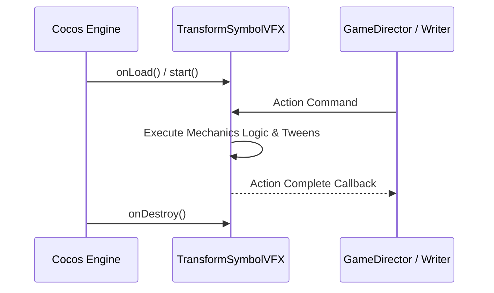

# 🔄 TransformSymbolVFX Lifecycle & Sequence Flowchart

<!-- convention-summary-start -->
### TransformSymbolVFX Lifecycle & Sequence Flowchart Summary

- **Core Architecture / Purpose**: Technical reference, API contract, and integration guide for TransformSymbolVFX Lifecycle & Sequence Flowchart.
- **Key Mechanisms & Design**: Encapsulates core algorithms, event hooks, and performance optimizations within the slot framework runtime.
- **Domain Capabilities**: cc_slot_mechanics, 01_overview
- **Scope & Code Paths**: `assets/cc-common/`
- **Related Docs**: [Master Index](../INDEX.md)
<!-- convention-summary-end -->

---

## 1. Lifecycle Sequence Diagram

